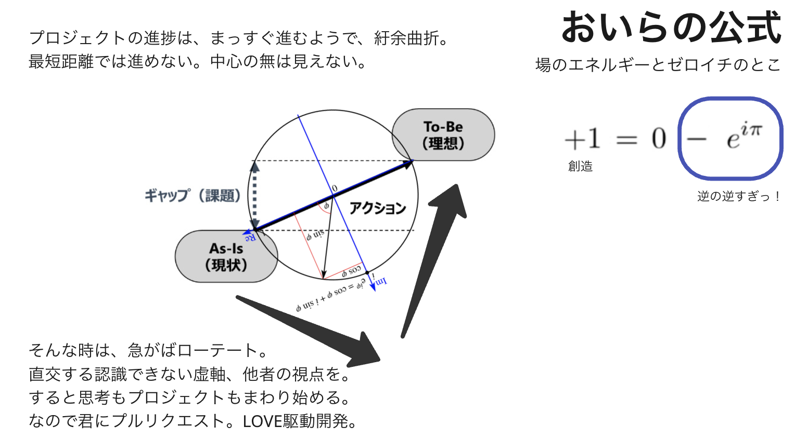

[ChatGPTによる解説はこちら](https://chatgpt.com/share/68294736-26ac-800b-9cf2-740ed7a4721f)

---

## 創造の構え-As is/To beフレームワーク-

---

### 発散の参考

- Complex operations
  - [参考:【How to Fold a Julia Fractal — Acko.net】](https://acko.net/blog/how-to-fold-a-julia-fractal/)

<video 
  src="{{ '/assets/images/humor/rotate.mp4' | relative_url }}"
  autoplay  
  muted  
  loop  
  playsinline  
  width="480">
</video>

- Communication
  - [参考:【Wind God and Thunder God: An Angle of Communication】](https://pjdhiro.blogspot.com/2023/10/wind-god-and-thunder-god.html)

