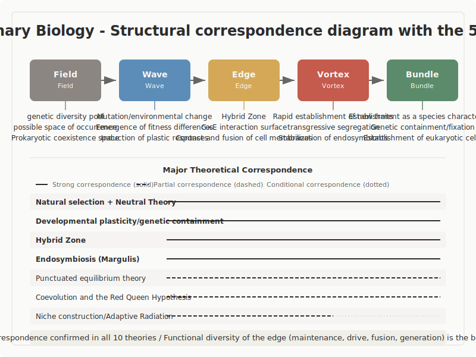

# Evolutionary Biology: Novelty Emerges from Error

## 1. Purpose of the Investigation in This Domain

This report presents the results of an investigation into whether evolutionary biology exhibits structural correspondence with the five-stage model of creation, Field -> Wave -> Edge -> Vortex -> Bundle.

Evolutionary biology is one of the disciplines that has most fully demonstrated the structure by which novelty emerges from error, or variation. Most mutations are rejected, but some are retained and later become material for new functions or new species. The question of this investigation is whether that structure corresponds to the five-stage model. This document is an investigation report. It does not consume evolution as a metaphor for creation. It treats the specific structure of evolutionary biology on its own terms and identifies correspondence as precisely as possible.

## 2. Method of Investigation

In the domain of evolutionary biology, ten theories and phenomena were selected for evaluation. The criteria were that they be established theories describing how novelty arises from variation, and that they be supported by empirical data. The set includes natural selection and neutral theory, the extended evolutionary synthesis and evolutionary developmental biology, inter-lineage interaction such as coevolution, hybrid zones, endosymbiosis, and horizontal gene transfer, and macroevolutionary patterns such as punctuated equilibrium and adaptive radiation.

For each theory, correspondence with the five-stage model was examined stage by stage, with particular attention to the three conditions associated with Edge: relational network, indeterminacy, and connection to Vortex.

Throughout the investigation, care is taken not to lose sight of the fact that natural selection has no intention. The five-stage model's idea of retention contains an attitudinal dimension, but retention in evolution, such as the drift of neutral mutation, is an unintentional process. That difference is recorded as a limit of structural correspondence.

## 3. Overview of the Five-Stage Model

This section explains the five-stage model used as the reference for the investigation. It is a model for describing the generation of existence itself, and is not limited to any specific scale or domain.

**Field**: An undifferentiated state. It is an initial condition in which neither direction nor structure has yet been fixed, a zero-state in which nothing has yet taken shape.

**Wave**: A stage of exploration in which multiple directions diverge and compete. Difference appears within what had been undifferentiated, and tension and fluctuation emerge.

**Edge**: A tense condition in which opposing elements coexist without converging into either side. This is the core stage of the model. The claim is that remaining at the boundary, or verge, is the essence of creation.

**Vortex**: A stage in which a new coherence or order rises spontaneously out of the tension. Contradictions retained at Edge are reorganized into a higher-order structure. In evolutionary biology, this appears concretely as rapid speciation, the emergence of a new level of organization, or adaptive radiation.

**Bundle**: A stage in which form is fixed and stabilized as a reusable structure. In evolutionary biology, this appears as stabilization of trait distributions, species characteristics, or evolutionarily stable states. Bundle is not a final freeze; it becomes the condition for the next Field.

If these definitions already produce discomfort, that is itself an important point for the investigation. One meaningful option is to keep that discomfort in view and continue reading. Another is to stop here. Both are legitimate responses.

## 4. Results of the Investigation

### Overall Picture

Ten evolutionary-biological structures were evaluated. Structural correspondence was confirmed in all ten cases. There were no conditional cases. Six structures showed especially strong correspondence with Edge.

The most distinctive feature of this domain is that the functional diversity of Edge is richer here than in any of the other thirty domains. Edge does not have a single function. It appears in at least four patterns: retained Edge, driving Edge, merging Edge, and emerging Edge.

### Main Findings

#### Natural Selection and Neutral Theory: Three Fates of Error

The basic structure of evolution can be summarized as variation -> rejection -> retention -> reuse. Mutation is a base-level change produced during DNA replication. Most mutations are neutral or weakly deleterious, while strongly deleterious mutations are removed by purifying selection. Beneficial mutations are relatively rare, but under the right conditions they become fixed in the population through selection.

Kimura's neutral theory (1968) showed that much molecular evolution is driven not by natural selection but by genetic drift. Ohta's nearly neutral theory (1973) quantified how weak mutations behave effectively as neutral depending on population size.

This can be organized as three fates of error. First, rejection, as in the elimination of deleterious mutation. Second, immediate adoption, as in the selective fixation of beneficial mutation. Third, retention, as in the drift of neutral mutation. The core claim of error-driven thinking is that errors headed for rejection can be taken up and retained as questions. That is, the first fate is converted into the third. What neutral theory shows is that this third fate, retention or drift, provides an enormous amount of material for novelty even in evolution.

#### Hybrid Zones: The Thickness of Edge Can Be Measured

A region in which two genetically differentiated populations come into contact and interbreed is called a hybrid zone. Such zones provide a window onto speciation in progress and have often been described as natural laboratories.

Hybrid zones are one of the purest biological realizations of Edge in the five-stage model. Genes from two populations mix, individuals arise that belong fully to neither species, and traits sometimes appear that exceed either parent, a phenomenon of transgressive segregation.

The thickness of this zone can be measured as cline width, and can be quantified as a function of selection strength and dispersal distance.

This provides biological support for the view that Edge is not merely a line but a region.

#### Endosymbiosis: Edge Disappears and a New Level Emerges

It is now firmly established through DNA evidence that mitochondria and chloroplasts derive from symbiotic ancient prokaryotes. When Margulis, then publishing as Lynn Sagan, proposed the idea in 1967, the manuscript was reportedly rejected by more than a dozen journals.

Endosymbiosis is a case in which a new level of organization, the eukaryotic cell, emerged through the fusion of boundaries, namely cell membranes. Ordinarily a boundary is understood as what separates different things. Here, by contrast, the disappearance of a boundary becomes the trigger of creation. The branching between incorporation becoming symbiosis or becoming digestion is an extreme example of indeterminacy at Edge.

The eukaryotic cell, once formed as a Bundle, became the Field for all later eukaryotic life. It is one of the most dramatic cases in natural history of Bundle returning to Field.

#### Coevolution and the Red Queen: Edge Drives

In coevolution, interaction between species continually updates the selection pressures acting on each side. The Red Queen hypothesis (Van Valen 1973) describes the condition in which one must keep running merely to remain in the same place.

In this structure, Edge, the boundary between species, does not merely separate. It functions as a dynamical device that continually drives change. The boundary itself keeps generating selection pressure. In a Red Queen world, Bundle is not stably maintained. This is an important case showing that Bundle in the five-stage model does not always mean lasting stability.

## 5. Correspondence with the Five Stages

### Field

In evolutionary biology, Field appears as a pool of diversity. It may take the form of a pool of genetic or phenotypic variation in natural selection, a possibility space within developmental systems, a communal gene pool in the early stages of horizontal gene transfer, or open niches in adaptive radiation. In each case, it is the matrix of possibility before structure has been fully fixed.

What matters here is that Field is not a uniform background. The Darwinian Threshold associated with horizontal gene transfer points to a qualitative transformation from a communal Field to an individuated Field. This suggests that there may be different kinds of Field, a point that may require the concept itself to be expanded.

### Wave

Wave is the stage at which difference begins to appear in the Field. Fitness differences become visible under environmental pressure in natural selection. Environmental change and geographic isolation amplify divergence in punctuated equilibrium. Environmental stimulation produces plastic response in developmental plasticity. Secondary contact reactivates gene flow in hybrid zones. In each case, fluctuation is being amplified.

### Edge

In evolutionary biology, six cases showed strong correspondence with Edge. What is especially notable is that Edge appears in four patterns.

**Retained Edge**: In hybrid zones, boundaries are maintained over long periods through a balance between selection and gene flow. Cline width remains stable, and the two populations interbreed without fully merging.

**Driving Edge**: In coevolution, the interspecies boundary continually generates selection pressure. The boundary is not a static line of separation but a dynamic apparatus driving change.

**Merging Edge**: In endosymbiosis, the fusion of cell membranes, which are organismal boundaries, generated a new level of organization. This is a case in which the disappearance of a boundary triggers creation.

**Emerging Edge**: At the Darwinian Threshold in horizontal gene transfer, organismal boundaries emerge out of a communal gene pool. The boundary itself is what comes into being.

### Vortex

Vortex appears as the stage in which new order rises rapidly. This includes the rapid establishment of new morphology in punctuated equilibrium, geologically instantaneous on the order of 10^3 to 10^5 years, the emergence of a new level through endosymbiosis, namely the eukaryotic cell, and explosive diversification in adaptive radiation, as in the Cambrian explosion or Darwin's finches. In each case, structuring happens quickly within a rhythm of preparation followed by realization.

### Bundle

Bundle is the stage in which a formed structure stabilizes as a reusable pattern. This includes fixation of trait distributions in natural selection, stabilization as a new species in punctuated equilibrium, establishment of the eukaryotic cell as a new Field in endosymbiosis, and stabilization of diversity in adaptive radiation.

Niche construction shows most directly how Bundle returns to Field. Organisms modify their environment, and the modified environment redefines the selection pressures on the next generation. The result of creation changes the precondition for the next creation. The extended evolutionary synthesis theorizes this recursive structure as reciprocal causation.

## 6. Insights from This Domain

### The Biological Basis of the Three Fates of Error

Natural selection and neutral theory demonstrate with molecular data the three fates of error, rejection, adoption, and retention. Population-genetic mathematics quantifies the probability of each fate as a function of population size, selection coefficient, and mutation rate.

The drift of neutral mutation is the biological counterpart of retention. The smaller the effective population size, the more likely it is that weak mutations behave as neutral. In other words, the width of retention depends on population conditions. Retention is not a fixed property but a context-dependent function.

### Four Patterns of Edge

The most important contribution from evolutionary biology is that Edge is not a single function. At least four patterns can be identified: retained Edge in hybrid zones, driving Edge in coevolution, merging Edge in endosymbiosis, and emerging Edge at the Darwinian Threshold.

This is a cross-domain hypothesis that should be tested elsewhere. One way to build a taxonomy of Edge may be to ask whether in-between in architecture, liminality in anthropology, or criticality in complexity science correspond to one of these four patterns.

### The Plurality of Field

The Darwinian Threshold associated with horizontal gene transfer shows that Field may have qualitatively different types. Early life may have operated within a communal Field, in which organismal boundaries were unclear and genes flowed freely, before a phase transition to an individuated Field in which vertical inheritance dominated. This suggests that Field in the five-stage model may not be a uniform background.

### The Instability of Bundle

The Red Queen hypothesis shows that Bundle does not necessarily mean lasting stability. Two coevolving species cannot remain permanently in a stable adaptive state. If one changes, the other must also change. This pattern, in which creation does not endure unchanged, places an important constraint on how Bundle should be understood.

## 7. Unresolved Questions

### Retention Without Consciousness

Natural selection has no intention. The drift of neutral mutation is not an attitude that takes up would-be rejected error as a question. It is the result of a probabilistic process. Whether the retention function in the five-stage model can be applied both to conscious attitudes and to unintentional processes is a major question about scale extension in the theory. This is the same pattern observed in D03 chemistry with delayed negative feedback, and it remains on the agenda as a retention question.

### Whether There Are Different Kinds of Field

The communal Field and individuated Field associated with horizontal gene transfer are concepts not treated explicitly in the current five-stage model. Is Field a uniform initial condition, or can it come in qualitatively different kinds? This question bears directly on the definition of Field in the theory.

### When Bundle Is Unstable

The instability of Bundle suggested by the Red Queen hypothesis raises the question of whether Bundle in the five-stage model should be understood as temporary stability or enduring stability.

### Cross-Domain Validation of the Four Patterns of Edge

The four patterns of Edge, retained, driving, merging, and emerging, have been confirmed within evolutionary biology. Whether they can also be observed in other domains remains a question for cross-domain validation.

## 8. Summary

In the investigation of evolutionary biology, structural correspondence with the five-stage model was confirmed in all ten cases. In particular, the structural parallel between the evolutionary pattern in which novelty emerges from error and the broader pattern of taking up rejected error as a question is supported by more than 150 years of accumulated data.

The distinct contribution of evolutionary biology can be summarized in three points. First, the three fates of error, rejection, adoption, and retention, are demonstrated by molecular data. Second, the functional diversity of Edge, in the four patterns of retention, driving, merging, and emergence, is richer here than in any of the thirty domains. Third, the return from Bundle to Field, visible in niche construction and the reciprocal causation of the extended evolutionary synthesis, is built into the theoretical core.

The state of the evidence should be stated plainly. The structure mutation -> rejection or retention -> novelty, as clarified by natural selection and neutral theory, is one of the most heavily evidenced structural correspondences found in the investigation. The quantification of Edge in hybrid zones and the emergence of a new level through endosymbiosis are also grounded in established findings. At the same time, the absence of intention in natural selection leaves an unresolved question about whether the concept of retention in the five-stage model can be extended to unintentional processes. The policy of this report is not to consume evolution as a loose metaphor of creation, but to describe both the precision and the limits of structural correspondence as accurately as possible.
