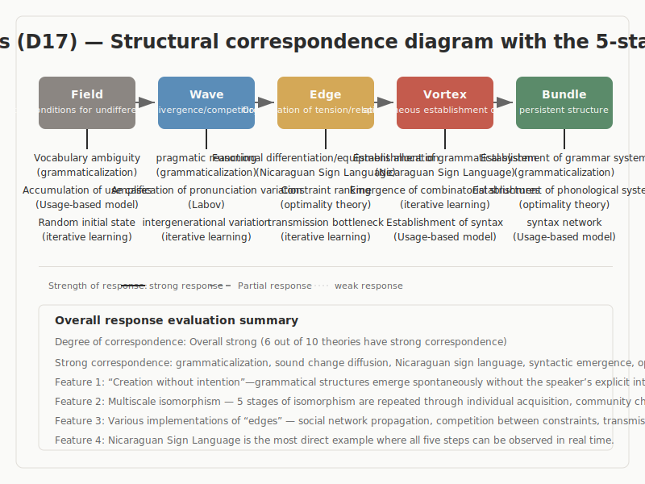

# Linguistics: The Five-Stage Structure Seen in Language Change and Emergence

## 1. Purpose and Question of the Investigation

This report presents the results of an investigation into the following question, using major theories in linguistics.

> Do the theories of this academic domain correspond structurally to the five-stage model, Field -> Wave -> Edge -> Vortex -> Bundle?

Linguistics is a discipline in which change and emergence in language can be observed across phonology, morphology, syntax, and pragmatics, and across the scales of individual, community, and history. How do words come into being? How does grammar acquire structure without being intentionally designed? How do new meanings become conventionalized? The purpose of this investigation is to examine how the structure of the five-stage model corresponds to existing theoretical systems describing these phenomena.

This document is a report of findings. It is neither a linguistics textbook nor a proof of the five-stage model. It reports both places where structural correspondence was confirmed and places where correspondence remains weak.

## 2. Method of Investigation

In this investigation, ten theories and phenomena were selected from linguistics.

**Selection criteria**: The set was designed to cover language change and emergence from multiple angles. It includes five areas: historical change, such as grammaticalization and the diffusion of sound change; language creation, such as Nicaraguan Sign Language, creole formation, and the iterated learning model; individual acquisition, such as constructional emergence and the critical period hypothesis; cognitive foundations, such as pragmatic inference and linguistic relativity; and formal structure, such as Optimality Theory.

**Method of evaluation**: For each theory, structural correspondence with the five-stage model was examined from multiple independent angles. Three evaluation lenses were used. First, the processual shape of language change, that is, which phases of emergence, diffusion, fixation, and systematization the theory describes. Second, the relation between intention and emergence, whether the case is one of unintended creation or intentional design. Third, isomorphism across scales, whether individual acquisition, community change, and historical change show the same structural pattern.

**Criteria of judgment**: A theory was judged to show strong structural correspondence when structures corresponding to the five stages could be clearly identified and when mechanisms corresponding to transitions between stages were described. A theory was judged to show partial correspondence when some stages could be mapped clearly but the overall structure required interpretive leaps. A theory was treated as conditional when the evidence for structural correspondence remained insufficient.

**Limits of the investigation**: This investigation is a structural analysis based on AI-assisted reading of the literature and has not been reviewed by linguists as subject-matter experts. Descriptions remain at the level of overview and do not attempt to cover all internal debates or the latest developments in each theory.

## 3. Overview of the Five-Stage Model

The five-stage model describes a common structure of creative process through five stages.

**Field**: An undifferentiated condition. It is the initial state in which neither direction nor structure has yet been fixed.

**Wave**: A stage of exploration in which multiple directions diverge and compete. Difference becomes visible and fluctuation appears.

**Edge**: A tense condition in which opposing elements coexist without converging into either side. The model assumes that whether a process can remain at this stage bears strongly on the quality of creation.

**Vortex**: A stage in which a new coherence or order rises spontaneously out of the tension. At an unpredictable moment, previously separate elements take a new form.

**Bundle**: A stage in which form is fixed and stabilizes as a reusable structure. Bundle becomes the precondition for the next cycle's Field, and the process continues spirally rather than returning to the identical same point.

This model is not limited to a specific scale, whether individual, collective, or historical, but includes the hypothesis that similar structure may appear across many scales.

If these definitions already feel uncomfortable, that discomfort is itself an important part of the investigation. It is equally legitimate to continue reading while keeping that discomfort in view or to stop at this point.

## 4. Results: Overall Picture

Of the ten candidates, eight showed strong or partial structural correspondence, while two remained only conditional.

| Theory / Phenomenon | Strength of Correspondence | Distinctive Feature |
|-----------|-----------|------|
| Nicaraguan Sign Language (NSL) | Strong | The full five-stage process can be observed in real time |
| Constructional emergence (usage-based) | Strong | High correspondence across all five stages |
| Iterated Learning Model (ILM) | Strong | Structure emerges from informational constraint |
| Grammaticalization | Partial, but strong | Irreversible one-way change corresponding to the five stages |
| Diffusion of sound change | Partial, but strong | Social structure shapes the form of change |
| Pragmatic inference | Partial, but strong | Implicature arises from maxim violation |
| Optimality Theory | Partial, but strong | Competition among constraints and ranking decisions |
| Critical period hypothesis | Partial | A distinctive view of temporal constraint on Field |
| Creole formation | Conditional | Case diversity is too great for an unqualified single pattern |
| Linguistic relativity | Conditional | Closer to a theory of state than a theory of process |

A distinctive feature of linguistics is the concentration of cases of unintended creation. The emergence of linguistic structure without deliberate intention on the part of individual speakers is independently described across several theories.

## 5. Results: Findings by Theory

### 5.1 Emergence and Systematization of Nicaraguan Sign Language (NSL)

In the late 1970s, a new sign language emerged in Nicaraguan schools for the deaf in the absence of an already available language model. Comparison across cohorts entering at different times showed that the process of language formation could be observed almost in real time. Children decomposed events into basic elements and assembled them hierarchically, while later cohorts extended and systematized what earlier ones had produced.

This process corresponds to the five stages as follows. Home-sign expression resources lacking unified system correspond to Field. Early variation and competition correspond to Wave. Functional differentiation of roles and positions together with assignment of grammatical devices correspond to Edge. Emergence of a system with discreteness, combinatoriality, and hierarchy corresponds to Vortex. Stabilization of norms through intergenerational transmission and convergence at community level corresponds to Bundle.

Two points are especially important. First, the grammaticalization of NSL was not something any individual speaker intended as a project of making grammar. Structure was woven collaboratively through generational turnover. Second, cohort comparison makes transitions between stages visible along a social time axis. This makes NSL one of the most direct cases in the whole investigation.

### 5.2 The Iterated Learning Model (ILM)

The iterated learning model holds that linguistic structure emerges through the bottleneck of intergenerational transmission. The bottleneck refers to the fact that the next generation cannot receive the totality of the previous generation's language in full. Experiments have shown that when transmission is repeated across generations from a random initial state, combinatorial and systematic structure arises spontaneously.

The correspondence with the five stages is as follows. A random initial signal space corresponds to Field. The bottleneck of intergenerational transmission introduces difference, corresponding to Wave. Learners infer relation patterns from partial information, corresponding to Edge. Combinatorial structure then emerges, corresponding to Vortex. That structure stabilizes and persists across generations, corresponding to Bundle.

The finding that inability to transmit everything generates structure is especially important for the five-stage model. Incomplete transmission forces the receiver to supplement what is missing, and that supplementation becomes a source of structure. This is a computationally explicit instance of the broader pattern in which constraint drives creation.

### 5.3 Grammaticalization

Grammaticalization is the process by which lexical items shift irreversibly into grammatical functions. The English form going to, for example, originally expressed physical motion toward somewhere, but through repeated use acquired a grammatical future function. Cross-linguistically, similar one-way paths are observed from content word to function word and from function word to affix. Expressions for body parts becoming spatial adpositions and then temporal expressions are a standard example.

In terms of the five stages, a condition in which multiple usages coexist corresponds to Field. Differences in frequency then expand, corresponding to Wave. Reanalysis in constructional environments creates the boundary between old and new functions, corresponding to Edge. A new function rises as a grammatical category, corresponding to Vortex. Irreversible stabilization as a grammatical rule corresponds to Bundle.

The distinctive feature of grammaticalization is irreversibility. Once grammaticalized, an element does not simply return to lexical status. This matches the spiral character of the Bundle -> Field return in the five-stage model, where the new Field is not identical with the old one. The fact that the same path recurs across unrelated languages is also a direct case of the same structural pattern repeating in different systems.

### 5.4 Pragmatic Inference and Meaning Change

Grice's cooperative principle treats participants in conversation as mutually expecting one another to follow the maxims of quantity, quality, relevance, and manner. When a maxim is intentionally violated, the hearer infers why the violation occurred and recovers implied meaning. Later work describes how implicatures arising at first as temporary inferences can, through repetition, become conventionalized and enter the meaning of the word itself.

The five-stage correspondence is as follows. Expectation built on the cooperative principle corresponds to Field. Intentional violation of a maxim produces implicit meaning, corresponding to Wave. Recovery of implicature through hearer inference reconnects speaker and hearer, corresponding to Edge. Conventionalization of implicature as part of meaning corresponds to Vortex. Fixation as a new lexical sense corresponds to Bundle.

A distinctive feature of pragmatics is that omission or detour generates information. Not saying something, or deliberately deviating, can produce new meaning through inference. Conventionalization of implicature is also a driver of grammaticalization, and therefore shows how theories connect internally within linguistics.

### 5.5 Constructional Emergence (Usage-Based Theory and Construction Grammar)

Usage-based theory argues that linguistic structure emerges from particular instances of use. Children first produce constructions tied to particular lexical items and reach productive use through repetition and generalization. Construction grammar treats constructions as pairings of form and meaning that bear meaning in their own right. The theory does not assume language-specific innate knowledge, but derives linguistic structure from general cognitive abilities such as statistical learning, chunking, and categorization.

The five-stage correspondence is as follows. Accumulation of concrete usage events corresponds to Field. Distributional biases and frequency gradients arise, corresponding to Wave. Chunking, categorization, and analogy create new relations, corresponding to Edge. Constructions emerge as form-meaning pairings, corresponding to Vortex. Generalization, productivity, and transmission across a constructional network correspond to Bundle. Correspondence across all five stages is high.

One especially important implication is the causal chain in which frequency bias drives chunking and chunking drives categorization. This gives a concrete mechanism for the transition from Wave to Edge. The domain-general character of the theory also resonates with the five-stage model's broader claim that similar structure may appear in many domains.

### 5.6 Diffusion of Sound Change (Labovian Quantitative Sociolinguistics)

Labovian sociolinguistics describes quantitatively how sound change arises as variation within a community, diffuses through social networks, and converges into a new norm. A key distinction is between change from below, unconscious diffusion beneath speaker awareness, and change from above, conscious adoption of prestigious forms.

The correspondence with the five stages is as follows. Coexistence of multiple pronunciation variants corresponds to Field. Amplification through generational and class difference corresponds to Wave. Weak ties and strong ties in conversational networks determine diffusion paths, corresponding to Edge. Stabilization within leading groups corresponds to Vortex. Norm formation as a community standard corresponds to Bundle.

A distinctive contribution of this theory is the finding that social variables such as class, gender, and network density determine the speed and direction of change. This is a quantitative description of the way social structure shapes the form of Edge.

### 5.7 Optimality Theory

Optimality Theory holds that linguistic structure is determined by rankings among universal constraints. Constraints are violable, and the optimal output is the candidate that violates the least important constraints. Two major types are normally distinguished: faithfulness constraints, pushing toward preservation of the input, and markedness constraints, pushing toward simplification of the output. Linguistic differences are described not through different constraints, but through different rankings among the same constraints.

The five-stage correspondence is as follows. The set of universal constraints corresponds to Field. Competition between faithfulness and markedness corresponds to Wave. Fixation of ranking, that is, the relational structure by which one constraint outranks another, corresponds to Edge. Selection of the optimal candidate corresponds to Vortex. Stabilization as a phonological system corresponds to Bundle.

A distinctive suggestion of this theory is that no perfect solution exists. What is selected is the solution that violates the least important constraints. Competition among constraints together with ranking decision is therefore one formal way of modeling Edge.

### 5.8 The Critical Period Hypothesis

The critical period hypothesis holds that language acquisition ability is biologically constrained by age. Work on age of arrival and later attainment, together with large-scale estimates of grammatical learning ability, suggests that sensitivity remains high only up to a certain point, though the existence and shape of a sharply bounded critical period remains contested.

The five-stage correspondence runs as follows. Learner and input environment correspond to Field. Age-related differences in sensitivity becoming visible correspond to Wave. Interaction between maturation constraints and learning strategies corresponds to Edge. Convergence toward each individual's final attainment corresponds to Vortex. Stabilization of life-long ability profile corresponds to Bundle. Because this reads a continuous curve into stages, the correspondence remains partial.

The distinctive contribution of this theory is its view of the temporal constraint on Field. The five-stage model seems implicitly to assume that Field is open in time. The critical period hypothesis suggests instead that Field may have a biological time window whose opening and closure shapes the possibility of creation.

### 5.9 Conditional Correspondence: Creole Formation

Creole formation describes the emergence of new language systems under forced multilingual contact, especially in colonial and slave-trade settings. A direction of correspondence can certainly be recognized: mixed multilingual conditions correspond to Field, friction through contact corresponds to Wave, encounter among elements through pidgin-like contact corresponds to Edge, emergence of creole grammar corresponds to Vortex, and community norm formation corresponds to Bundle.

At the same time, great variation across cases, in power relation, population ratio, and structural distance among input languages, requires caution. The fact that Field is forcibly produced by external power rather than arising as a more spontaneous undifferentiated condition also raises questions about the range of the model's Field concept.

### 5.10 Conditional Correspondence: Linguistic Relativity

Linguistic relativity, in its contemporary form, holds that linguistic systems influence cognition. Strong determinist versions have been abandoned, but weaker versions, such as thinking for speaking and experimentally studied effects on temporal or spatial conceptualization, still receive empirical support.

This theory uniquely describes the relation in which linguistic system as Bundle constrains the framework of the next cognitive cycle as Field. Yet because it is closer to a theory of states of constraint than a theory of process, its correspondence with the sequential unfolding of the five stages is limited.

## 6. Cross-Domain Patterns

The following patterns recur across multiple theories, not only within single cases.

### 6.1 Concentration of Cases of Unintended Creation

The most striking cross-domain finding contributed by linguistics is the concentration of cases of unintended creation. Grammatical formation in NSL, change from below in sound change, spontaneous emergence of structure in ILM, and conventionalization of deviant usage in grammaticalization all show structure arising without individual participants intending to build that structure. Linguistics therefore provides multiple independent cases supporting the hypothesis that the five-stage model does not presuppose intentional design.

### 6.2 Isomorphism Across Scales

Grammaticalization, at the scale of historical change, constructional emergence, at the scale of individual acquisition, and ILM, at the scale of intergenerational transmission, all share a directionality of use -> patterning -> structuring -> norm formation. This suggests that individual acquisition, community change, and historical change may follow the same broad pattern. At the same time, because the mechanisms differ across scales, cognitive constraints at the individual level, social networks at the community level, transmission bottlenecks at the historical level, the distinction between superficial similarity and true structural isomorphism remains unresolved.

### 6.3 Diversity of Edge Implementations

In linguistics, structures corresponding to Edge are implemented in different ways from theory to theory. At least eight types can be identified: institutional type, reanalysis in constructional environments; propagation type, diffusion through networks; differentiation type, functional differentiation; cognitive type, chunking and analogy; inferential type, recovery of implicature; competitive type, ranking among constraints; threshold type, maturation constraints; and deficit type, transmission bottlenecks. This diversity suggests that Edge is not the name of one mechanism, but an abstract category covering several distinct structures.

## 7. Unresolved Questions

- **The relation between ILM bottleneck and the five-stage model**: To what degree does the finding that inability to transmit everything generates structure correspond directly to the five-stage model? The relation between the experimental setup and the model needs more rigorous examination.
- **Whether cross-scale isomorphism is structural or superficial**: Is grammaticalization at historical scale and constructional emergence at individual scale the same mechanism at different scales, or merely a surface resemblance?
- **Creole formation and forced Field**: Cases in which Field is produced by external power may require revision or expansion of the model's ordinary concept of Field.
- **What the diversity of Edge implies**: The confirmation of eight different Edge types shows both the richness of the concept and the possibility that it may be too broad. The boundary between structural correspondence and mere similarity in label still needs testing.

## 8. Summary

Linguistics is a domain with high structural correspondence to the five-stage model. Of the ten candidates, eight showed strong or partial structural correspondence, while two remained conditional. Three showed especially high-strength correspondence with Edge.

Three main findings emerge from the investigation.

First, multiple independent theories show cases of unintended creation. In NSL, sound change, ILM, and grammaticalization alike, structure emerges without participants intending to design it. This supports the claim that the five-stage model does not depend on intentional design.

Second, ILM shows computationally and experimentally that constraints on information transmission can generate structure. This provides one possible clue to the broader question of why structure emerges at all. At the same time, the theoretical distance between ILM experiments and the five-stage model means that this cannot be treated as direct proof.

Third, similar patterns may recur across the scales of individual acquisition, community change, and historical change. But because the driving mechanisms differ from one scale to another, it remains unresolved whether the resemblance is one of true structural isomorphism or only surface similarity.

The points that remained only conditional are equally important. Creole formation shows too much diversity across cases to be reduced safely to one pattern, and linguistic relativity is not primarily a process theory, so its correspondence with staged unfolding is limited. The temporal constraint on Field suggested by the critical period hypothesis also pushes reconsideration of what the five-stage model implicitly assumes about the openness of Field.
