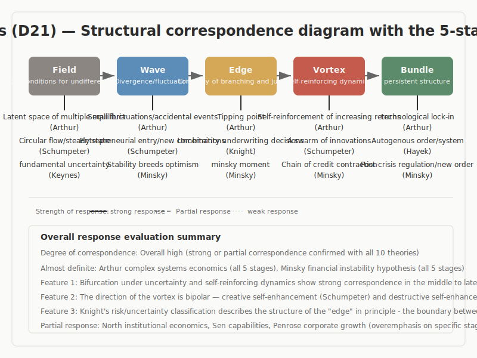

# Economics

## 1. Purpose and Research Question

This report was prepared to answer the following question.

> Do the theories in this academic domain correspond structurally to the five-stage model: Field (場), Wave (波), Edge (縁), Vortex (渦), Bundle (束)?

Theories that describe economic phenomena as generative processes are evaluated in terms of their structural correspondence to the five stages. The five lineages examined here are the Austrian school, Keynesian school, institutional school, evolutionary economics, and complexity economics.

This report presents research findings; it is not a document written to justify any particular theory. Areas of strong correspondence and areas that require reservation are described with the same degree of neutrality.

## 2. Method

### Scope and Selection Criteria

In this domain, 10 theories and practical models were selected for evaluation. The selection was based on three criteria: (1) the theory explicitly addresses processes of generation or transformation; (2) structural analysis is possible on the basis of primary sources or well-established secondary sources; and (3) different lineages within the domain can be compared.

### Evaluation Procedure

For each theory, we first explain what the theory describes and then examine where correspondence with the five stages can be identified. Judgments of correspondence are based on an integrated assessment of textual concepts, concrete cases, connections between stages, the presence or absence of circulation from Bundle to the next Field, and the risk of overinterpretation.

### Criteria of Judgment

- **Strong structural correspondence**: The core concepts of the theory correspond concretely to multiple stages of the five-stage model, and the reasons for that judgment can be explained in the main text.
- **Conditional correspondence**: A correspondence can be indicated, but interpretive reservations remain in the mapping between stages.
- **No confirmed correspondence**: Partial approximations exist, but the theory cannot be read naturally as the structure of the five stages as a whole.

### Limits of the Investigation

This investigation does not provide an exhaustive examination of every work within each theory. It focuses on the core concepts of the major works and extracts structures at a comparable level of granularity. As a result, some internal details of the theories and some disagreements in the history of doctrine are not treated exhaustively.

## 3. Overview of the Model

The five-stage model describes the process of creation through the following five stages.

| Stage | Definition |
|------|------|
| **Field** | An undifferentiated state. It refers to initial conditions in which neither direction nor structure has yet been determined. |
| **Wave** | A stage of exploration in which multiple directions diverge and differences are amplified. |
| **Edge** | A stage of tension in which opposing elements coexist without immediately converging on either side. |
| **Vortex** | A stage in which a new coherence or order emerges from within tension. |
| **Bundle** | A stage in which form becomes fixed and stabilizes as a reusable structure. |

This model is not a one-way line; it includes circulation in which Bundle becomes the condition for the next Field. The five stages should also be understood not as rigidly separated boxes but as a continuous spectrum. The model includes the hypothesis that the same structure can be repeated across different scales, from momentary thought to institutional formation to long-term historical change.

If a sense of incongruity remains at this point, that itself is an important perspective of the present investigation. Readers may proceed while retaining that sense of incongruity.

## 4. Research Findings: Overall Picture

### List of Theories Evaluated

| Theory | Proponent | Structural Correspondence |
|------|--------|----------|
| Schumpeter Creative Destruction | Schumpeter (1912, 1942) | Strong |
| Hayek Spontaneous Order and the Price Mechanism | Hayek (1945, 1973) | Strong |
| Keynes Fundamental Uncertainty and Animal Spirits | Keynes (1936, 1937) | Strong |
| Knight Risk and Uncertainty | Knight (1921) | Strong |
| Nelson & Winter Evolutionary Economics | Nelson & Winter (1982) | Strong |
| Arthur Complexity Economics and Increasing Returns | Arthur (1994, 2015) | Strong |
| North Institutional Economics | North (1990) | Strong |
| Sen Capability Approach | Sen (1999) | Strong |
| Minsky Financial Instability Hypothesis | Minsky (1986) | Strong |
| Penrose Theory of the Growth of the Firm | Penrose (1959) | Strong |

Of the 10 theories evaluated, 10 showed strong structural correspondence, 0 showed conditional correspondence, and 0 showed no confirmed correspondence. Overall, this domain displays correspondence with the five-stage model at a relatively high density, but the mode of correspondence is not uniform. Some theories describe the conditions of Field in rich detail, whereas others describe the tension of Edge or the fixation of Bundle with particular precision.

What is especially important is not the high rate of correspondence in itself, but which theory describes which stage in what vocabulary. Although all of these theories address the same broad problem of creation, they illuminate different layers of the five stages, including the body, institutions, time, perception, practice, and symbol.

## 5. Research Findings: Examination of Major Theories
### 5.1 Schumpeter Creative Destruction

Schumpeter Creative Destruction, proposed by Schumpeter (1912, 1942), holds that the fundamental driving force of economic development is endogenous change through "new combinations" (neue Kombinationen) (*Theorie der wirtschaftlichen Entwicklung*, 1912). "Creative destruction" refers to the ceaseless process by which innovation destroys existing structures and creates new industries (*Capitalism, Socialism and Democracy*, 1942).

Circular flow = equilibrium reproduction (Field) -> new combinations by entrepreneurs = disruption of equilibrium (Wave) -> credit creation and branching market acceptance = the success or failure of new combinations (Edge) -> swarming of innovations = an upswing phase of the business cycle (Vortex) -> establishment of a new industrial structure = new equilibrium (Bundle). This theory corresponds to all five stages. "Creative destruction" itself is an economic description of a stance that takes the existing order destined to be discarded up as a question. Fractality is also present: the same structural pattern recurs from the individual firm to the industry to the macroeconomy.

Within D21, this is the most comprehensive description of the "economic process of creation." Whereas other theories address particular aspects such as uncertainty, institutions, or finance, Schumpeter describes economic development itself as a creative process. Because the personal element of the "entrepreneur" lies at the core of the theory, it connects directly to a stance-centered account of creation. It is a theory of economic development within the Austrian school, a critical response to Walras's general equilibrium theory, and while acknowledging the influence of Marx on capitalism's immanent transformative power, it emphasizes entrepreneurship rather than class struggle. It is also a direct precursor of evolutionary economics.

### 5.2 Hayek Spontaneous Order and the Price Mechanism

Hayek Spontaneous Order and the Price Mechanism, proposed by Hayek (1945, 1973), argues that socially relevant knowledge is dispersed among individuals and cannot be aggregated by any central authority ("The Use of Knowledge in Society", AER 1945). The price mechanism is an information system that aggregates dispersed knowledge, producing the formation of unintended order.

The totality of dispersed knowledge = a latent knowledge space that no one can grasp in full (Field) -> fluctuations in relative prices = signals of scarcity and surplus (Wave) -> individual market transactions = points of contact where dispersed judgments "meet" (Edge) -> the self-maintaining dynamics of spontaneous order = chain reactions of price adjustment (Vortex) -> institutional order = law, custom, and market institutions (Bundle). The correspondence from Field to Wave to Bundle is structurally strong.

Within D21, this is the only theory that explicitly addresses creation without consciousness. Spontaneous order is formed without being intended by anyone. This makes it important as a test case for the lens of whether the five stages apply not only to conscious processes but also to unconscious and transpersonal ones. The concept of a "discovery procedure" also resonates structurally with a stance-centered account of creation, in that it values the unpredictability of outcomes. It belongs to the social philosophy of the Austrian school. Its direct context is the socialist calculation debate (Mises-Hayek vs. Lange). It is also congenial to Polanyi's tacit knowledge and influenced by Ferguson and the Scottish Enlightenment.

### 5.3 Keynes Fundamental Uncertainty and Animal Spirits

Keynes Fundamental Uncertainty and Animal Spirits, proposed by Keynes (1936, 1937), argues that knowledge of the future exists under "fundamental uncertainty" that cannot be reduced to probabilistic calculation ("The General Theory of Employment", QJE 1937). "Animal spirits" refers to the idea that action under uncertainty is driven not by rational calculation but by "spontaneous optimism" (*General Theory*, Ch.12).

Convention = the tacit premise that the present state will continue (Field) -> collapse of convention = abrupt change in expectations (Wave) -> animal spirits = the branching point of whether to act or to refrain in a situation that cannot be calculated (Edge) -> multiplier effects and speculative dynamics = self-reinforcing processes (Vortex) -> establishment of new conventional expectations (Bundle). The description of Edge is the most explicit in D21. Liquidity preference corresponds directly, in economic terms, to the maintenance of tension.

Within D21, this is the only theory that conceptualizes the rationality of refraining itself. Whereas Knight treats uncertainty as something to be borne, Keynes also finds rationality in not bearing it, that is, in preserving liquidity. This contrast illuminates the two-sided character of maintaining tension: preservation as preparation for creation, and preservation as avoidance of action. It forms part of the philosophical foundation of Keynesian economics. The 1937 QJE article is the clearest statement of "fundamental uncertainty." The concept was further developed by post-Keynesians such as Davidson and Shackle, and it stands in theoretical dialogue with Knight.

### 5.4 Knight Risk and Uncertainty

Knight Risk and Uncertainty, proposed by Knight (1921), distinguishes "risk" as a situation in which the probability distribution is known from "uncertainty" as a situation in which probabilistic calculation is impossible (*Risk, Uncertainty, and Profit*, 1921). The source of profit is unmeasurable uncertainty; under complete information, profit converges to zero.

An ocean of uncertainty = a domain to which probabilistic calculation cannot be applied (Field) -> the manifestation of uncertainty = the misfit of existing predictive models (Wave) -> entrepreneurial judgment = the branching point of whether to assume or suspend action in an unmeasurable situation (Edge) -> the emergence of profit = feedback resulting from having assumed uncertainty (Vortex) -> ex post verification of judgment through market selection (Bundle). The description of Edge is clear: entrepreneurial "judgment" is the core of the theory.

Within D21, this theory provides the conceptual foundation of uncertainty. Keynes's fundamental uncertainty and Minsky's endogenous instability both rely on Knight's distinction between risk and uncertainty. That distinction also anticipates a broader lens for the fate of error: risk can be processed through probabilistic calculation, whereas uncertainty cannot be eliminated and instead must be retained or assumed. This is a foundational text of the Chicago school. Knight's concept of uncertainty emerged independently and contemporaneously with Keynes (1937). Later Chicago economics, such as Friedman, moved toward reducing Knightian uncertainty to risk, departing from Knight's original intent.

### 5.5 Nelson & Winter Evolutionary Economics

Nelson & Winter Evolutionary Economics, proposed by Nelson & Winter (1982), argues that firm behavior is based on "routines." Routines are the totality of organizational memory, capability, and decision rules (*An Evolutionary Theory of Economic Change*, 1982). "Search" refers to the process by which firms look for new routines when performance falls below a satisfactory level.

The totality of existing routines = the tacit knowledge and capability base of the organization (Field) -> performance gap = deviation from the satisfactory level (Wave) -> the search process = the branching point between old and new routines (Edge) -> organizational settlement and self-reinforcement of new routines (Vortex) -> stabilization of industrial structure and technological trajectories (Bundle). This theory corresponds to all five stages. "Performance gap -> search" is the clearest organizational implementation, in D21, of starting from a perceived shortfall.

"Routine" is an organizational description of Field. Field is not empty; it is filled with the organization's tacit knowledge and capabilities. "Satisficing" means stopping at a solution that is good enough rather than pursuing optimization. This may be regarded as an organizational version of maintaining tension, though care is required because it is closer to compromise than to active suspension of closure, in line with its attribution to Simon. As a direct successor to Schumpeter, the theory shifts the focus from the "heroic entrepreneur" to "organizational search." It is a foundational text of evolutionary economics, integrating Schumpeter, Simon, and biological evolutionary theory (Darwin-Lamarck). It is positioned as a critique of the optimization assumptions of neoclassical economics and is continuous with Penrose's concept of resources.

### 5.6 Arthur Complexity Economics and Increasing Returns

Arthur Complexity Economics and Increasing Returns, proposed by Arthur (1994, 2015), develops the idea of "increasing returns": small advantages become self-reinforcing and generate lock-in (*Increasing Returns and Path Dependence in the Economy*, 1994). A "tipping point" is the critical point at which a small event determines the path in a situation where multiple equilibria are possible.

A latent space in which multiple equilibria are possible (Field) -> small fluctuations and contingent events (Wave) -> tipping point = the critical point at which the path is determined (Edge) -> self-reinforcing dynamics through increasing returns = the lock-in process (Vortex) -> establishment of technological lock-in and a dominant design (Bundle). All five stages correspond vividly. The "tipping point" is the most explicit description of Edge within D21. Fractality is also present: the same structural pattern recurs across technology, industry, and the economy as a whole.

Within D21, this theory offers the most explicit theorization of Edge. The tipping point structurally satisfies the three conditions of Edge: a network of relations through interactions among agents, indeterminacy through the coexistence of multiple equilibria, and connection to Vortex through self-reinforcement by increasing returns. "Lock-in" also demonstrates the irreversibility of Edge: once a tipping point has been crossed, shifting to another path becomes difficult. This makes it an economic test case for the contrast between spiral and circulation. It belongs to the complexity economics associated with the Santa Fe Institute and constitutes a fundamental critique of neoclassical equilibrium theory. It also connects across domains with D29 (complex systems). Historical cases such as the QWERTY keyboard and VHS versus Betamax are especially rich here.

### 5.7 North Institutional Economics

North Institutional Economics, proposed by North (1990), defines institutions as the "rules of the game" that structure human interaction. These include formal constraints such as laws and rules and informal constraints such as customs, norms, and culture (*Institutions, Institutional Change and Economic Performance*, 1990). The source of institutional change lies in changes in relative prices and changes in preferences, which generate friction with existing institutions.

Informal constraints = culture, norms, and customs (Field) -> changes in relative prices and preferences = friction with existing institutions (Wave) -> institutional innovation = the branching point at which experiments with new rules are either accepted or not (Edge) -> self-reinforcing mechanisms of institutions = path-dependent lock-in (Vortex) -> a stable institutional framework (Bundle). The theory corresponds to all five stages, but the mechanism of transition from Edge to Vortex remains theoretically underspecified.

Within D21, this theory provides the most comprehensive description of the social constitution of Field. Informal constraints such as culture and norms are the preconditions of law and the market and constitute a less visible layer of Field. It corresponds structurally to D15 Ranciere's distribution of the sensible: both the distribution of the sensible and informal constraints are invisible orders that underlie visible institutions. It belongs to new institutional economics and extends Coase's transaction cost theory to the dynamics of institutional change. North received the Nobel Prize in Economics in 1993, and the theory is related to Williamson's economics of organization.

### 5.8 Sen Capability Approach

The Capability Approach proposed by Sen (1999) defines "capability" as the combination of "functionings" a person can achieve, that is, substantive freedom (*Development as Freedom*, 1999). Development is not the growth of GDP but the expansion of substantive freedom.

Capability space = the totality of potentially achievable functionings (Field) -> deprivation = recognition of the absence of capability (Wave) -> conversion factors = the set of conditions through which resources are transformed into functionings (Edge: the intersection of the personal, the social, and the environmental) -> agency = the achievement of functionings through the exercise of freedom (Vortex) -> the achieved combination of functionings = well-being (Bundle). The structure from deprivation to capability resonates directly with a model that begins from what is lacking.

Within D21, this is the only theory that places the recognition of deprivation at the starting point of the theory. Whereas other economic theories begin from equilibrium or efficiency, Sen begins from what is missing. In that sense, it is the most direct economic embodiment of a deficiency-oriented starting point. Conversion factors also show the multivalence of Edge: even where the same resources exist, different intersections of conditions generate different results. This marks a philosophical transformation in welfare economics through a critique of utilitarianism. Sen both collaborated with and diverged from Nussbaum's list of capabilities. He received the Nobel Prize in Economics in 1998, and the approach has been implemented in the Human Development Index (HDI).

### 5.9 Minsky Financial Instability Hypothesis

The Financial Instability Hypothesis proposed by Minsky (1986) argues that stability itself generates instability. During stable periods, economic actors expand risk-taking, and financial structures become fragile (*Stabilizing an Unstable Economy*, 1986). Minsky identifies three stages of financial posture: hedge finance, speculative finance, and Ponzi finance.

Financial order in a stable period = hedge finance is dominant (Field) -> optimism generated by stability -> expanding risk-taking -> gradual fragilization of financial postures (Wave) -> Minsky moment = the critical point at which Ponzi finance collapses (Edge) -> a chain of asset sales = self-reinforcing credit contraction (Vortex) -> a new post-crisis financial order = strengthened regulation and related arrangements (Bundle). The theory corresponds to all five stages, and it is distinctive in showing that Field contains the conditions of its own destruction. Fractality is also present: the same structural pattern recurs from individual transactions to financial institutions to the financial system as a whole.

Within D21, this is the only theory that addresses endogenous instability. In contrast to Schumpeter's entrepreneur arriving as a transformative force, in Minsky the stable system itself sows the seeds of destabilization. The transition from Field to Wave is not an external shock but an immanent shift. Vortex is also distinctive here because it is destructive: whereas the vortexes in Nelson & Winter and Schumpeter are creative, Minsky's vortex is a destructive chain of credit contraction. This is a post-Keynesian theory of finance that applies Keynes's concept of uncertainty to financial markets. It was reevaluated after the financial crisis of 2008, and the term "Minsky moment" became widely used in financial journalism.

### 5.10 Penrose Theory of the Growth of the Firm

The Theory of the Growth of the Firm proposed by Penrose (1959) argues that the source of firm growth lies in the manager's recognition of "unused productive services." The same resources can provide different services (*The Theory of the Growth of the Firm*, 1959). "Subjective productive opportunity" means that growth potential depends not on objective resources but on the manager's subjective recognition.

The firm's internal pool of resources = the latent polyvalence of productive services (Field) -> the manager's subjective recognition of "unused productive services" (Wave) -> recombination of resources = the judgment point at which existing resources are redirected toward new uses (Edge) -> growth dynamics = the self-reinforcement of new uses -> new capabilities -> new recognitions (Vortex) -> an expanded set of productive opportunities = the grown firm (Bundle). The transition from Field to Wave depends not on "objective conditions" but on the manager's subjective recognition, which corresponds directly to an account centered on subjective uptake.

This theory is a precursor to the resource-based view (RBV). It directly influenced Barney's RBV and Teece's theory of dynamic capabilities, and it is also continuous with the evolutionary economics of Nelson & Winter. It is historically significant as a pioneering achievement by a woman economist.

## 6. Cross-Cutting Patterns

First, as shown by Schumpeter Creative Destruction, Hayek Spontaneous Order and the Price Mechanism, and Keynes Fundamental Uncertainty and Animal Spirits, this domain describes difference and conflict not merely as obstacles but as the conditions under which new order emerges. This means that, among the five stages, the transition from Edge to Vortex can be observed here with particular richness.

Second, what Knight Risk and Uncertainty, Nelson & Winter Evolutionary Economics, and Arthur Complexity Economics and Increasing Returns share is that generation is not a one-off event. It includes a circulation of the formation of conditions, the amplification of tension, local ordering, settlement, and the next reconfiguration. This confirms that the five-stage model must be read not as a static classification table but as temporal movement.

Even more importantly, a high correspondence rate does not mean that all theories are saying the same thing. One theory richly describes the conditions of Field; another details the tension of Edge; still another clearly shows the fixation of Bundle and the next cycle. This very difference constitutes the thickness of the domain.

## 7. Unresolved Questions

1. Is the correspondence found in each theory a stage structure immanent to the theory itself, or is it a structure extracted by the analyst?

2. To what extent can the structure confirmed in this domain be extended from the explanation of particular cases to a more general model of generation? The conditions under which comparability can be preserved without losing the specificity of the objects still require careful examination.

3. Should the five stages be read as a linear progression, or as a circulation involving multiple temporal layers and repetition? In particular, there are differences in the degree to which each theory explicitly articulates the return from Bundle to the next Field.

4. What becomes visible, and what is lost, when the vocabulary specific to this domain is translated into the general vocabulary of the five stages? The boundary between translatability and untranslatability is itself an important issue for future comparative inquiry.

## 8. Conclusion

In this reexamination of the domain, strong structural correspondence was confirmed for 10 of the 10 theories, and conditional correspondence for 0. In particular, Schumpeter Creative Destruction, Hayek Spontaneous Order and the Price Mechanism, and Keynes Fundamental Uncertainty and Animal Spirits provide especially thick descriptions of the movement from Field to Edge, or from Edge to Vortex, and therefore stand as the domain's central evidence.

At the same time, the findings in this domain do not claim that the same five stages appear in exactly the same way in every theory. The stages that appear most strongly differ from theory to theory, and some cases still require reservations in stage mapping. What matters, therefore, is not generalizing directly from the high rate of correspondence, but continuing to compare which moments are described in which vocabulary.

In that sense, this domain not only supports the validity of the five-stage model in one direction; it is also a domain that imposes conditions on how the model should be read. The very fact that theories with thick correspondence and theories requiring reservation are both present is part of what gives value to this comparative investigation.
