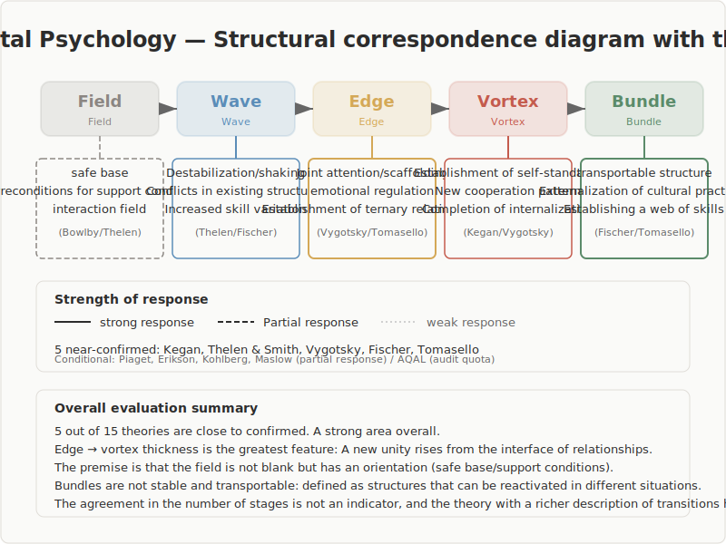

# Developmental Psychology

## 1. Purpose and Question

This report examines whether major theories in developmental psychology structurally correspond to the five-stage model of Field, Wave, Relation, Vortex, and Bundle. The question is not which theory is superior, nor whether every theory can be merged into one system. The question is narrower: do these theories describe change as a sequence in which an undifferentiated state gives way to difference, difference is reorganized through relations, a coherent structure emerges, and that structure is then retained?

For that reason, this report does not treat developmental psychology as a single voice. It asks where the correspondence is strong, where it is partial, and what kind of vocabulary developmental psychology offers for making the five-stage model more precise.

## 2. Method

The survey covered 15 theories across structural-developmental theory, self-development theory, sociocultural theory, attachment theory, infancy research, dynamic systems theory, and moral development theory. Theories by Kegan, Rochat, Luyckx, Thelen and Smith, Piaget, Vygotsky, Bowlby, Erikson, Maslow, Cook-Greuter, Wilber, Fischer, Stern, Tomasello, and Kohlberg were reviewed.

The comparison did not rely on matching stage counts. Instead, it focused on four questions. First, does a theory describe development as structural transformation rather than mere accumulation of content? Second, does it identify a phase in which difference or tension is reorganized through relations? Third, does that reorganization lead to the emergence of a new coherence? Fourth, is the process open to observation or measurement?

At the same time, the structural correspondences proposed in this report are interpretive hypotheses based on the survey data, not definitive mappings established through exhaustive close reading of the primary texts. Much of the correspondence work includes AI-assisted interpretation, and there remain places where the author's own close verification is not yet complete. In addition, the alignment of the labels Field, Wave, Relation, Vortex, and Bundle is gradient rather than exact, so the comparison does not assume a strict one-to-one mapping for every concept.

## 3. Overview of the Model

In this report, the five-stage model is defined as follows. Field is a still-undifferentiated condition in which possibilities exist without clear separation. Wave is the phase in which differences, tensions, and directional pulls come to the foreground. Relation is the interface where multiple elements meet and where rules, constraints, and connections begin to form. Vortex is the rise of a coherent organization or prototype. Bundle is the retention of that organization as a structure that can be carried forward and reused.

These stages are read as a cycle rather than a straight line. Bundle is not a terminal point. It becomes the support for the next Field. If these definitions feel unfamiliar, that tension is itself part of what the survey is testing. The findings below show where that tension is resolved by developmental psychology and where it remains open.

## 4. Findings: Overall Picture

Across the 15 theories, 9 showed strong structural correspondence and 6 showed conditional correspondence. As a whole, developmental psychology tends to describe development as transformation of structure rather than accumulation of content, and that makes it broadly compatible with the five-stage model.

The sharpest correspondences appeared in Kegan, the dynamic systems approach, Vygotsky, and Tomasello. In those theories, the phase corresponding to Relation is not a thin boundary. It is the site where a new order is generated through interaction. By contrast, theories such as Maslow or Wilber offer developmental ordering or broad conceptual organization, but give a weaker account of the relational interface and of the mechanism of transition. Their correspondence is therefore more limited.

Another important result is that developmental psychology offers many observable vocabularies: the Subject-Object Interview, zone-of-proximal-development tasks, the Strange Situation procedure, joint-attention studies, and sentence-completion measures. This gives the five-stage model a way to connect with observable developmental processes instead of remaining only at the level of abstraction.

## 5. Findings: Major Insights

The discussions below are interpretive readings grounded in the method described in Section 2. They show how AI read the structural features of each prior theory and then attempted a comparison with the five-stage model.

### 5.1 Kegan's Structural Developmental Theory

Kegan presents development as a change in what is embedded in the self and what becomes available for reflection as object. His orders of consciousness form a developmental sequence, most adults are placed around orders 3 and 4, and order 5 remains relatively rare. The process is not only conceptual; it is linked to an interview-based method of assessment.

In this report's reading, the core of the theory lies not in differences in developmental content but in changes in the relational structure of what remains embedded in the self and what becomes available for reflection. The strongest similarity is not simple label matching but the isomorphism of the mechanism by which what had been subject becomes object, together with the ordered process from embeddedness to differentiation and reintegration. Especially important is the way the self is first formed in a web of reciprocity with others and only later coheres into a principle of its own.

On that basis, early embeddedness resembles Field. The emergence of differentiated needs and tensions resembles Wave. Order 3, where the self is formed in a web of interpersonal relations, is especially close to Relation. Order 4, where a self-authored principle coheres, resembles Vortex. Order 5, where multiple self-systems interpenetrate, resembles Bundle. The shift from order 3 to 4 shows especially strong functional equivalence because a self previously embedded in relations becomes a coherent principle of its own.

The implication is that developmental psychology does more than provide stage labels. It helps specify how transformation happens. Instead of asking only where a person is, it becomes possible to ask what is still embedded and what is becoming reflectable.

### 5.2 Vygotsky's Zone of Proximal Development

Vygotsky describes development as the difference between what a learner can do alone and what becomes possible with the assistance of a more capable other. Scaffolding is the educational practice of adjusting that support and eventually removing it. Development proceeds through the internalization of social interaction.

In this report's reading, the core of the ZPD is that capacity does not first mature inside the individual and then get expressed. It is first generated at the interface of joint activity and only later internalized. The strongest similarity lies less in label matching than in the isomorphic mechanism by which capability emerges between support and resistance, and in the ordered process from joint performance to self-regulation. Scaffolding appears here not as an external aid but as an operation that makes the central developmental mechanism visible.

On that basis, the range of what can already be done alone functions as Field. Encountering a task that cannot yet be reached alone is Wave. The coordinated tension of joint performance is Relation. The shift from outer dialogue to self-regulation is Vortex. The stabilization of that regulation as reusable capacity is Bundle. Here, relation is not a mere medium. It is the site where new capability is generated.

The implication is that Relation should not be treated as a merely social supplement to an inner process. It is the place where new capability is generated.

### 5.3 Bowlby's Attachment Theory

Bowlby argues that attachment to a caregiver functions as a secure base that makes exploration possible. Repeated experiences of exploration and return are integrated into internal working models, and these patterns shape later relationships. The Strange Situation procedure is a classic observational setting for this process.

In this report's reading, the secure base is not a mere starting point but a relational ground that sustains repeated movement between exploration and return. The core is the emotionally regulated judgment between approaching the unknown and retreating, and the accumulation of those experiences into an internal working model. The strongest similarity lies less in label matching than in the ordered process of exploration, anxiety, and integration, and in the functional equivalence of a relational base that makes the next exploration possible.

On that basis, Field is not an empty starting point. It is a reliable relational ground that supports movement into the unknown. Leaving that secure base is Wave. The emotionally charged moment of approaching novelty or returning for safety is Relation. The integration of those experiences into an internal working model is Vortex. Their stabilization into enduring attachment patterns is Bundle. Bundle then supports the next round of exploration, which makes the cycle visible.

The implication is that the beginning of change is not best described as neutral openness. It is better described as relational safety that makes exploration possible.

### 5.4 Tomasello's Shared Intentionality and Joint Attention

Tomasello argues that around 9 to 12 months, infants acquire new forms of joint attention and intention understanding, and that these become the basis of language, norms, and cultural learning. Joint attention is not a simple dyadic exchange. It is a triadic relation among child, other, and object.

In this report's reading, the core of the theory is not emotional contact with another person but the emergence of a shared world through an object. The strongest similarity lies less in label matching than in the functional equivalence of a triadic structure that jointly organizes meaning and roles, and in the ordered process from shared attention to shared goals and then to cultural practice. Joint attention is therefore read not as simultaneous looking alone but as the moment in which doing something together takes form.

On that basis, an interaction in which no shared object is fixed yet is Field. The appearance of a difference in attention or intention is Wave. The formation of joint attention, where attention becomes jointly organized around the same object and coordinated action becomes possible, is Relation. Shared goals and symbol use rise as Vortex. Language, norms, and role expectations endure as Bundle.

The implication is that Bundle does not remain only inside an individual. It can persist outside the individual as a practice, a norm, or an institution. That makes the five-stage model useful not only for individual development but also for shared world-making.

### 5.5 Cook-Greuter's Ego Development Theory

Cook-Greuter extends the Loevinger tradition by describing development beyond the autonomous stage with greater precision. Sentence-completion measures are used for assessment, and most adults are placed in conventional or conscientious stages, while later stages remain relatively rare.

In this report's reading, the core of the theory is not the accumulation of developmental content but the process by which self-structure itself becomes an object of awareness and is eventually loosened. The strongest similarity lies less in label matching than in the isomorphic mechanism by which an organized self can take itself as object, and in the ordered process from integration to reflexivity and then to return into a larger background. The post-autonomous stages are especially important because they show retained structure reopening the conditions for another round of formation.

On that basis, the tensions of difference and norm that come to the foreground from the conformist to the conscientious range are closest to Wave and Relation. At the autonomous stage, the self coheres and approaches Vortex. At the construct-aware stage, that very structure becomes an object of awareness. At the unitive stage, the established structure appears to dissolve back into a larger background. In that sense, Bundle is not mere fixation. It is retained structure becoming reflexive, and beyond that reflexivity lies a higher-order return to Field.

The implication is that the five-stage model should not be read as a ladder with a final endpoint. Developmental psychology gives a vocabulary for understanding Bundle as reflexive retention that can reopen the cycle.

## 6. Cross-Domain Patterns

First, developmental psychology repeatedly describes development as the reorganization of structure rather than the accumulation of content. Kegan, Cook-Greuter, Piaget, and Fischer all focus on how experience is organized, not simply on what is learned.

Second, Relation is central in many of the theories, but its form changes. In Vygotsky it appears as the interface of assistance and internalization. In Tomasello it appears as triadic joint attention. In Bowlby it appears as the emotionally charged judgment between exploration and return. In Stern it appears as affective attunement in the formation of self-sense. Relation is therefore not just a boundary line. It is the place where the form of relation itself changes.

Third, transition is often best understood as dynamic reorganization. The dynamic systems approach and Piagetian equilibration both describe change as fluctuation, competition, and the emergence of a new stability. This suggests that the five-stage model is more accurate when read as a recurring schema of reorganization than as a fixed sequence of slots.

Fourth, Bundle has wider meanings than simple closure. In attachment theory it appears as an internal working model. In Tomasello it appears as language and norm-governed practice. In Cook-Greuter it appears as reflexive structure. Bundle is therefore best understood as a mode of retention that supports the next cycle of transformation.

## 7. Unresolved Questions

- When an eight-stage or multi-level theory is mapped onto five stages, where does genuine structural correspondence end and flexible relabeling begin?
- Can dyadic relations, triadic relations, and larger multi-variable systems all be described with the same concept of Relation without losing precision?
- Can Bundle be treated as the same stage when it refers to inner retention in one theory and to institutional or cultural retention in another?
- How far can the return from Bundle to Field be tracked empirically as a recurring process across the lifespan?

## 8. Conclusion

The structural correspondence between developmental psychology and the five-stage model is, overall, moderate to strong. The strongest point of contact lies in the way developmental psychology describes structural transformation and in the way it gives a rich vocabulary for Relation as the central phase of generation. Kegan clarifies transition mechanism, Vygotsky clarifies relational production of capacity, Bowlby clarifies the nature of Field as secure ground, Tomasello clarifies Relation as shared world formation, and Cook-Greuter clarifies Bundle and higher-order return.

At the same time, not every theory offers a clean one-to-one match across all five stages. Some have mismatched stage counts, some treat Relation only weakly, and some say little about long-term retention. The conclusion, then, is not that developmental psychology proves the five-stage model once and for all. It is that developmental psychology supplies a rich set of concepts and observational frames for making the model more precise in practice. Confidence is highest around Relation and around stage transition. Full one-to-one alignment across all theories remains an open question.

## Colophon

- generator_model: codex:gpt-5
