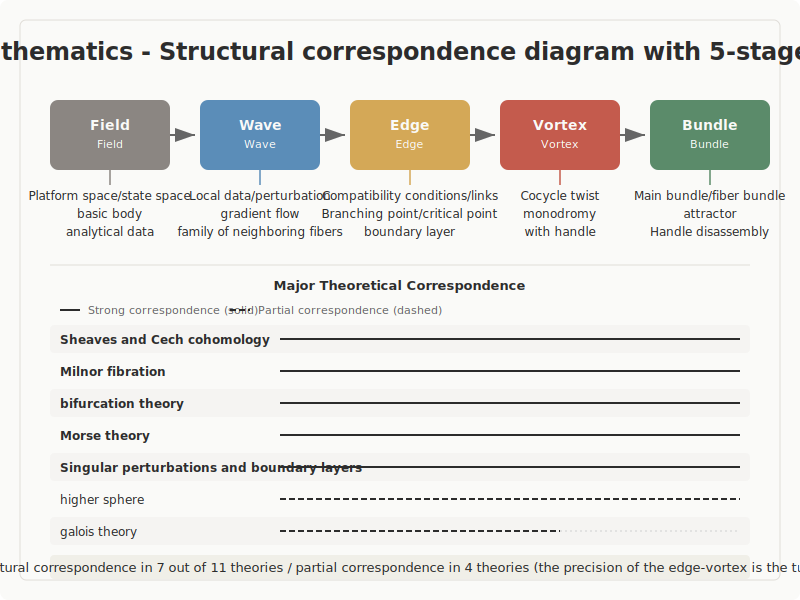

## Mathematics

A structural correspondence study with the 5-Stage Model (Field · Wave · Edge · Vortex · Bundle)

---

## Overview of the Study

- **Scope**: 11 major theories in mathematics
- **Research question**: Do mathematical theories correspond structurally with the 5-Stage Model?
- **Results**: Strong correspondence in 7 cases, partial correspondence in 4 cases

---

## Structural Correspondence Diagram

---

## Overview of the 5-Stage Model

| Stage | Definition |
|-------|-----------|
| Field (ba) | Undifferentiated state. The initial condition in which neither direction nor structure has yet been determined |
| Wave (nami) | The stage of exploration in which multiple directions diverge and compete |
| Edge (en) | A state of tension in which opposing elements coexist without converging on either side. The place where they meet at a boundary, influence each other, and relationships emerge |
| Vortex (uzu) | The stage in which new coherence (order) spontaneously arises from within the tension |
| Bundle (taba) | The stage in which form is fixed and stabilizes as a reusable structure |

---

## Overview of Structural Correspondences

| # | Theory / Concept | Proponent(s) | Corresponding Stages | Assessment |
|---|---|---|---|---|
| 1 | Spinors and 720-degree rotation | Élie Cartan, Wolfgang Pauli et al. | Field, Wave, and Bundle are relatively clear; the positioning of Edge and Vortex requires continued verification | Partial correspondence confirmed |
| 2 | Julia sets and dynamics on the boundary | Gaston Julia, Pierre Fatou | Field · Wave · Edge · Vortex · Bundle | Strong structural correspondence confirmed |
| 3 | Sheaves and Čech cohomology | Jean Leray, Eduard Čech, Alexander Grothendieck et al. | Field · Wave · Edge · Vortex · Bundle | Strong structural correspondence confirmed |
| 4 | Milnor fibration | John Milnor | Field · Wave · Edge · Vortex · Bundle | Strong structural correspondence confirmed |
| 5 | Higher categories | Samuel Eilenberg, Saunders Mac Lane et al. | Field through Bundle are readable, but the latter stages rely increasingly on abstract metaphor | Partial correspondence confirmed |
| 6 | Galois theory | Évariste Galois | Field, Wave, Edge, and Bundle are traceable, but the Vortex mechanism is weak | Partial correspondence confirmed |
| 7 | Bifurcation theory | Henri Poincaré et al. | Field · Wave · Edge · Vortex · Bundle | Strong structural correspondence confirmed |
| 8 | Persistent homology | Herbert Edelsbrunner, Gunnar Carlsson, Robert Ghrist | Field · Wave · Edge · Vortex · Bundle | Strong structural correspondence confirmed |
| 9 | Singular perturbation and boundary layers | Ludwig Prandtl et al. | Field · Wave · Edge · Vortex · Bundle | Strong structural correspondence confirmed |
| 10 | Hodge theory | W. V. D. Hodge | Field, Wave, Edge, and Bundle are visible, but the independence of Vortex is weak | Partial correspondence confirmed |
| 11 | Morse theory | Marston Morse | Field · Wave · Edge · Vortex · Bundle | Strong structural correspondence confirmed |

---

## Key Entry 1: Sheaves and Čech Cohomology

- **As fact**: A presheaf is defined as a contravariant functor from the category of open sets to sets, groups, or similar structures. For it to become a sheaf, local data must agree on overlaps, and those agreeing local data must be glueable into a single global datum. The crucial point is that mere enumeration of local information is insufficient for a sheaf — agreement conditions on overlaps are a prerequisite.
- **As reading**: The level of analogy is structural. What is visible here is that local data does not directly become global data; rather, a global object is established only by passing through agreement conditions on overlaps. The sequence — local, overlap, cocycle, global object — is made explicit, and the fact that the role of each stage is difficult to interchange is what gives this theory its strength.
- **As interpretation**: The correspondence with the 5 stages is clearest when Field is read as the base space, Wave as local data, Edge as the agreement conditions on overlaps, Vortex as twisting captured by non-trivial cocycles, and Bundle as the global sheaf or principal bundle. Since "Bundle" appears here as a literal bundle, the final stage of the 5-Stage Model is not merely metaphorical.

---

## Key Entry 2: Milnor Fibration (John Milnor)

- **As fact**: In the neighborhood of an isolated singularity of a complex hypersurface, the complement of the link — obtained from the intersection of a small sphere with the singular fiber — fibers over the circle. What Milnor showed is a theorem stating that a fiber bundle structure over the entire complement arises from the analytic data near the singularity.
- **As reading**: The level of analogy spans both mechanism and structure. The analytic data near the singularity does not transform directly into a bundle; rather, the global structure emerges via the link — a boundary object — and monodromy — the action of traversing around it. Here "boundary" and "circular action" are connected, with Edge and Vortex clearly distinguished yet joined.
- **As interpretation**: In the 5-stage framework, it is natural to read Field as the analytic data, Wave as the family of nearby fibers, Edge as the link, Vortex as the monodromy, and Bundle as the fiber bundle over the circle. Since the final stage is guaranteed by the form of a theorem, this is one of the theories in the mathematical domain where "Bundle" literally stands in the most direct sense.

---

## Key Entry 3: Bifurcation Theory (Henri Poincaré et al.)

- **As fact**: Bifurcation theory deals with phenomena in which the number or stability of solutions changes qualitatively as a parameter varies continuously. In saddle-node bifurcation, a stable and an unstable fixed point collide and annihilate; in Hopf bifurcation, a periodic orbit is born from a steady solution. Bifurcation diagrams are the standard tool for visualizing these changes in parameter space.
- **As reading**: The level of analogy is process. In bifurcation theory, Field, Wave, Edge, Vortex, and Bundle appear side by side within the same diagram, ordered by time or by parameter. The causal chain of change is clear: Field is the entire parameter space, Wave is fluctuation or perturbation, Edge is the bifurcation point where multiple solutions compete, Vortex is the reorganization of solutions, and Bundle is the new stable state.
- **As interpretation**: The correspondence with the 5 stages is most natural when Field is read as parameter space, Wave as perturbation, Edge as the bifurcation point, Vortex as the separation or periodization of solutions, and Bundle as the new attractor. Because the entire 5-stage sequence can be traced as a single dynamical chain, this is one of the theories in mathematics most suited to displaying the process of change.

---

## Cross-Cutting Patterns

- The pattern that appears most prominently across mathematics is that "Edge is generative." Overlaps, links, bifurcation points, critical points, and boundary layers all appear not as lines that halt change, but as sites of action that determine global structure.
- Strong correspondences fall broadly into two lineages. One connects the local to the global — as in sheaf theory and singular perturbation. The other involves reorganization through passage through criticality — as in bifurcation theory and Morse theory.
- In mathematics, the Vortex becomes strong when it can be written as an operation such as a cocycle, monodromy, handle attachment, or matching — not as vague fluctuation. In other words, the more a theory can describe the Vortex as an independent operation, the stronger its correspondence with the 5-Stage Model.
- Bundle appears frequently not as a metaphorical "coherence" but as a literal bundle, global object, stable state, or unified solution. For this reason, in mathematics the final stage tends to be the most concrete, which in turn allows the validity of readings at intermediate stages to be checked in reverse.

---

## Open Questions

- How far the agreement conditions on overlaps, singular links, bifurcation points, critical points, and boundary layers can be unified under a single definition of "Edge" remains unresolved. The commonality is high, yet the thickness of undecidability differs from theory to theory.
- Whether circular actions such as monodromy, topological operations such as handle attachment, and asymptotic connections such as matching can all be treated as the same "Vortex" requires further examination. There is room to distinguish theories in which circulation is essential from those in which reorganization is essential.
- Whether the 5 stages should be read as five discrete boxes or as names for salient phases within continuous change has not been settled even within mathematics. Bifurcation theory and persistent homology handle continuous quantities, which poses this question acutely.
- A decision is also needed on whether the four theories with only partial correspondence — higher categories, Galois theory, Hodge theory, and spinors — should be used as counterexample candidates going forward, or whether refining the mapping conditions could elevate them to strong candidates.

---

## Conclusion

- This study confirms that mathematics is overall a domain in which structural similarity with the 5-Stage Model is well-supported
- At the same time, what mathematics has shown is not that "one need only search for five names"
