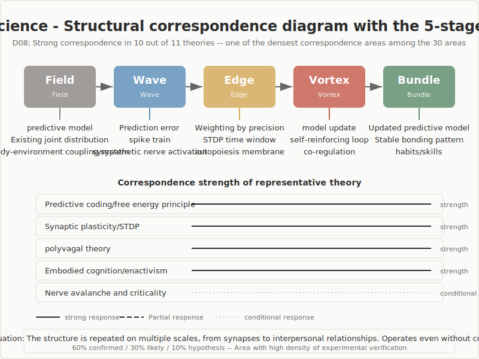

## Neuroscience

Survey of structural correspondence with the 5-stage model (Field · Wave · Edge · Vortex · Bundle)

---

## Survey Overview

- **Scope**: 11 major theories in neuroscience
- **Research question**: Do neuroscientific theories correspond structurally to the 5-stage model?
- **Results**: Strong correspondence in 10 cases, conditional correspondence in 1 case
- **Temperature distribution**: Approximately 60% near-confirmed findings, 30% well-supported findings, 10% at hypothesis stage
- This domain showed one of the densest structural correspondences among all 30 domains surveyed

---

## Structural Correspondence Diagram

---

## Overview of the 5-Stage Model

| Stage | Definition |
|-------|------------|
| Field (ba) | Undifferentiated state. Initial condition in which neither direction nor structure has yet been determined |
| Wave (nami) | Exploration stage in which multiple directions diverge and compete |
| Edge (en) | Tension state in which opposing elements coexist without converging on either side. The place where things meet at a boundary, influence each other, and relationships are formed |
| Vortex (uzu) | Stage in which new coherence (order) spontaneously emerges from tension |
| Bundle (taba) | Stage in which form is fixed and stabilized as a reusable structure |

---

## Overview of Structural Correspondences

| # | Theory / Concept | Key Researchers | Corresponding Stages | Judgment |
|---|-----------------|-----------------|---------------------|----------|
| 1 | Predictive coding / Free energy principle | Friston, Clark, Rao & Ballard | Field · Wave · Edge · Vortex · Bundle | Strong |
| 2 | Interoception and interoceptive inference | Craig, Seth, Barrett | Field · Wave · Edge · Vortex · Bundle | Strong |
| 3 | Constructed emotion theory | Barrett, Damasio, LeDoux | Field · Wave · Vortex · Bundle | Strong |
| 4 | Executive function and cognitive control | Miller & Cohen, Botvinick, Aron | Wave · Edge · Vortex · Bundle | Strong |
| 5 | Consciousness and global workspace | Dehaene, Tononi, Seth | Cross-cutting (threshold condition) | Strong |
| 6 | Sleep, dreams, and the prediction-error loop | Hobson, Nir & Tononi, Domhoff | Field · Wave · Vortex | Strong |
| 7 | Polyvagal theory | Porges | Field · Wave · Edge · Vortex · Bundle | Strong |
| 8 | Embodied cognition / Enactivism | Varela, Thompson, Maturana | All stages (cross-cutting) | Strong |
| 9 | Synaptic plasticity / STDP | Bliss & Lomo, Markram, Bi & Poo | Field · Wave · Edge · Vortex · Bundle | Strong |
| 10 | Neural oscillations and coherence | Fries, Canolty | Field · Wave · Edge · Vortex · Bundle | Strong |
| 11 | Neural avalanches and criticality | Beggs & Plenz | Field · Wave · Edge · Vortex · Bundle | Conditional |

---

## Key Entry 1: Predictive Coding and the Free Energy Principle

- **Summary**: The brain does not passively wait for sensory input; it continuously predicts what input will arrive next. Higher layers send predictions downward, while lower layers return prediction errors — a bidirectional process (Rao & Ballard 1999, Friston 2010)
- **Structural correspondence**: All 5 stages
  - The existing predictive model as a whole corresponds to the **Field**
  - The mismatch between predictions and sensory input corresponds to the **Wave**
  - The precision-weighted filtering of which errors to register corresponds to the **Edge**
  - Revision of the existing model corresponds to the **Vortex**
  - Stabilization of the new predictive model corresponds to the **Bundle**
- **Note**: Reading precision as Edge remains open to debate. Precision functions primarily as a control parameter, and there is some distance between that characterization and the Edge description of "meeting at a boundary and mutually influencing each other"

---

## Key Entry 2: Synaptic Plasticity and STDP

- **Summary**: The difference in firing timing (tens of milliseconds) between pre- and postsynaptic neurons determines whether synaptic connections are potentiated or depressed (Markram et al. 1997, Bi & Poo 1998)
- **Structural correspondence**: All 5 stages
  - The existing distribution of synaptic connections corresponds to the **Field**
  - The spike train as a temporal event corresponds to the **Wave**
  - The relative timing of pre- and postsynaptic firing corresponds to the **Edge** (a relational quantity that determines direction)
  - The self-reinforcing loop through repetition corresponds to the **Vortex**
  - The stable connection pattern as a trace of learning corresponds to the **Bundle**
- **Note**: This process occurs without consciousness. Structural change is directed solely by a physical quantity — the time difference — making this an important case demonstrating that the 5-stage structure can operate even at levels that do not presuppose consciousness

---

## Key Entry 3: Polyvagal Theory

- **Summary**: The autonomic nervous system comprises three hierarchical systems (dorsal vagal system, sympathetic nervous system, ventral vagal system), each supporting different behavioral strategies (Porges 2011)
- **Structural correspondence**: All 5 stages
  - The safe relational field established by activation of the ventral vagal system corresponds to the **Field**
  - Sympathetic activation and bodily arousal correspond to the **Wave**
  - Autonomic regulation at the boundary with another person corresponds to the **Edge**
  - Synchrony and co-regulation between the autonomic nervous systems of two individuals corresponds to the **Vortex**
  - The establishment of a relationship as a secure base corresponds to the **Bundle**
- **Note**: This demonstrates that the Edge operates at the bodily boundary with another person. The events described take place between bodies, mediated by the physiological mechanism of the autonomic nervous system

---

## Key Entry 4: Embodied Cognition and Enactivism

- **Summary**: Cognition is not the product of the brain alone; it arises from the interaction of brain, body, and environment (Varela, Thompson & Rosch 1991). Autopoiesis refers to the organizational pattern by which life generates and maintains itself
- **Structural correspondence**: Cross-cutting across all stages
  - The coupled system of body and environment corresponds to the **Field**
  - Sensorimotor exploration corresponds to the **Wave**
  - The autopoietic "membrane" (the boundary between body and environment) corresponds to the **Edge**
  - The generation of meaning through action corresponds to the **Vortex**
  - Stabilization as habit or skill corresponds to the **Bundle**
- **Note**: The structure of "meeting at a boundary and mutually influencing each other" repeats isomorphically at different scales — from the cell membrane to the body, from the body to the environment. This supports the possibility that the 5-stage model is a scale-independent structural description

---

## Structural Correspondence in Detail

| Stage | Correspondence in This Domain | Representative Theories / Concepts |
|-------|-------------------------------|-------------------------------------|
| Field | Existing predictive model, safe relational field, background rhythm, connection distribution | Predictive coding, Polyvagal theory, CTC, STDP |
| Wave | Generation of prediction error, arousal and exploration, spike trains, oscillations | Predictive coding, Polyvagal theory, STDP, CTC |
| Edge | Precision-weighted filtering, direction determined by time difference, phase synchrony, autonomic co-regulation with others | Predictive coding, STDP, CTC, Polyvagal theory |
| Vortex | Model revision, self-reinforcing loop, phase-locking entrainment, co-regulation | Predictive coding, STDP, CTC, Polyvagal theory |
| Bundle | New predictive model, stable connection pattern, establishment of relationship | Predictive coding, STDP, Polyvagal theory |

---

## Cross-Cutting Patterns

- **"Relationship determines direction" structure**: In STDP, the time difference in firing; in CTC, phase synchrony; in polyvagal theory, autonomic entrainment — each uses a different physical quantity to select the direction of structural change. The Edge is not a specific mechanism but a structural feature: "selection through relationship"
- **Scale invariance**: The pattern of "detection of difference, formation of relationship, structural change" repeats isomorphically from the synapse (milliseconds) to interpersonal relationships (years)
- **Relationship to consciousness**: STDP executes structural change without consciousness. The 5-stage structure operates regardless of whether consciousness is present; consciousness is positioned as part of the process, not as a prerequisite
- **Field as precondition**: The Field is not a blank starting point but a state in which the conditions for receiving change are in place. Safety (polyvagal theory) and proximity to criticality (neural avalanches) correspond to those conditions

---

## Open Questions

- How to formally characterize the structural feature common to multiple implementations of the Edge (time difference, phase synchrony, social engagement)
- The validity of reading precision as Edge — the tension between its character as a control parameter and the Edge description
- Establishing the independence of neural avalanches and criticality from complexity science (SOC)
- Integrating criticisms of the neuroanatomical details of polyvagal theory (e.g., Grossman & Taylor 2007)
- The isomorphism of the 5-stage structure across levels with and without consciousness is well-supported but still at the hypothesis stage

---

## Conclusion

- Neuroscience is one of the domains with the densest structural correspondence to the 5-stage model among all 30 domains. Strong correspondence was confirmed in 10 out of 11 cases
- **Most noteworthy findings**:
  1. The "relationship determines direction" structure appears repeatedly across different scales — from the synapse to interpersonal relationships
  2. The 5-stage structure does not presuppose consciousness. Synaptic plasticity executes structural change without consciousness
  3. The Field is not a blank starting point but a state in which the conditions for receiving change are in place
- **Temperature disclosure**: Near-confirmed findings (predictive coding, synaptic plasticity, etc.) account for approximately 60%; well-supported but still-being-verified findings (causal relationships in CTC, details of polyvagal theory, etc.) for approximately 30%; hypothesis-stage findings for approximately 10%
