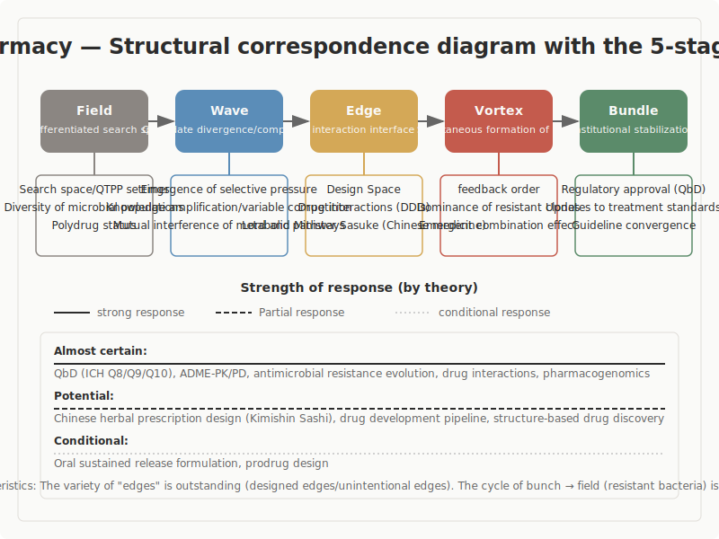

## Pharmacy

Structural correspondence survey with the five-stage model (Ba, Nami, En, Uzu, Taba)

---

## Survey Overview

- **Scope**: 10 major theories in pharmacy
- **Research question**: Do theories in pharmacy structurally correspond to the five-stage model?
- **Results**: Conditional correspondence 1

---

## Structural Correspondence Diagram

---

## Overview of the Five-Stage Model

| Stage | Definition |
|-------|-----------|
| Ba (Field) | An undifferentiated state. Initial conditions where neither direction nor structure has yet been determined |
| Nami (Wave) | A stage of exploration where multiple directions diverge and compete |
| En (Edge) | A state of tension where opposing elements coexist without converging to either side. A place where elements meet at boundaries, influence each other, and relationships emerge |
| Uzu (Vortex) | A stage where new coherence (order) spontaneously arises from within tension |
| Taba (Bundle) | A stage where form is established and stabilizes as a reusable structure |

---

## Overall Structural Correspondence

| Temperature | Theory/Concept | Assessment |
|---|---|---|
| Near-definitive | QbD (ICH Q8/Q9/Q10), ADME-PK/PD, antimicrobial resistance evolution, drug interactions, pharmacogenomics | Correspondence across all five stages is clear, with particularly concrete descriptions of En |
| Probable | Kampo prescription design (jun-chen-zuo-shi), drug development pipeline, structure-based drug discovery | Correspondence exists, but interpretive gaps remain in the quality of En and earlier stages |
| Conditional | Oral sustained-release formulations, prodrug design | Procedural correspondence is solid, but there is interpretive room in the connection between "control/design" and "generation" |

---

## Key Entry 1: QbD: Quality by Design (ICH Q8/Q9/Q10)

- QbD (Quality by Design) is a quality assurance philosophy that builds pharmaceutical quality into the design stage of development rather than relying on post-manufacturing inspection. Led by the FDA and ICH (International Council for Harmonisation of Technical Requirements for Pharmaceuticals for Human Use) in the 2000s, it was institutionalized as ICH Q8 (Pharmaceutical Development), Q9 (Quality Risk Management), and Q10 (Pharmaceutical Quality System). The core concept of Design Space is officially defined as "the multidimensional combination and interaction of input variables and process parameters that have been demonstrated to provide assurance of quality" (ICH Q8(R2), 2009).
- **As fact**: ICH Q8(R2) specifies a process beginning with the setting of QTPP (Quality Target Product Profile), proceeding through knowledge accumulation via development studies to the establishment of Design Space, the formulation of a Control Strategy, regulatory approval, and continuous improvement throughout the product lifecycle. Q9 prescribes a cyclical process of risk assessment and management, while Q10 defines a quality system covering the entire pharmaceutical lifecycle.
- **As reading**: Here we note that the vocabulary of the ICH official definition itself structurally corresponds to the five-stage model. The level of similarity is structure. The fact that "interaction" is explicitly stated in the official definition of Design Space, that operations within the Space institutionally guarantee an "undecided permissible range," and that the risk cycle of Q9 and the continuous improvement of Q10 form a dynamic feedback loop represent not merely label similarity but correspondence in the placement relationship of processes.
- **As interpretation**: Setting the QTPP corresponds to Ba (establishing quality goals as initial conditions); knowledge amplification through development studies corresponds to Nami (exploration where multiple variables compete and diverge); Design Space corresponds to En (a space where interactions among multiple variables coexist); the Q9 risk cycle and Q10 continuous improvement correspond to Uzu (dynamic order formation through feedback); and the Control Strategy and post-approval operations correspond to Taba (an institutionally stable management structure).
- What makes QbD particularly important in this survey is that the word "interaction" is included in the official definition of a regulatory document. This means that pharmacy is describing the structure that the five-stage model's En points to using its own institutional vocabulary. Rather than merely "resembling" the model, this is a rare case where the reading is "writing the same structure in the language of regulation."

---

## Key Entry 2: Antimicrobial Resistance Evolution: Solutions Generate New Problems

- Antimicrobial resistance is the phenomenon by which resistant mutants proliferate and spread within a population due to the selective pressure of antimicrobial use. Resistance genes spread across species through horizontal gene transfer (via plasmids and similar mechanisms). This was already warned about in Fleming's 1945 Nobel Prize lecture, and the WHO continues to pursue countermeasures as a top priority (Davies & Davies, 2010).
- **As fact**: When antimicrobials are administered, susceptible bacteria die while bacteria with resistance mutations survive. Resistance genes transfer to other bacterial species via plasmids and similar vehicles through horizontal gene transfer. The cycle of new drug development, emergence of resistant bacteria, and revision of treatment guidelines repeats on a timescale of decades.
- **As reading**: Here we note the cyclical structure in which "a solution (new drug) generates a new problem (resistant bacteria) and becomes the starting point of the next cycle." The level of similarity is process, and particularly important is the explicit traceability of the circulation from Taba back to Ba. The same cycle occurs at multiple scales, from molecular-level mutations to selection within bacterial populations to updates in public health institutions.
- **As interpretation**: The diverse microbial population with varying susceptibility corresponds to Ba; the emergence of selective pressure through antimicrobial administration corresponds to Nami; horizontal gene transfer via plasmids corresponds to En (movement of genes through interspecies relationships); the dominance and self-organization of resistant clones corresponds to Uzu; and the updating of treatment standards corresponds to Taba. The updated treatment standards then generate new selective pressure, forming the Ba of the next cycle.
- This theory is important because it is one of the most explicit cases demonstrating the Taba-to-Ba cycle in the five-stage model. The structure of "solutions generate new problems" is isomorphic with natural selection in evolutionary biology, but the fact that human intervention drives evolution is distinctive to pharmacy.

---

## Key Entry 3: Drug-Drug Interactions (DDI): Where the Indeterminacy of En Is Maximized

- Drug-Drug Interaction (DDI) is a phenomenon in which, when multiple drugs are used simultaneously, one drug affects the metabolism, absorption, distribution, or excretion of another. Inhibition or induction of CYP enzymes is the main mechanism, and the number of combinations expands rapidly with the increase in polypharmacy (Huang et al., 2007; FDA, 2020).
- **As fact**: In polypharmacy, drug A may inhibit (or induce) the CYP enzyme involved in the metabolism of drug B, causing the blood concentration of drug B to change to an unexpected level. Even two-drug combinations yield an enormous number of possibilities, and the full scope of interactions in simultaneous use of three or more drugs is in principle difficult to grasp. The FDA continuously updates its DDI guidance.
- **As reading**: Here we note the property that "combinatorial explosion makes prior prediction structurally difficult in principle." The level of similarity is structure, and the situation in which indeterminacy (a state in which what will happen cannot be determined) is maximized most vividly illustrates the nature of En in the five-stage model. The state of polypharmacy cannot be described by the properties of individual drugs alone; it must be grasped as the entire network of relationships.
- **As interpretation**: The state of polypharmacy corresponds to Ba; mutual interference of metabolic pathways corresponds to Nami; unexpected interactions through CYP inhibition/induction correspond to En (the network of relationships generates indeterminacy); emergent combined effects correspond to Uzu; and the process of converging into guidelines as contraindicated combinations or dose adjustments corresponds to Taba.
- DDI is a case where En appears as an "unintended encounter" beyond design or control. This contrasts with structure-based drug discovery, which is an example of "precisely designed En," and this contrast constitutes an important pole of the "spectrum of En" in the pharmaceutical domain.

---

## Cross-Cutting Patterns

- The most striking pattern across pharmacy is the "spectrum of En"
- Second, "institutionalization of relationships" permeates the entire domain
- Third, the Taba-to-Ba cycle appears explicitly at multiple timescales
- Fourth, a "fractal" can be seen within pharmacy itself

---

## Unresolved Questions

- Many concepts in pharmacy center on "intentional control and design." How to reconcile this with the "spontaneous generation" assumed by the five-stage model remains a topic for future examination. Whether control and generation are opposed, or whether control also contains generative phases, is an unsettled question.
- The "spectrum of En" was confirmed within pharmacy, but verification of whether this spectrum holds similarly in other domains has not yet been completed.
- The three concepts of PK/PD, pharmacogenomics, and DDI form a cluster called "individualization of En," but whether the segmentation of kinetic models, genetic sources of individual variation, and unintended interactions is sufficient remains a pending matter.
- The correspondence between QbD's Design Space and the five-stage model's En is based on direct correspondence with ICH official vocabulary, but it remains necessary to clarify whether "correspondence at the level of institutional vocabulary" and "structural correspondence" are the same thing or claims at different levels.

---

## Conclusion

- This survey confirmed that pharmacy is a domain with very strong structural similarity to the five-stage model overall
- Pharmacy's greatest contribution is the presentation of the "spectrum of En"
- The findings of this survey are distributed across temperature bands from near-definitive to conditional
