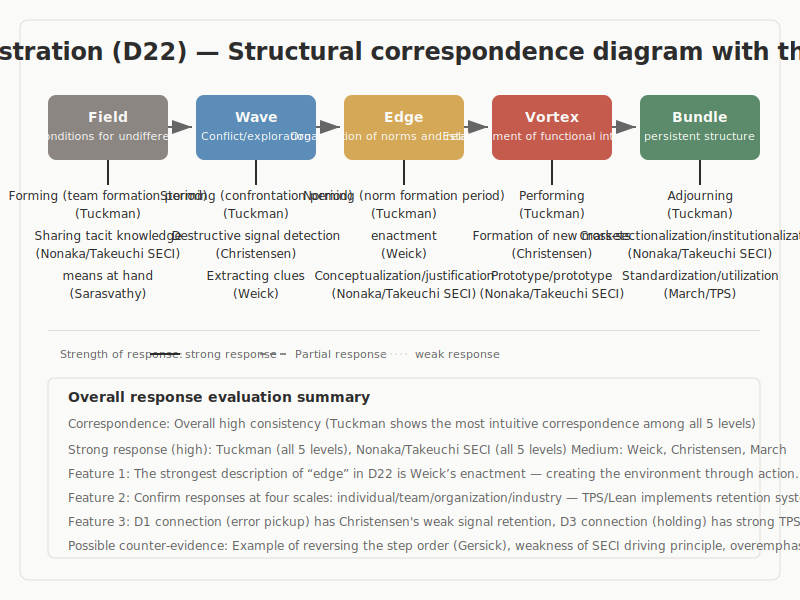

## Business Management

Structural correspondence survey with the 5-stage model (Ba / Wave / En / Uzu / Taba)

---

## Survey Overview

- **Survey target**: 11 major theories in business management
- **Research question**: Do the various theories of business management correspond structurally to the 5-stage model?
- **Results**: Structural correspondence confirmed in all 11 cases, ranging from high alignment to partial correspondence

---

## Structural Correspondence Diagram

---

## Overview of the 5-Stage Model

| Stage | Definition |
|-------|------------|
| Ba (Field) | An undifferentiated state. The initial condition in which no direction or structure has yet been established |
| Wave | The exploratory stage in which multiple directions diverge and compete |
| En (Edge) | A state of tension in which opposing elements coexist without converging on either side. The place where they meet at the boundary, influence each other, and relationships emerge |
| Uzu (Vortex) | The stage in which a new coherence (order) arises spontaneously from within the tension |
| Taba (Bundle) | The stage in which the form is fixed and stabilizes as a reusable structure |

---

## Overview of Structural Correspondences

| Theory | Structural Similarity (5-stage correspondence) | Points of non-alignment | Strength of evidence |
|--------|------------------------------------------------|------------------------|----------------------|
| Tuckman | Forming→Storming→Norming→Performing→Adjourning highly aligns with Ba→Wave→En→Uzu→Taba | Actual teams show recursion and stagnation; linear progression is not guaranteed | High |
| Nonaka & Takeuchi (SECI/Ba) | The flow of tacit knowledge sharing→conceptualization→justification→prototyping→cross-leveling aligns well | The description of the driving principle (why it progresses) is weak | Medium |
| March (Exploration/Exploitation) | The allocation problem between exploration and exploitation is effective for explaining Uzu→Taba | The first-half transitions of Ba, Wave, En are too abstract for direct correspondence | Medium |
| Weick (Sensemaking) | The phase of interpretation formation aligns with Wave→En→Uzu | Does not present the full 5 stages as a stage model | Medium |
| Christensen (Disruptive Innovation) | New market formation is effective for explaining En→Uzu→Taba | Strong dependence on industry scale, unsuitable for comparison at team scale | Medium |

---

## Key Entry 1: Tuckman Model

- **Overview**: A model describing 5 stages of team development (Forming→Storming→Norming→Performing→Adjourning)
- **Structural correspondence**: The most direct correspondence with the 5-stage model is observed. Forming corresponds to Ba, Storming to Wave, Norming to En, Performing to Uzu, and Adjourning to Taba
- **Key note**: Its limitation is that it is a linear progression model. Recursion and stagnation are frequently observed in actual teams

---

## Key Entry 2: Nonaka & Takeuchi's SECI Model

- **Overview**: A model describing knowledge creation as a process of conversion between tacit and explicit knowledge
- **Structural correspondence**: A flow of tacit knowledge sharing (Ba), conceptualization (Wave), justification (En), prototyping (Uzu), and cross-leveling (Taba) is confirmed
- **Key note**: The concept of "Ba (field)" resonates with the Ba of the 5-stage model, but the weak description of the driving principle is a challenge

---

## Key Entry 3: March's Exploration and Exploitation

- **Overview**: A theory of how organizations allocate between exploring new possibilities and exploiting existing capabilities
- **Structural correspondence**: The transition from exploration to exploitation is effective in explaining Uzu→Taba
- **Key note**: The correspondence with the earlier stages (Ba, Wave, En) is at a high level of abstraction, making direct mapping difficult

---

## Cross-Cutting Patterns

- The Tuckman model shows the most direct 5-stage correspondence, but has the limitation of linearity
- The validity of treating team-scale theories (Tuckman) and industry-scale theories (Christensen) on the same comparative axis requires re-examination
- Knowledge creation theory (SECI) independently holds the concept of Ba, providing rich points of contact with the 5-stage model
- Overall, correspondence with the latter stages (Uzu, Taba) tends to be clearer than with the earlier stages (Ba, Wave, En)

---

## Unresolved Questions

- The possibility of unifying the comparative axes of team scale and industry scale
- Description of the driving principle of "why transitions occur" in each theory
- Methods for incorporating recursion and stagnation into the model
- Addition of "under what conditions does correspondence break down" in a falsifiable form for each of the 11 theories

---

## Conclusion

- Structural correspondence with the 5-stage model was confirmed in all 11 theories of business management
- Particularly strong correspondence is seen in the Tuckman model and the Nonaka & Takeuchi SECI model
- While correspondence with the latter stages (Uzu, Taba) is generally clear, there were large differences between theories in correspondence with the earlier stages
