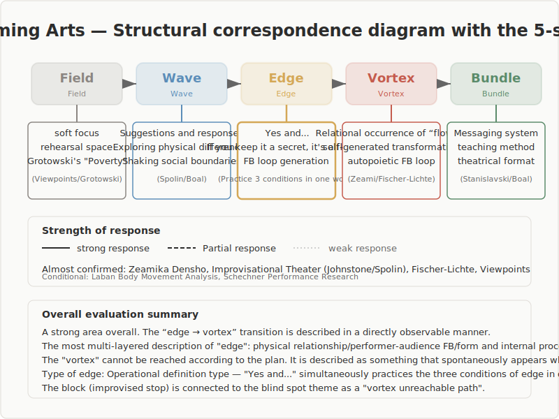

## Performing Arts

Survey of Structural Correspondence with the 5-Stage Model (Ba / Nami / En / Uzu / Taba)

---

## Survey Overview

- **Subject**: Major theories of performing arts
- **Research question**: Do the various theories of performing arts correspond structurally to the 5-stage model?
- **Findings**: 2 cases of conditional correspondence

---

## Structural Correspondence Diagram

---

## Overview of the 5-Stage Model

| Stage | Definition |
|------|------|
| Ba (Field) | An undifferentiated state. Initial conditions in which no direction or structure has yet been established |
| Nami (Wave) | A stage of exploration in which multiple directions diverge and compete |
| En (Edge) | A state of tension in which opposing elements coexist without converging on either side. The place where boundaries touch, mutual influence occurs, and relationships emerge |
| Uzu (Vortex) | The stage in which a new coherence (order) spontaneously arises from within the tension |
| Taba (Bundle) | The stage in which form is confirmed and stabilizes as a reusable structure |

---

## Overview of Structural Correspondence

| Confidence | Theory Group | Assessment |
|---|---|---|
| Near-confirmed | Zeami's Fushikaden, Improvisational Theater (Johnstone / Spolin / Nachmanovitch), Fischer-Lichte's Aesthetics of the Performative, Viewpoints (Bogart / Overlie) | Concrete correspondence confirmed across all 5 stages, with particularly precise description of the En→Uzu transition |
| Probable | Grotowski's Poor Theatre, Stanislavski System, Meyerhold's Biomechanics, Boal's Theatre of the Oppressed | Correspondence exists, but the externality of En is limited, or interpretive steps are needed to read it as a process model |
| Conditional | Laban Movement Analysis, Schechner's Performance Studies | Correspondence of individual concepts is acknowledged, but as a whole they do not constitute a consistent process model, or differences remain between descriptive category systems and process models |

---

## Major Entry 1: Zeami's Fushikaden — The Training Process and the Relational Emergence of "Hana"

- Zeami Motokiyo (c. 1400–1418) described the training process for Noh in age-based stages, discussing the key points of practice at each stage and the rise and fall of "hana" (aesthetic effect). In the Fushikaden, he drew a sharp distinction between "jibunn no hana" (temporary charm) and "makoto no hana" (the essential aesthetic effect acquired through disciplined training). The passage "Hana to, omoshiroki to, medzurashiki to, kore mitsu wa onaji kokoro nari" (Hana, interest, and novelty — these three are of the same mind) shows that hana is not a fixed attribute but an aesthetic effect that arises relationally and dynamically from freshness — that is, from the gap between expectation and actuality.
- **As fact**: Zeami stated "Hisureba hana nari. Hisezeba hana narubekarazu" (Concealed, it is hana; unconcealed, it cannot be hana), arguing that withholding disclosure is a condition for hana to exist. In the Kakyo, he also presented "Riken no ken" — a cognitive operation in which the performer sees oneself from the audience's viewpoint. The training process is described as flowing from the undifferentiated charm of childhood, through the crisis of ages 17–18 (when the gap between self-image and actual ability is exposed), to the formation of conditions in which hana arises within a relationship with the audience, culminating in structural integration.
- **As reading**: Here we read the sequence of structural transitions visible at each stage of the training process. The level of analogy is process, with particular attention to the sequence: "from an undifferentiated state, differences are exposed, a new quality arises within a relationship, and that quality remains as a transmissible system." Furthermore, the description of "hana" as arising dynamically within a relationship is a structural feature indicating that generation occurs not within the individual but at the interface of relationship.
- **As interpretation**: The undifferentiated charm of childhood corresponds to Ba (a state in which possibility is open); the crisis of ages 17–18 to Nami (oscillation between self-image and actual ability); "Kensho doshin" (performer-audience interaction) and "Hisureba hana" (maintaining indeterminacy through non-disclosure) to En; the emergence of "makoto no hana" to Uzu; and the institutionalization of knowledge through the transmission text system to Taba. In particular, the description of "hana" arising as an indeterminate entity within a web of relationships overlaps precisely with the structure of En (relational web + indeterminacy + connection to Uzu).
- "Riken no ken" can also be read as a concrete description of self-referentiality at the Uzu stage — a cognitive structure that grasps wholeness while standing within it. Furthermore, "Shoshin wasurubekarazu" (never forget the beginner's mind) suggests a spiral structure in which Taba (form and tradition) reconnects to Ba (the openness of the undifferentiated), illuminating the fact that the 5 stages involve not unidirectional progression but also return.

---

## Major Entry 2: Improvisational Theater — "Yes, and..." as an Operational Definition of En

- Keith Johnstone (1979), Viola Spolin (1963), and Stephen Nachmanovitch (1990) each established theories and methods of improvisational theater through different paths. Johnstone theorized status transactions and spontaneity training; Spolin developed theater games and the concept of focus; Nachmanovitch theorized improvisation in the arts broadly as a creative process. Common to all three is the "Yes, and..." principle — the basic principle that scenes develop when a participant accepts (rather than rejects) a partner's offer (proposal) and adds to it.
- **As fact**: In improvisational theater, the prohibition of planning is a methodological principle. From an empty stage, offers are presented, and scenes emerge as participants respond to them. Spolin's "focus" is a technique for concentrating the group's attention on one point; Johnstone's "status transactions" use the up-and-down of interpersonal hierarchies as the driving force of improvisation. Nachmanovitch argued for improvisational creativity from the dialectic of "play" and "constraint."
- **As reading**: Here we read the structure by which the improvisational process makes the 5 stages directly observable in real time on a scale of seconds to minutes. The level of analogy is process, with particular attention to the point that "generation without planning" is methodologically guaranteed. "Yes, and..." realizes in a single phrase: relational connection (formation of a relational web), indeterminacy of outcome (what emerges is not known in advance), and connection to the next development (advancement of the scene).
- **As interpretation**: The empty stage corresponds to Ba (openness in which what will emerge is undetermined); the presentation of and response to offers to Nami (status oscillation, differentiation of proposals); the formation of a relational web through "Yes, and..." to En; the self-organizing emergence of an unexpected but coherent scene to Uzu; and the codification of games and formats to Taba. The unique contribution of improvisational theater is that "Yes, and..." functions as an operational definition of "En." It makes an abstract concept practically executable in a single phrase, serving as a concrete analogy for explaining "En" in other domains.

---

## Major Entry 3: Fischer-Lichte — The Aesthetics of the Performative and the Autopoietic Feedback Loop

- Erika Fischer-Lichte (2004/2008), in The Transformative Power of Performance, argued that meaning-generation in performance occurs not through semiotic representation but through bodily co-presence (leibliche Ko-Präsenz). It is a theory that replaces the concept of "artwork," which traditional aesthetics presupposed, with the concept of "event."
- **As fact**: The core of Fischer-Lichte's theory is the "autopoietic feedback loop." The loop of interaction arising between performers and audience self-generates the performance, and its outcome is not predetermined. Furthermore, the "oscillation" in which perception swings between the semiotic body (the representing body) and the phenomenal body (the present body) is held to be the core of the performance experience. From within this feedback loop, unpredictable qualities "emerge" (Emergenz), leading participants into liminality (a threshold state). Liminality borrows V. Turner's concept, referring to a transformative experience in which everyday categorical distinctions dissolve.
- **As reading**: Here we read in the autopoietic feedback loop the structural features of En: the claim that the feedback loop is self-sustaining and generative. The level of analogy is structure, with attention to the relational arrangement of "unpredictable qualities emerging from a space of sustained interaction." In particular, Fischer-Lichte places the connection from feedback loop to emergence at the center of her theory, providing a precise description of the transition mechanism from En to Uzu.
- **As interpretation**: The space of bodily co-presence corresponds to Ba; the oscillation of perception (vibration between semiotic body and phenomenal body) to Nami; the autopoietic feedback loop to En; emergence and liminality to Uzu; and the institutionalization of aesthetic discourse and performance studies to Taba. The important contribution of this theory is that it most precisely theorizes the transition mechanism from "En→Uzu." The model — that when the feedback loop acquires sufficient thickness, unpredictable qualities emerge — theoretically supports the 5-stage description that Uzu emerges when the conditions of En are in place.
- It should be noted that Fischer-Lichte's use of the concept of "autopoiesis" differs from the strict definition of Maturana/Varela (a self-enclosed system) and is used in the sense of self-generativity. This lexical discrepancy is actually an important caveat, insofar as it suggests that the "En" of performance is an open system, not a closed one.

---

## Cross-Domain Patterns

- The most prominent pattern across performing arts is the multilayered nature of "En"
- First, **physical relationships among performers**
- Second, **the performer-audience feedback loop**
- Third, **the dialectic of form and inner process**

---

## Unresolved Questions

- **How to integrate the multilayered nature of En**: Physical relationships among performers, the performer-audience feedback loop, the dialectic of form and inner process, and the dissolution of social boundaries all function as "En," but whether these are different manifestations of the same structure or structurally different phenomena has not yet been settled.
- **The relationship between descriptive categories and process models**: In cases such as Laban Movement Analysis and Schechner's Performance Studies, where systems for describing movement or meta-theoretical concepts correspond to individual stages of the 5 stages, whether this can be called "structural correspondence" remains a methodological challenge.
- **The positioning of creation through subtraction**: As Grotowski's via negativa shows, the transition from Ba to Taba can be a process of removal rather than accumulation. How to integrate a reading of the 5 stages as "additive progression" with a reading as "subtractive exposure" requires future clarification.
- **The persistence of Uzu**: Grotowski's total act arises not as a "state" but as a one-time "event." Whether Uzu is a persistent state or a one-time event changes the definition of Uzu.

---

## Conclusion

- This survey confirmed that performing arts is, as a whole, a domain for which structural analogy with the 5-stage model is probable
- There are three reasons why performing arts is a particularly important domain for this survey
