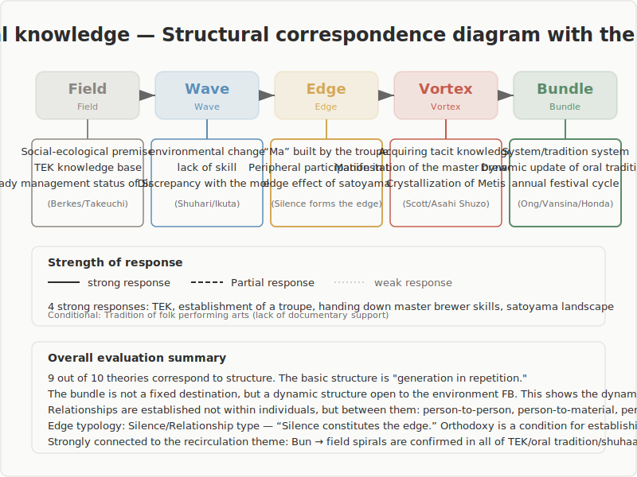

## Traditional Knowledge

Structural correspondence survey with the 5-stage model (Ba / Wave / En / Uzu / Taba)

---

## Survey Overview

- **Survey target**: 10 major theories in traditional knowledge
- **Research question**: Do the various theories of traditional knowledge correspond structurally to the 5-stage model?
- **Results**: Strong correspondence in 4 cases, partial correspondence in 5 cases, conditional correspondence in 1 case

---

## Structural Correspondence Diagram

---

## Overview of the 5-Stage Model

| Stage | Definition |
|-------|------------|
| Ba (Field) | An undifferentiated state. The initial condition in which no direction or structure has yet been established |
| Wave | The exploratory stage in which multiple directions diverge and compete |
| En (Edge) | A state of tension in which opposing elements coexist without converging on either side. The place where they meet at the boundary, influence each other, and relationships emerge |
| Uzu (Vortex) | The stage in which a new coherence (order) arises spontaneously from within the tension |
| Taba (Bundle) | The stage in which the form is fixed and stabilizes as a reusable structure |

---

## Overview of Structural Correspondences

| # | Theory/Concept | Proponent | Correspondence stages | Assessment |
|---|----------------|-----------|----------------------|------------|
| 1 | Traditional Ecological Knowledge (TEK) | Berkes, Colding & Folke | Ba, Wave, En, Uzu, Taba | Strong correspondence |
| 2 | Legitimate Peripheral Participation (LPP) | Lave & Wenger | Ba, Wave, En, Uzu, Taba | Partial correspondence |
| 3 | Ichiza-Konryu (establishing one gathering) | Zeami, Yamanoue Soji | Ba, Wave, En, Uzu, Taba | Strong correspondence |
| 4 | Shu-Ha-Ri | Martial and performing arts tradition | Wave, En, Uzu, Taba | Partial correspondence |
| 5 | Skills transmission of the chief brewer (Dassai case) | Asahi Shuzo case | Ba, Wave, En, Uzu, Taba | Strong correspondence |
| 6 | Oral tradition | Ong, Vansina | Ba, Wave, En, Uzu, Taba | Partial correspondence |
| 7 | Metis (practical wisdom) | Scott, Sillitoe | Ba, Wave, En, Uzu, Taba | Partial correspondence |
| 8 | Waza knowledge / artisan skills | Ikuta Kumiko, Sennett | Ba, Wave, En, Uzu, Taba | Partial correspondence |
| 9 | Satoyama landscape | Takeuchi et al., SATOYAMA Initiative | Ba, Wave, En, Uzu, Taba | Strong correspondence |
| 10 | Transmission of folk performing arts | Honda Yasuji | Ba, Wave, En, Uzu, Taba | Conditional correspondence |

---

## Key Entry 1: Traditional Ecological Knowledge (TEK) (Berkes, Colding & Folke, 2000)

- TEK is a cumulative body of knowledge, practice, and belief that is culturally transmitted across generations and evolves through adaptive processes. Berkes, Colding & Folke (2000) defined it as a "knowledge-practice-belief complex" and described adaptive management practices including multi-species management, resource rotation, succession management, and landscape patch management. Huntington (2000) pointed out the practical barrier that TEK is centered on oral transmission and difficult to document.
- **As a matter of fact**: According to Berkes et al.'s description, TEK is structured as a cycle of observation, interpretation, response, institutionalization, and updating through environmental feedback. Knowledge is inseparable from rights, territory, and cosmology — it is a system with ontological depth, not merely technical knowledge.
- **As an interpretation of structure**: Here we read a staged structure of knowledge generation within TEK's adaptive management cycle. The level of similarity is process. Particular attention is given to the fact that the transitions from observation to interpretation and from interpretation to response contain the formation of relational knowledge and the formation of coherent practice.
- **As an interpretive reading**: TEK's adaptive management cycle corresponds structurally to the 5 stages. The social-ecological system in which living practices are embedded constitutes Ba; environmental pulses such as resource fluctuations and abnormal weather make differences manifest as Wave; the comparison of signs and compilation of causal chains by experienced practitioners constitutes En; changes in harvesting rules and the formation of coherent response practices through taboos, rotation systems, and patch management constitute Uzu; and the sedimentation into institutions, norms, and worldviews along with intergenerational transmission function as Taba. Particularly noteworthy is that Taba is dynamically updated in response to environmental feedback, demonstrating the need to understand Taba not as a fixed endpoint but as a cyclically updated structure.

---

## Key Entry 2: Ichiza-Konryu (Zeami's Fushikaden, Yamanoue Soji's Yamanoue Soji Ki)

- Ichiza-konryu refers to the concept of "the gathering being established" in noh theater and the tea ceremony. Zeami in *Fushikaden* positioned the establishment of the gathering as a core concept of the performing arts, with "universal affection" constituting "the happiness of ichiza-konryu." In *Yamanoue Soji Ki*, the intent of treating everything from entry into the roji to departure as "once in a lifetime" is recorded. Recent empirical research has organized the finding that "co-creation of Ba" can be established even between the host and inexperienced guests, corresponding to ichiza-konryu.
- **As a matter of fact**: Ichiza-konryu is not the skill or knowledge of an individual but a collective experience that emerges from the relationship between host and guest. In the tea ceremony, the roji, tea room, implements, and arrangements constitute the precondition space; non-ordinary space arises through the act of entering the room; and from the exchange mediated by the gestures, silences, and minimal language of host and guest, a sense of unity that "this gathering has been established" arises.
- **As an interpretation of structure**: Here we read the staged structure of collective emergence in the process of ichiza-konryu. The level of similarity is structure, with particular attention to the arrangement of "emergence of collective unity from relational exchange." The establishment of the gathering is not controlled by individual intention or planning but is described as arising spontaneously from the interactions among participants.
- **As an interpretive reading**: This process corresponds to the 5 stages. The roji, tea room, implements, and arrangements constitute the precondition space as Ba; the non-ordinariness from entering the room and uncertainty about etiquette generate tension as Wave; the exchange mediated by the gestures, silences, and meaning-assignment of implements between host and guest weaves relationships as En; the sense of unity that "this gathering has been established" emerges creatively as Uzu; and the experience becomes Taba through memorization and normalization as one encounter, remaining as structure for the next Ba. What is particularly striking in this process is that the transition from En to Uzu appears with exceptional clarity as "the emergence of collective unity from relational exchange."

---

## Key Entry 3: Satoyama Landscape (Takeuchi et al., SATOYAMA Initiative)

- Satoyama is a socio-ecological production landscape formed at the connecting zone between human settlement (sato) and mountain woodland (yama) in Japan. Systematized by Takeuchi et al. in the context of landscape ecology, it was incorporated into an international framework as the SATOYAMA Initiative at CBD COP10 (Nagoya) in 2010. The satoyama landscape is composed of a mosaic land use (paddy fields, coppice woodland, grassland, reservoirs, etc.), and the management of succession through disturbance (mowing, burning, logging, etc.) is described as the mechanism that maintains biodiversity.
- **As a matter of fact**: The very meaning of satoyama refers to the boundary between sato and yama. In this connecting zone, anthropogenic disturbance management maintains a mosaic-like landscape, and it has been confirmed that abandonment of management (absence of disturbance) leads to succession progression and loss of landscape diversity.
- **As an interpretation of structure**: Here we read the mechanism of order generation through boundary maintenance and disturbance within the landscape management structure of satoyama. The level of similarity is structure, with attention to the point that the spatial arrangement of "the connecting zone of sato and yama" itself functions as a Ba that generates interaction among multiple elements.
- **As an interpretive reading**: Satoyama is a case where correspondence with the 5 stages is particularly clear. The social-ecological system intertwining humans and nature constitutes Ba; seasonal variation and anthropogenic disturbance (burning, logging, mowing, etc.) generate differences as Wave; the interaction of multiple elements in the connecting zone of sato and yama functions as En; the maintained landscape mosaic (coexistence of paddy fields, coppice woodland, grassland, and reservoirs) forms coherence as Uzu; and management institutions, ecological calendars, and commons rights are transmitted as Taba across generations. The important insight that satoyama demonstrates is that "managed disturbance" is the condition for order. When Wave ceases (when disturbance is lost), the mosaic quality as Uzu is also lost.

---

## Cross-Cutting Patterns

- Three structural patterns recur repeatedly across the domain of traditional knowledge and arts
- **First, generation within repetition
- **Second, the dynamism of Taba
- **Third, the relational nature of En

---

## Unresolved Questions

- The etymology attribution of Shu-Ha-Ri is academically contested. Textual-historical scrutiny of whether direct attribution to Zeami is appropriate remains incomplete, and critical editing of the original texts is needed.
- Regarding the reference to TEK: this survey is a pointing out of structural similarity and not an extraction or appropriation of knowledge content, but as consideration for the principle of FPIC (Free, Prior, and Informed Consent), the scope of reference and purpose need to be made explicit at the time of publication.
- The 5-stage model has the sequential structure of "Ba→Wave→En→Uzu→Taba," but creation in traditional knowledge is essentially cyclic and repetitive. How to incorporate the cyclical nature of the return from Taba to Ba into the description of the 5 stages is an unresolved theoretical challenge.
- Metis (Scott) and TEK conceptually overlap considerably, as both deal with locally specific practical knowledge. In this survey they were distinguished by different foci — contrast with the state (Scott) and environmental management (Berkes) — but whether there is a framework that can integrate both is worth considering.

---

## Conclusion

- This survey confirmed that traditional knowledge and arts is a domain with overall strong structural similarity to the 5-stage model
- The greatest insight to be gained from this domain is that creation in traditional knowledge appears as "generation within repetition"
- The findings of this survey are distributed across the compelling to hypothesis confidence bands
