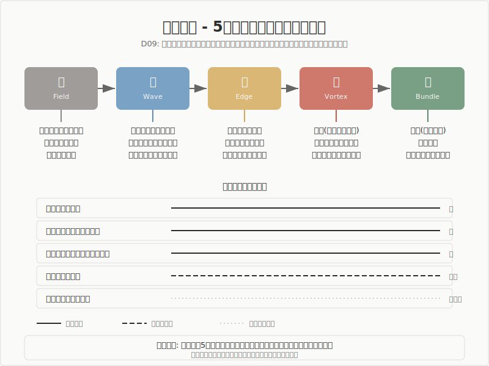

# 生命科学

> **立ち位置明示**
> 本稿は、生命科学の主要理論と「5段階モデル（場→波→縁→渦→束）」との
> 構造的類似を調査した報告です。特定の理論的立場を主張するものではなく、
> 異なるラベルが同じ構造を指しているかを検討した調査記録として読まれたい。

## 1. 調査の目的と問い

本調査は、生命科学における代謝・発生・免疫・生殖などの基本プロセスが「5段階モデル（場→波→縁→渦→束）」と構造的に対応するかどうかを検討するものです。

生命科学は、神経科学（D08）が「情報処理としての脳」を扱うのに対し、「エネルギー・代謝・物質としての生命プロセス」を扱います。アストロサイトが乳酸を供給してシナプス機能を支える代謝連関から、有性生殖が40億年以上にわたり遺伝的多様性を生み出し続ける構造まで、その範囲は分子レベルから世代を超えるスケールにわたります。本調査では、これらの生命プロセスに5段階モデルの構造が現れるかを検証しました。

調査の範囲は、アストロサイト-ニューロン代謝連関、ミトコンドリア代謝と神経信号コスト、ミクログリアとシナプス刈り込み、経験依存的ミエリン化、アロスタティック負荷、グリンパティック系と睡眠、ドーパミン報酬予測誤差、有性生殖の構造、オートファジー、モルフォゲン勾配と形態形成、獲得免疫のクローン選択にわたり、合計11の理論・概念を評価しました。

中心的な問いは以下のとおりです。

- 意識を伴わない生命プロセスにも、5段階モデルの構造は現れるか
- 生命科学におけるエネルギー・代謝・物質の変換は、5段階の各段階とどのように対応するか
- 対応が強い場合と弱い場合、それぞれから何が読み取れるか

## 2. 調査の方法

### 方法の概要

本調査は、以下の手順で進められました。

まず、生命科学の各分野から5段階モデルとの構造的類似が期待される理論・概念を選定し、一次文献・教科書級文献に基づいて生物学的事実を確認しました（Phase 1-2）。次に、各理論について複数の独立した視点から構造的対応を検討し、対応の強弱を判定しました（Phase 3-4）。

判定基準は以下のとおりです。

- **強い対応**: 生命プロセスが5段階の全順序と直接一致し、複数の独立した文献系統で支持されるもの
- **部分的な対応**: 一部の段階に明確な対応が確認されるが、全5段階にわたる対応は限定的であるもの
- **条件付きの対応**: 対応は示唆されるが、5段階の「構造」ではなく「成立条件」を記述しているもの

その後、Phase 5（論拠監査）で既存11件の強度分類とギャップ分析を実施し、Phase 6（構造再読）で各エントリの5段階対応を4軸（正確な対応・怪しい対応・破綻箇所・見えていなかった構造）で再評価しました。Phase 7（横断統合）で領域内の横断パターンを抽出しました。

### 調査の限界

本調査は代謝・発生・免疫・生殖など「物質・エネルギーの変換」を軸としており、生態学的な群集動態やマクロ進化のプロセスは調査対象に含まれていません。また、11件のうち前半6件は神経代謝に集中しており、この選択がドメイン全体の代表性に影響している可能性があります。5段階モデルとの対応は構造的類似の検討であり、生命科学の理論と5段階モデルが同一であるという主張ではありません。

### 方法論的開示（S60）

> 本調査における先行研究との構造対応は解釈仮説であり、原著の精読に基づく
> 確定的対応ではありません。5段階のラベルと先行研究のラベルの対応にはグラデーション
> があり、1対1の厳密なマッピングではありません。また、AIによる解釈代行のプロセスを
> 含むため、著者（pjdhiro）自身の精読による検証が完了していない箇所があります。

## 3. モデルの概要

5段階モデルは、創造プロセスを5つの段階で記述する枠組みです。

**場（ば）** は、未分化の状態です。方向も構造もまだ定まっておらず、潜在的な可能性を含む初期条件にあたります。生命科学の文脈では、遺伝子プールの多様性、細胞内の栄養・エネルギー状態、均一な初期条件を持つ胚領域がこの段階に対応します。

**波（なみ）** は、場の中に差異が生まれ、複数の方向性が発散・競合する段階です。予測と現実のずれが顕在化し、系の状態が変動します。生命科学では、減数分裂による対称性の破れ、抗原刺激による活性化、モルフォゲン勾配の立ち上がりがこの段階にあたります。

**縁（えん）** は、対立する要素が共存し、どちらにも収束しない緊張状態です。配偶子の出会いにおける性選択、免疫細胞間の分子認識（MHC提示・TCR認識・共刺激の三重関係）など、異なるものが接触し、その接触の質が後続プロセスの成否を決定する局面です。

**渦（うず）** は、縁での緊張の中から新たなまとまり（秩序）が自発的に立ち上がる段階です。受精における一倍体配偶子の融合による新たな二倍体の出現、オートファジーにおける隔離膜の巻き込みと閉鎖、免疫応答におけるクローン選抜と収束がこの段階に対応します。

**束（たば）** は、形が確定し、再利用可能な構造として安定する段階です。子孫として安定した新しい遺伝的組み合わせ、免疫記憶としてのメモリー細胞、ミエリン構造としての学習の物理的記録がこの段階に対応します。

このモデルは特定のスケールに限定されるものではなく、分子レベルから世代を超える時間軸に至るまで、異なる抽象化の階層で繰り返し現れる構造生成のパターンを記述するための枠組みです。

## 4. 調査結果: 全体像

生命科学領域では、11の理論・概念について5段階モデルとの構造対応を検討しました。結果は以下のとおりです。

| # | 理論/概念 | 提唱者/起源 | 主な対応段階 | 判定 |
|---|----------|-----------|------------|------|
| 1 | アストロサイト-ニューロン代謝連関 | Pellerin & Magistretti (1994) | 場・波・束 | 部分的対応 |
| 2 | ミトコンドリア代謝と神経信号コスト | Attwell & Laughlin (2001) | 場 | 条件付きの対応 |
| 3 | ミクログリアとシナプス刈り込み | Schafer et al. (2012) | 波・渦・束 | 部分的対応 |
| 4 | 経験依存的ミエリン化 | Fields (2015) | 束 | 条件付きの対応 |
| 5 | アロスタティック負荷 | McEwen (1998) | 波・束 | 部分的対応 |
| 6 | グリンパティック系と睡眠 | Xie et al. (2013) | 場・束 | 条件付きの対応 |
| 7 | ドーパミン報酬予測誤差 | Schultz et al. (1997) | 場・波 | 部分的対応 |
| 8 | 有性生殖の構造 | Van Valen (1973), Otto (2009) | 全5段階 | 強い対応 |
| 9 | オートファジー | Tsukada & Ohsumi (1993) | 渦 | 部分的対応 |
| 10 | モルフォゲン勾配と形態形成 | Wolpert (1969), Turing (1952) | 場・波 | 部分的対応 |
| 11 | 獲得免疫のクローン選択 | Burnet (1957), Tonegawa (1983) | 全5段階 | 強い対応 |

温度帯の分布は、確定的な事実に基づく強い構造対応が2件（有性生殖、獲得免疫）、部分的対応が6件、条件付きの対応が3件です。全体として「場・波 > 渦・束 > 縁」の強度分布を示しています。

> **安全弁**
> ここまでの全体像で十分な場合、以降の詳細分析は省略可能です。
> 各知見の詳細は以下のセクションで展開します。

## 5. 調査結果: 主要な知見

### 5.1 有性生殖の構造（Van Valen, Maynard Smith, Otto）

- **事実として**: 有性生殖は真核生物の初期進化で確立された基本的な繁殖様式です。減数分裂では交差（染色体間のDNA交換）、ランダムな染色体分配、ランダムな受精によって遺伝的変異が生成されます。無性生殖と比較して「2倍のコスト」（次世代への遺伝子伝達効率の半減）があるにもかかわらず、大多数の真核生物で維持されています。Red Queen仮説（Van Valen 1973）は、寄生者との共進化が遺伝的多様性を要請し続けることでこのコストを説明します。

- **読み取りとして**: ここでは、個体群の多様性が維持され、分裂・選別・融合を経て新しい組み合わせが安定化する循環的な構造を読み取ります。類似の水準はプロセスであり、特に「多様性の維持→分裂→出会い→融合→安定化→次世代の多様性」という循環的順序に着目します。

- **解釈として**: 遺伝子プール（場）の中で減数分裂が対称性を破り（波）、配偶子が出会って性選択を受け（縁）、受精によって新たな二倍体が立ち上がり（渦）、子孫として安定した新しい遺伝的組み合わせが遺伝子プールに戻る（束→場への循環）。全5段階にわたる対応が明瞭で、束→場の循環が自然に現れます。注目すべきは、このプロセスが40億年以上にわたり意識を伴わずに継続してきた点です。5段階が特定の認知能力に依存せず、物質の組織化パターンとして機能していることを示唆します。

### 5.2 獲得免疫のクローン選択（Burnet, Tonegawa, Schatz）

- **事実として**: クローン選択説（Burnet 1957）は、抗原が既存のリンパ球クローンから適合するものを選び出し、増殖・分化を導くことを提唱しました。V(D)J再構成（Schatz et al. 1989, Tonegawa 1983）はRAG-1/RAG-2酵素による受容体遺伝子の組み換えで、免疫受容体の多様性を生成する分子機構です。胸腺ではT細胞が正の選択と負の選択を受け、自己MHC分子を認識できるが自己抗原に過剰反応しないクローンだけが成熟します。胚中心では体細胞超変異と親和性成熟により、抗体の結合力が反復的に精緻化されます。

- **読み取りとして**: ここでは、多様なレパートリーの生成、刺激による活性化、分子レベルの接触と認識による選別、選抜の収束、記憶としての安定化という段階的な構造を読み取ります。類似の水準は構造であり、特に「接触の質が応答の成否を直接制御する」という関係構造に着目します。

- **解釈として**: V(D)J再構成によって生成されたナイーブなリンパ球の多様性プール（場）に、抗原が刺激として入ることで活性化が起きます（波）。ここでAPC（抗原提示細胞）とT細胞の間で三重の関係——MHC分子による抗原ペプチドの提示、T細胞受容体による認識、共刺激分子による確認——が成立して初めて応答が進行します（縁）。正の選択と負の選択、クローン間の競合によって適合するクローンが収束し（渦）、エフェクター細胞と長寿命のメモリー細胞として安定化します（束）。胚中心での親和性成熟は、この「縁→渦→束」が螺旋的に反復して精度が向上する好例です。

### 5.3 モルフォゲン勾配と形態形成（Wolpert, Turing）

- **事実として**: Wolpert（1969）は、胚発生の空間パターン形成を「位置情報」の枠組みで説明しました。細胞は、モルフォゲンの濃度を「位置値」として読み取り、その値に応じて分化の運命を決めます。ショウジョウバエ胚ではbicoidタンパク質が前後軸に沿った濃度勾配を形成し、閾値応答で下流遺伝子の発現パターンが決まることが実験的に示されています（Driever & Nusslein-Volhard 1988）。一方、Turing（1952）は反応-拡散の数学的結合により、均一な状態から周期的パターンが自己組織化しうることを理論的に示しました。魚類の皮膚の縞模様がこのモデルと整合することが確認されています（Kondo & Asai 1995）。

- **読み取りとして**: ここでは、均一な初期条件から勾配が生じ、閾値を経由して離散的な運命決定に至り、空間パターンとして固定化されるプロセスを読み取ります。類似の水準はプロセスであり、特に「均一→勾配→閾値→パターン形成→固定化」という順序構造に着目します。Wolpert（トップダウン的位置情報）とTuring（ボトムアップ的反応拡散）という独立した2つの理論系統が同じ構造遷移を示す点が注目されます。

- **解釈として**: パターン形成前の均一に近い胚領域（場）にモルフォゲンの勾配が立ち上がり（波）、閾値応答によって連続的な濃度が離散的な細胞運命に変換され（縁）、境界のシャープ化とドメインの自己組織化が進み（渦）、固定化された空間パターンとして安定化します（束）。ただし、縁の対応は一方向的な情報から運命への変換であり、「異なるものが境界で接し影響し合う」双方向性は薄い点は留保が必要です。この知見の独自性は、5段階が時間軸だけでなく空間軸に沿っても展開される可能性を示す点にあります。

### 5.4 オートファジー（Tsukada & Ohsumi, Kabeya）

- **事実として**: オートファジーは、栄養欠乏条件で細胞質成分が液胞やリソソームへ送られ分解・再利用される細胞内プロセスです（Tsukada & Ohsumi 1993）。ATG/APG遺伝子群の同定は大隅良典のノーベル生理学・医学賞（2016年）につながりました。Atg8/LC3のPE結合（脂質化）がオートファゴソーム形成のマーカーとなり（Kabeya et al. 2000）、隔離膜が基質を包み込んで閉鎖し、リソソームと融合して内容物を分解します。

- **読み取りとして**: ここでは、起動から膜形成、包み込み、閉鎖、融合、分解、再利用へと至る不可逆に近い順序構造を読み取ります。類似の水準はプロセスであり、特に「隔離膜が基質を物理的に包み込んで閉じる」という渦段階の具体性に着目します。

- **解釈として**: 細胞内の栄養・エネルギー状態（場）から、飢餓を契機にAtg複合体が起動し（波）、Atg複合体と膜の結合関係が形成され（縁）、隔離膜が基質を巻き込んで閉鎖する過程で新たな構造体（オートファゴソーム）が立ち上がり（渦）、リソソームとの融合を経て分解産物が代謝に再利用されます（束）。渦段階は、「包み込み」が文字通り物理的に実行される点で際立って具体的です。注目すべきは、外部刺激なしに内部状態の逸脱（飢餓）によって起動する「内発的プロセス」である点です。

### 5.5 ミクログリアとシナプス刈り込み（Schafer, Stevens）

- **事実として**: ミクログリアは脳の常在免疫細胞です。発達期のシナプス刈り込みは、補体系（C1q, C3）による標識を介してミクログリアが不要なシナプスを貪食する過程です（Schafer et al. 2012, Stevens et al. 2007）。M1/M2という単純な分極の二分法は現在批判されており、活性化状態は連続的なスペクトラムとして理解されるべきだとされています（Ransohoff 2016）。

- **読み取りとして**: ここでは、正常な回路環境のもとで不要なシナプスが検出・標識され、物理的に除去されて精緻化された回路が残るプロセスを読み取ります。類似の水準はプロセスであり、特に「渦」が通常の「融合・包摂」ではなく「分解的」な方向に作用する点に着目します。

- **解釈として**: 正常なシナプス環境（場）の中で活動が低下したシナプスが検出され（波）、補体系のC1q/C3によって「削除対象」としてタグ付けされます（縁）。ミクログリアがそのシナプスを貪食し（渦）、結果として精緻化された回路が残ります（束）。ここでの渦は、通常の「まとまりとして立ち上がる」方向ではなく、「不要なものを除去して精緻化する」方向に作用しています。この「分解的な渦」が束（精緻化された回路）に至るという構造は、渦の本質が「方向」ではなく「質的変換」である可能性を示唆します。ただし、この解釈は仮説段階にとどまります。

### 5.6 アロスタティック負荷（McEwen）

- **事実として**: アロスタシスは、変化を通じて安定性を維持するプロセスであり、ホメオスタシスの拡張概念です（McEwen 1998）。アロスタティック負荷は、この適応反応の慢性的な累積コストです。慢性ストレスは海馬の樹状突起萎縮や前頭前野の構造変化を引き起こし（McEwen 2007）、その影響は生涯を通じて異なるパターンを示します（Lupien et al. 2009）。

- **読み取りとして**: ここでは、適応的なプロセスが過負荷になったとき、正常な循環が破綻して構造的損傷に至るメカニズムを読み取ります。類似の水準はプロセスであり、特に「正常な調整から蓄積を経て構造的変化に至る」という順序に着目します。

- **解釈として**: アロスタティック負荷は、5段階の通常のプロセスとは異なる位置づけを持ちます。恒常性（場）に対してストレスが予測誤差として蓄積し（波）、環境との境界での適応的調整が限界を超え（縁の失敗）、負荷が蓄積し続けて過負荷状態に陥り（渦の病的変形）、海馬萎縮などの構造変化として固定化されます（病的な束）。これは5段階の「失敗モード」——波が縁で適切に処理されず蓄積する病態——を記述していると考えられます。

### 5.7 ドーパミン報酬予測誤差（Schultz, Fiorillo）

- **事実として**: 中脳ドーパミンニューロンは予期しない報酬に対してphasic burst（発火の急増）を示し、条件づけ学習後は応答が報酬そのものから報酬予告刺激へ移行します（Schultz et al. 1997）。期待された報酬が来ないとphasic dip（活動の低下）が観察されます。不確実性もドーパミンニューロンの活動パターンに符号化されることが報告されています（Fiorillo et al. 2003）。

- **読み取りとして**: ここでは、予測モデルに対する誤差信号の発生とモデル更新の反復構造を読み取ります。類似の水準はプロセスであり、特に「予測から誤差を経てモデル更新、安定化に至る」循環に着目します。

- **解釈として**: 報酬に関する予測モデル（場）に対して予測誤差がburst/dipとして発生し（波）、予測モデルが更新され（渦）、更新された予測が安定化します（束）。縁に相当する段階——波から渦への移行を制御する構造——は明示的に記述されていませんが、学習率が縁的機能を果たしている可能性が考えられます。burst（正の予測誤差）とdip（負の予測誤差）の非対称性は、波の方向性が神経化学的に区別されることを示す興味深い知見です。

### 5.8 アストロサイト-ニューロン代謝連関（Pellerin & Magistretti, Araque）

- **事実として**: アストロサイトはグルタミン酸取り込みに連動して好気的解糖を亢進し、乳酸を産生・放出します——ANLS仮説（Pellerin & Magistretti 1994）。海馬における乳酸輸送の阻害は長期記憶形成を障害しますが、短期記憶には影響しません（Suzuki et al. 2011）。シナプスはプレ・ポスト・アストロサイトの3要素からなる三者間シナプスとして理解されるようになっています（Araque et al. 1999）。ただし、ニューロン自身の解糖能力を示す反証データも存在し（Dienel 2017, Diaz-Garcia et al. 2017）、ANLS仮説の普遍性については論争が続いています。

- **読み取りとして**: ここでは、異なる細胞種間の循環的な物質交換によってシナプス機能が支えられる構造を読み取ります。類似の水準はメカニズムであり、特に「3要素が協調して成立する場の内部構造」に着目します。

- **解釈として**: 代謝的恒常性（場）に対してシナプス活動によるエネルギー需要の増大（波）が生じ、アストロサイト-ニューロン間の循環的連関（縁）を経て、長期記憶として安定化します（束）。ただし、この対応は5段階の「構造」そのものよりも「プロセスを支える条件」としての性格が強く、対応は部分的です。三者間シナプスは、場が単一の要素ではなく複数要素の協調によって成立するという「場の内部構造」を示す点で示唆的です。

### 5.9 その他の知見

**ミトコンドリア代謝と神経信号コスト**: 灰白質エネルギー消費の大半はイオン勾配回復に費やされ（Attwell & Laughlin 2001）、エネルギー制約がスパースな皮質計算の一因となっています。このエントリは5段階の「構造」ではなく「成立条件」——すなわち5段階の各段階が機能するための物理的なコスト制約——を記述しています。5段階との構造対応は弱いものの、「波の選択性がコスト制約から自然に導かれる」という知見は、5段階が作動する物理的条件を理解する上で価値があります。

**経験依存的ミエリン化**: ミエリン形成は成人脳でも経験・学習に応じて継続します（Fields 2015）。ミエリンは文字通り軸索を「束ねる」構造であり、束段階の好例です。さらに、ミエリン形成（束）が伝導速度を変え（場の物理的特性を変更）、新たな活動パターン（波）を可能にするという「束から場へのフィードバック」の具体的な実装を提供しています。

**グリンパティック系と睡眠**: 脳の老廃物排出システムは主に睡眠中に活性化されます（Xie et al. 2013）。5段階の「リセットプロセス」——サイクルとサイクルの間にある回復期——として位置づけられます。5段階は連続的に回り続けるのではなく、リセット期間を要するという知見は、5段階理論の射程を限定する方向の証拠でもあります。

## 6. 横断的パターン

生命科学の11エントリを横断して、以下のパターンが浮上しました。

### 意識を伴わない5段階

11エントリ中、意識を伴うのはドーパミン報酬予測誤差（報酬の主観的体験）とアロスタティック負荷（ストレスの主観的体験）の2件のみです。有性生殖は40億年以上、オートファジーは全ての真核細胞で、獲得免疫のクローン選択は分子レベルで、いずれも意識の関与なく作動しています。これは、5段階が「意識的な創造のプロセス」ではなく「物質・エネルギーの組織化パターン」として機能していることを示唆する、この領域で最も重要な横断的知見です。ただし、意識を伴う場合と伴わない場合で5段階の動態が同一かどうかは未検証であり、この点は未解決の問いとして残ります。

### 渦の二方向性

受精（有性生殖）は2つの配偶子が融合して新しい存在が立ち上がる「包摂的な渦」です。一方、シナプス刈り込みやオートファジーは不要なものを除去・分解する「分解的な渦」です。しかし、いずれの方向でも渦の後には束——精緻化された回路、再利用された代謝物、新しい個体——が生じます。この観察は、渦の本質が「包摂か分解か」という方向ではなく、「入力を質的に異なる出力に変える位相転移点」であるという仮説を支持します。ただし、この定義は検証困難であり、現時点では仮説段階にとどまります。

### 縁の実装多様性

強い対応が確認された2件（有性生殖、獲得免疫）に共通する構造は、「異なるもの（雌雄の配偶子、APCとT細胞）が物理的に接触し、その接触の質（性選択、分子認識の特異性）が後続プロセスの成否を直接制御する」というものです。これは他の領域で確認された縁の実装（時間差による可塑性、位相同期、社会的関与）とは全く異なる物理量で実装されており、縁が特定のメカニズムではなく構造的特徴であるという仮説を補強します。一方、3件のエントリでは縁の対応が確認されず、この不均一さが5段階対応の限界を正直に示しています。

### 場から波への内発的起動

5段階の通常の記述では波は外部からの摂動で始まりますが、オートファジー（飢餓という内部状態の逸脱）とTuring不安定性（均一状態からの自発的パターン生成）は、波が場の内部から自発的に生じるケースを示しています。これらは「外部入力による誤差」ではなく「内部状態の逸脱が生む変動」であり、5段階の起動条件を「外部摂動」から「平衡からの逸脱」へと拡張する可能性を示唆します。

### スケール横断的な反復

有性生殖、オートファジー、モルフォゲン勾配、獲得免疫の4件で、「多様性/均一性から撹乱/分裂、選別/閾値を経て変換/収束に至り、安定化/記憶として定着する」パターンが分子から集団に至る異なるスケールで反復することが確認されました。5段階が特定のスケールに依存しない構造的パターンであることの証拠ですが、異なるスケールでの同型性が表面的な類似にとどまるのか、深層的な構造的同一性であるのかは未検証です。

## 7. 未解決の問い

本調査から、以下の問いが未解決のまま残っています。

**渦の二方向性の位置づけ**: 包摂的な渦と分解的な渦は5段階の同じ段階として扱えるのか、それとも質的に異なるものとして区別すべきか。仮に渦を「質的変換の位相転移点」と再定義するなら、その形式的な定義はどのようなものか。

**5段階の失敗モード**: アロスタティック負荷は波が縁で処理されず蓄積する病態を記述しています。この「失敗モード」は5段階の内部にある逸脱なのか、5段階の外部にある現象なのか。適切な保持と過剰な蓄積の境界を決定するものは何か。

**時間・空間・スケールの独立性**: モルフォゲン勾配は空間軸に沿った5段階の展開を示し、有性生殖は世代軸に沿った展開を示しています。5段階が特定の次元やスケールに依存しない構造的パターンであるなら、それは「プロセス」（時間的展開）ではなく「パターン」（構造的関係）として再定義すべきか。この問いには数学的な形式化が必要です。

**場の能動的生成**: V(D)J再構成は場（免疫受容体の多様性プール）を能動的に生成するメカニズムです。減数分裂も場（遺伝的多様性）の再生成です。5段階の場は「与えられる前提条件」なのか、「前のサイクルの束から再構成される生成物」なのか。この自己再帰性は5段階の循環性の核心に関わります。

**内発的起動の射程**: 5段階の起動条件を「外部摂動」から「平衡からの逸脱」に拡張した場合、5段階の起動条件の範囲はどこまで広がるのか。あらゆる不安定性が「波」であるなら、この定義は広すぎて弁別力を失う可能性があります。

**スケール間の接続メカニズム**: 分子レベルの5段階がどのように集積して細胞レベルの5段階になるかは未記述です。「同じパターンが現れる」ことは確認されましたが、なぜ現れるかの説明がなく、これは別の調査で検討すべき問題です。

## 8. 結論

生命科学の11件の調査では、2件（有性生殖、獲得免疫のクローン選択）で5段階モデルとの強い構造対応が確認されました。これら2件は全5段階にわたって対応が高く、特に縁段階で「異なるものの接触の質が後続プロセスの成否を決定する」という構造が分子・細胞レベルで明瞭に確認されています。6件で部分的な対応が、3件で条件付きの対応が確認されました。

この領域で特に重要な知見は、5段階の構造パターンが意識を伴わない生命プロセスにも現れることです。有性生殖、オートファジー、獲得免疫は意識の関与なく5段階の順序を示しており、5段階が認知プロセスに限定されず、物質とエネルギーの組織化パターンとしても機能している可能性を示唆します。

同時に、いくつかの重要な限界も明らかになりました。11件のうち3件は5段階の「構造」ではなく「成立条件」や「リセット過程」を記述しており、全エントリで均一に5段階が対応するわけではありません。縁の対応は2件で極めて強い一方、3件では確認されず、この不均一さは5段階の各段階が全ての現象に同等に当てはまるわけではないことを示しています。

> **結びの温度開示**
> 本調査の知見は、確定（生命プロセスの事実記述）から仮説（渦の二方向性、内発的起動の拡張、スケール横断的な同型性の意味）まで幅広い温度帯に分布しています。特に「意識なき5段階」の意味、渦の定義の拡張、スケール間接続のメカニズムについては、更なる検証が必要です。

## Colophon

| 項目 | 値 |
|------|-----|
| 生成日 | 2026-03-18 |
| generator_model | claude-opus-4-6 |
| evidence_count | 11件（強い対応: 2, 部分的: 6, 条件付き: 3） |
| source_evidence | evidence-D09-life-sciences.md |
| source_dr | DR-D09-life-sciences.md |
| reader_rules | reader-rules-creation-report v2.2 |
| template | domain-report-template v1.0 |
