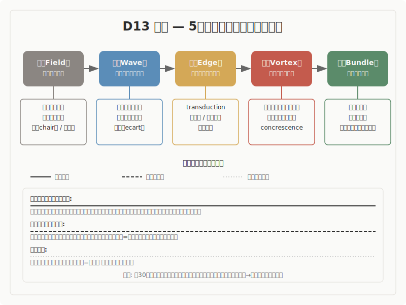

# 哲学

> **立ち位置明示**
> 本稿は、哲学の主要理論と「5段階モデル（場→波→縁→渦→束）」との
> 構造的類似を調査した報告です。特定の理論的立場を主張するものではなく、
> 異なるラベルが同じ構造を指しているかを検討した調査記録として読まれたい。

## 1. 調査の目的と問い

本調査は、西洋・東洋の哲学における主要な過程論・存在論が「5段階モデル（場→波→縁→渦→束）」と構造的に対応するかどうかを検討するものです。

哲学は、30の調査領域のなかで最も抽象度が高い領域です。他の領域が個別の現象（星の形成、化学反応、生物の進化など）を記述するのに対し、哲学は「存在とは何か」「認識はどのように成立するか」「生成とは何か」といった根本的な問いに取り組みます。この抽象性は二重の意味を持ちます。一方で、構造的対応が見つかれば他の領域に共通する基盤を示す可能性がありますが、他方で、抽象度が高いために「何にでも対応できてしまう」という牽強付会のリスクも高くなります。

本調査では、存在論（シモンドン、ホワイトヘッド、シェリング）、プラグマティズム（デューイ、パース）、現象学（フッサール、メルロ＝ポンティ）、解釈学（ガダマー）、ポスト構造主義（ドゥルーズ＝ガタリ）、批判理論（アドルノ）、日本哲学（西田幾多郎）の7つの系譜から11の理論を評価しました。

中心的な問いは以下のとおりです。

- 哲学における過程論・存在論は、5段階モデルの順序（場→波→縁→渦→束）と構造的に対応するか
- 哲学理論が記述する「生成のプロセス」と5段階モデルが記述する「創造のプロセス」は、構造的に同型か
- 5段階モデルへの対応が困難な哲学理論は、モデルの限界について何を教えるか

## 2. 調査の方法

### 方法の概要

本調査は、以下の手順で進められました。

まず、西洋近現代哲学と日本哲学の諸理論から、5段階モデルとの構造的類似が期待される過程論・存在論を選定しました。各理論について一次文献（原著の特定箇所）を参照し、理論の内在的構造を確認しました（Phase 1-2）。次に、各理論について複数の独立した視点から構造的対応を検討し、対応の強弱を判定しました（Phase 3-4）。

判定基準は以下のとおりです。

- **強い対応**: 理論の内在的構造が5段階の順序と直接一致し、一次文献の具体的テキスト箇所による裏付けがあるもの
- **部分的な対応**: 一部の段階に明確な対応が確認されるが、全5段階にわたる対応は限定的であるもの
- **条件付きの対応**: 対応は示唆されるが、理論と5段階モデルの間に根本的な緊張があるもの

その後、Phase 5（論拠監査）で既存11件の強度分類とギャップ分析を実施し、Phase 6（構造再読）で各エントリの5段階対応を4軸（正確な対応・怪しい対応・破綻箇所・見えていなかった構造）で再評価しました。Phase 7（横断統合）で領域内の横断パターンを抽出しました。

### 調査の限界

本調査の11の理論は近現代西洋哲学が10件、日本哲学が1件であり、文化的・地理的な偏りがあります。インド哲学（中観派・唯識）、イスラーム哲学（イブン・アラビー）、アフリカ哲学（ubuntu）といった伝統は調査に含まれていません。また、哲学理論の抽象度の高さにより、原理的にほぼどの理論も5段階に対応づけることが可能であり、個々の対応の意味を慎重に評価する必要があります。

### 方法論的開示（S60）

> 本調査における先行研究との構造対応は解釈仮説であり、原著の精読に基づく
> 確定的対応ではありません。5段階のラベルと先行研究のラベルの対応にはグラデーション
> があり、1対1の厳密なマッピングではありません。また、AIによる解釈代行のプロセスを
> 含むため、著者（pjdhiro）自身の精読による検証が完了していない箇所があります。

## 3. モデルの概要

5段階モデルは、創造プロセスを5つの段階で記述する枠組みです。

**場（ば）** は、未分化の状態です。方向も構造もまだ定まっておらず、潜在的な可能性を含む初期条件にあたります。哲学的な文脈では、シモンドンの前個体的場（準安定状態）、フッサールの受動的背景（未分節の感覚的地平）、西田の絶対無の場所がこの段階と対応します。

**波（なみ）** は、場の中に差異が生まれ、複数の方向性が発散・競合する段階です。微小な揺らぎが成長し、系の均衡が崩れ始めます。哲学では、フッサールの触発（背景から際立つものが差異として生じる）、パースの疑い（信念と現実の不一致が不快として経験される）、メルロ＝ポンティの裂開（肉の内部における最小の差異）がこの段階にあたります。

**縁（えん）** は、対立する要素が共存し、どちらにも収束しない緊張状態です。複数の要素が関係し合い、新たな構造の可能性が生まれる臨界的な局面です。哲学では、シモンドンのtransduction（局所的な構造解決の隣接伝播）、デューイの問題定式化（困難の所在と定義による関係の同定）、パースのアブダクション（驚くべき事実から新しい仮説を創出する論理的操作）がこの段階に対応します。

**渦（うず）** は、縁での緊張の中から新たなまとまり（秩序）が自発的に立ち上がる段階です。自己維持的なプロセスが作動し、系が質的に変化します。哲学では、ホワイトヘッドの合生（多から一が生じる自己形成的過程）、ガダマーの解釈学的循環（部分と全体の往還が理解のまとまりを生成する）、西田の行為的直観（知と作が不可分な行為を通じた個物の成立）がこの段階にあたります。

**束（たば）** は、形が確定し、再利用可能な構造として安定する段階です。哲学では、デューイの信念の確立（信念として束ねられ、状況が確定する）、ホワイトヘッドの充足（合生の完了が後続の出来事のデータとなる）、パースの信念の固定（探究の帰結として行動習慣が確立される）がこの段階にあたります。なお、束が永続するとは限りません。アドルノやガダマーが示すように、束は本質的に暫定的な凝集であり、次の場への循環を含みます。

## 4. 調査結果: 全体像

11件の調査対象について、5段階モデルとの構造的対応を評価した結果を以下に示します。

| # | 理論/概念 | 提唱者 | 対応段階 | 判定 |
|---|----------|--------|---------|------|
| 1 | 個体化論（transduction） | シモンドン | 全5段階 | 強い対応 |
| 2 | 反省的思考の5段階 | デューイ | 全5段階 | 強い対応 |
| 3 | 過程哲学（concrescence） | ホワイトヘッド | 波・渦・束に強い対応 | 部分的な対応 |
| 4 | 自然哲学（Naturphilosophie） | シェリング | 波に強い対応 | 条件付きの対応 |
| 5 | 受動的総合（passive synthesis） | フッサール | 場・波・縁に強い対応 | 部分的な対応 |
| 6 | 「肉」と可逆性 | メルロ＝ポンティ | 波・縁に強い対応 | 部分的な対応 |
| 7 | 地平融合（Horizontverschmelzung） | ガダマー | 全5段階 | 部分的な対応 |
| 8 | リゾーム・脱領土化 | ドゥルーズ＝ガタリ | 場に対応 | 条件付きの対応 |
| 9 | 探究と信念の固定 | パース | 全5段階 | 強い対応 |
| 10 | 否定弁証法 | アドルノ | 批判的照射として機能 | 部分的な対応 |
| 11 | 場所の論理 | 西田幾多郎 | 場・縁・渦に強い対応 | 部分的な対応 |

温度帯の分布は以下のとおりです。強い対応が確認された理論は3件（シモンドン、デューイ、パース）であり、いずれも全5段階にわたる対応を持ちます。部分的な対応が確認された理論は6件であり、特定の段階で独自の貢献を持ちます。条件付きの対応が2件（シェリング、ドゥルーズ＝ガタリ）であり、いずれも5段階モデルとの間に根本的な緊張を含みます。

> **安全弁**
> ここまでの全体像で十分な場合、以降の詳細分析は省略可能です。
> 各知見の詳細は以下のセクションで展開します。

## 5. 調査結果: 主要な知見

### 5.1 個体化論（シモンドン）

シモンドンの個体化論は、11件のなかで最も安定した構造対応を示す理論です。

**事実として**: シモンドンは、個体化を質料形相論の枠組みで捉えることを拒否し、前個体的な準安定状態（metastable field）からtransductionを通じて個体と環境（milieu）が同時に生成される連続的プロセスとして記述しました（*L'individuation a la lumiere des notions de forme et d'information*, Introduction, §I）。transductionとは「局所的な構造解決が隣接領域に伝播する操作」であり、結晶化の種結晶が過飽和溶液の構造化を次々に誘発する過程が原型事例とされます。また、個体化によって前個体的余剰（charge de realite pre-individuelle）が枯渇せず、再個体化の可能性として保持されるとしました。

**読み取りとして**: ここでは、前個体的場からの構造化という全体プロセスの中に、局所構造化の隣接伝播（transduction）という段階を識別する、プロセス水準の構造的特徴を読み取ります。特に、前個体的余剰が個体化後も残存するという点は、循環が「なぜ終わらないか」を内在的に説明する構造です。

**解釈として**: 前個体的場は場（未分化の初期条件）に、ポテンシャル差による不安定化は波（差異の顕在化）に、transductionは縁（局所的な関係網の形成と隣接への伝播）に、個体と環境の同時生成は渦（まとまりの立ち上がり）に、安定構造の形成と余剰の保持は束（結晶化と次の場への循環）に、それぞれ構造的に対応すると考えられます。この対応は段階数の偶然的一致ではなく、両者が「存在の生成」という同じ問題圏を異なる語彙体系で記述していることから生じていると考えられます。

### 5.2 反省的思考の5段階（デューイ）

デューイの反省的思考論は、一次文献で5つの段階を明示的に列挙する唯一の候補であり、対応付けの恣意性が最も低い理論です。

**事実として**: デューイは*How We Think*（1910年、第6章）において、反省的思考の「5つの論理的に区別されるステップ」を列挙しました。(i) 感じられた困難（felt difficulty）、(ii) 困難の所在と定義、(iii) 解決案の示唆、(iv) 推論による展開、(v) 観察・実験による採否。デューイは第1・第2ステップが融合しうることを明記しており、段階を厳格な線形順序としては捉えていません。また、*Logic: The Theory of Inquiry*（1938年）では探究を「不確定な状況を確定した状況に変換する、制御された変換」と一般化しました。

**読み取りとして**: ここでは、探究プロセス全体が「不確定→確定」の変換として、5つの区別可能な段階を経る構造を読み取ります。類似の水準はプロセスであり、特にデューイ自身が段階を列挙していることによって、対応の恣意性が最小化されています。

**解釈として**: 状況（conditions + intended result）は場に、感じられた困難は波に、困難の所在と定義（問題定式化）は縁に、解決案の示唆と推論による展開は渦に、観察・実験による採否（信念としての確立）は束に、それぞれ対応すると考えられます。ただし、デューイの記述は「反省的思考」に焦点を当てており、「芸術的創造」や「存在の創造」への拡張にはデューイ自身の*Art as Experience*（1934年）を経由した別途の検討が必要です。

### 5.3 過程哲学（ホワイトヘッド）

**事実として**: ホワイトヘッドは*Process and Reality*（1929年）において、実在の基本単位を「現実的機会（actual occasion）」として設定しました。各機会は過去のデータの感受（prehension）を「合生（concrescence）」で統合し、充足（satisfaction）に達して後続の機会のデータとなります。この過程を「多は一となり、一によって増大する（the many become one, and are increased by one）」と定式化しました。

**読み取りとして**: ここでは、「受容→統合→結実→次の前提」という循環的プロセスの全体構造を読み取ります。類似の水準は構造であり、特に合生から充足への収束過程に注目します。

**解釈として**: 合生は渦（多から一が生じる自己形成的過程）に、充足は束（結実した新たなデータ）に、それぞれ強く対応すると考えられます。一方、actual world（過去の機会群）を場に対応させることについては、actual worldが「すでに構造化された過去」であり、5段階の場（未分化の状態）とは構造化の程度が異なるため、留意が必要です。また、縁の対応はホワイトヘッドの理論の内在的構造からは取り出しにくく、部分的な対応にとどまります。

### 5.4 受動的総合（フッサール）

**事実として**: フッサールは後期の講義録（*Analysen zur passiven Synthesis*, 1918-1926年）において、自我の能動的関与に先立つ受動的な意識の構造化を記述しました。触発（Affektion）は「背景から際立つものが差異として生じ、自我に力を及ぼす」現象であり、連合的結合は類似性と隣接性に基づく受動的な結びつきです。

**読み取りとして**: ここでは、意識における構造化が自我の意志なしに進行するプロセスを読み取ります。類似の水準はメカニズムであり、特に「受動的に構造化が進む」という特徴に注目します。

**解釈として**: 受動的背景（未分節の感覚的地平）は場に、触発は波（差異の受動的な生起）に、連合的結合は縁（関係の受動的な形成）に、それぞれ対応すると考えられます。渦・束の対応はやや弱く、フッサールの理論が場→波→縁の前半3段階の記述に強みを持つことが確認されました。なお、フッサールの現象学的還元（epoche）は存在論的コミットメントを括弧に入れるため、5段階モデルが存在の創造を記述するならば、フッサールとの対応には射程の差が残ります。

### 5.5 「肉」と可逆性（メルロ＝ポンティ）

**事実として**: メルロ＝ポンティは未完の著作*Le visible et l'invisible*において、「肉（chair）」を主体と世界が共有する前-区別的な元素として提示し、「裂開（ecart）」と「交叉配列（chiasme）」の概念を展開しました。裂開は肉の内部に生じる最小の差異であり、交叉配列は触れる者と触れられるものが交差する界面です。

**読み取りとして**: ここでは、裂開から交叉配列への流れにおける、差異の生起から相互変容的な関係の成立へと至るプロセス構造を読み取ります。類似の水準はプロセスです。

**解釈として**: 裂開は波（差異の顕在化）に、交叉配列は縁（境界における相互変容）に対応すると考えられます。特に交叉配列は縁の「複数の要素が共存しながら相互に変容する」性格の深い哲学的記述です。一方、渦・束の対応は薄く、メルロ＝ポンティの理論は波→縁の記述に独自の強みを持ちます。また、可逆性が「完全な一致には決して達しない」（常にecartを含む）という性質は、段階間の移行が完全には完了しないことの存在論的根拠を提供する可能性があります。

### 5.6 地平融合（ガダマー）

**事実として**: ガダマーは*Wahrheit und Methode*（1960年）において、理解を「前理解の地平」と「テクストの地平」の融合として記述しました。理解は前理解（Vorurteil）なしには成立せず、「問い（Frage）」が前理解と他者性の境界に生まれることで解釈学的循環が起動します。融合された地平は「常に進行中の出来事」であり、完了することはありません。

**読み取りとして**: ここでは、前理解→問い→循環的理解→地平融合という理解のプロセス全体の構造を読み取ります。類似の水準はプロセスであり、特に「問い」が理解を起動するメカニズムに注目します。

**解釈として**: 前理解の地平は場に、前理解と他者性の齟齬は波に、問いの生成は縁に、解釈学的循環は渦に、地平の融合は束に、それぞれ対応すると考えられます。全5段階に対応がありますが、ガダマーの記述は「理解の生成」に焦点を当てており、「存在の創造」への拡張には射程の差があります。また、「地平の融合」がガダマーにおいて「常に進行中の出来事」であることは、束を「達成された完了」ではなく「暫定的な凝集」として理解すべきことを示唆します。

### 5.7 探究と信念の固定（パース）

**事実として**: パースは"The Fixation of Belief"（1877年）において、探究を「疑いの不快（irritation of doubt）」に駆動される信念の固定過程として記述しました。疑いは意志で起こせるものではなく、実在する生きた不一致感でなければ探究を駆動しません。アブダクション（仮説推論）は「驚くべき事実」と「可能な説明仮説」の間に新しい関係を創出する論理的操作です。

**読み取りとして**: ここでは、疑い→探究→信念の固定→新たな疑いという循環的プロセスの全体構造を読み取ります。類似の水準はプロセスであり、特にアブダクションという論理的操作が新たな関係を創出する点に注目します。

**解釈として**: 信念（安定した行動習慣）は場に、疑いの不快は波に、アブダクションは縁に、演繹・帰納のループは渦に、信念の固定は束に、それぞれ対応すると考えられます。パースのアブダクションは、縁の段階で何が起きているかについての論理学的な記述を提供する点で独自の貢献を持ちます。また、「疑いは生きた経験でなければプロセスを駆動しない」という指摘は、波の発生条件に重要な制約を加えます。

### 5.8 場所の論理（西田幾多郎）

**事実として**: 西田幾多郎は「場所の論理」において、あらゆる存在を包む「絶対無の場所」を提示しました。絶対矛盾的自己同一は、矛盾する要素が分離しながら同時に結びつく構造を記述します。行為的直観は知と作が不可分な行為を通じた個物の成立を意味し、西田はこれをもって認識と創造の区別を解消しました。

**読み取りとして**: ここでは、場所の三層構造（有の場所→相対的無の場所→絶対無の場所）と、絶対矛盾的自己同一の構造を読み取ります。類似の水準は構造であり、特に場の多層性と、矛盾を保持したまま結びつく関係様式に注目します。

**解釈として**: 絶対無の場所は場の最も深い存在論的基盤に、絶対矛盾的自己同一は縁（矛盾する要素が共存しながら結びつく）に、行為的直観は渦に、それぞれ対応すると考えられます。ただし、絶対無の場所は5段階の「場」よりも上位の概念であり、場だけでなく5段階全体を包む可能性があります。また、西田的には段階的移行は存在せず、これらは同時的な出来事の異なる側面です。この点は5段階の「段階性」に対する根本的な問いかけとなっています。

### 5.9 否定弁証法（アドルノ）と批判的照射

**事実として**: アドルノは*Negative Dialektik*（1966年）において、概念が対象を完全に把握することの不可能性を主題化しました。星座的配置（Konstellation）は、複数の概念が対象を囲み相互に照らし合う方法であり、単一の概念による完全な把握を拒否します。あらゆる同一化は非同一的なもの（das Nichtidentische）を抑圧するとされます。

**読み取りとして**: ここでは、アドルノの理論が5段階モデルとの「対応」ではなく、モデルに対する「批判的照射」として機能する点を読み取ります。類似の水準はメカニズムですが、方向は対応ではなく批判です。

**解釈として**: 星座的配置は渦（複数要素の相互作用）に部分的に対応しますが、渦の「収束」とは異なり、星座は「完全な把握に至らない」ことを本質とします。束に対しては、あらゆる結果が暫定的であり再解体可能であるという批判を投げかけます。アドルノの理論は5段階モデルを「正しい」とも「間違い」とも言いませんが、各理論を5段階に振り分けること自体に「概念的暴力」が含まれうることへの警告として機能します。

### 5.10 段階化への批判（ドゥルーズ＝ガタリ、シェリング）

2件の条件付き対応は、5段階モデルの限界を示す知見として独自の価値を持ちます。

**事実として**: ドゥルーズ＝ガタリは*Mille Plateaux*（1980年）においてリゾーム的思考を展開し、あらゆる点があらゆる点と接続しうる非線形的なネットワークを記述しました。シェリングの自然哲学は、極性（Polaritat）――引力と斥力の生産的緊張――を記述しましたが、縁に相当する概念を持ちません。

**読み取りとして**: ここでは、ドゥルーズの段階化への原理的拒否と、シェリングの二項的対立から多項的関係網への移行の不在を、5段階モデルの構造的限界に関わる特徴として読み取ります。

**解釈として**: ドゥルーズのリゾーム原理は、場→波→縁→渦→束という方向性を持つプロセスと原理的に相容れません。この不一致は対応の「失敗」ではなく、5段階モデルが「線形的段階」として硬直化するリスクへの内在的な警告です。シェリングの「縁の不在」は、波（二項的対立）から縁（多項的関係網）への移行が理論的に非自明であることの反証的証拠です。

## 6. 横断的パターン

哲学領域の11理論を横断して、以下のパターンが確認されました。

### パターン1: 「縁」の多面性

哲学は「縁」を最も多角的に記述する領域です。6つの異なる縁の記述が得られました。シモンドンのtransduction（伝播型）、デューイの問題定式化（問題化型）、パースのアブダクション（跳躍型）、メルロ＝ポンティの交叉配列（可逆型）、ガダマーの問い（対話型）、西田の絶対矛盾的自己同一（矛盾保持型）です。この多面性は、「縁」が単一の操作ではなく複数の関係様式を包含する概念であることを示唆します。

### パターン2: 束→場循環の駆動力の多様性

なぜ束は場に戻るのかという問いに対して、哲学は5つの異なる回答を提供します。シモンドンの前個体的余剰の残存（存在論的）、ホワイトヘッドの不可逆的前進（形而上学的）、パースの新たな疑いの発生（方法論的）、ガダマーの効果史の堆積（解釈学的）、アドルノの非同一性の残存（批判的）です。異なる角度から同じ現象（循環の持続）が記述されていることは、束→場循環が5段階モデルの本質的な特徴であることを示唆します。

### パターン3: 受動性→能動性の勾配

哲学理論群は、5段階プロセスの中で受動性から能動性への勾配が存在することを示します。場と波は完全に受動的（フッサールの受動的総合、パースの「疑いは意志で起こせない」）、縁は受動と能動の境界（デューイの問題定式化は能動的だが出発点のfelt difficultyは受動的）、渦はプロセスの力学に導かれる（ガダマーの「事柄そのものが対話を主導する」）、束は能動性の凝固（デューイの信念の確立）です。この勾配は、5段階が「主体の意志によるプロセス」ではなく「受動的生起から能動的凝固への移行」であることの哲学的基盤を提供すると考えられます。

### パターン4: 段階化への内在的抵抗

ドゥルーズ＝ガタリのリゾーム的思考、西田の絶対矛盾的自己同一、デューイの段階間融合可能性という3つの異なる理論が、5段階の「段階性」そのものに哲学的抵抗を示しました。この抵抗は、5段階モデルを「離散的段階」ではなく「連続的スペクトラム上の位相」として理解すべきことの哲学的根拠を形成すると考えられます。

### 他領域との接続可能性

縁の多面性は、複雑系科学（D29）で記述される「縁の4つの顔」（閾値型・競合型・界面型・伝播型）との統合が有望です。哲学はこれらの「顔」に存在論的深度を加える可能性があります。また、渦と束の記述が場→波→縁に比べて相対的に薄い点は、物理学（D02）や複雑系科学（D29）が補完する必要があることを示しています。

## 7. 未解決の問い

以下の問いは、本調査では解決に至らず、今後の検討課題として残ります。

**場の深度問題**: 西田の絶対無の場所、フッサールの受動的背景、シモンドンの前個体的場は、いずれも「場」に対応するとされますが、それぞれの深度が異なります。5段階の「場」は単層的な概念で十分か、それとも複数の深度を持つ階層的概念として精緻化すべきかは未解決です。

**段階の存在論的地位**: 5段階は明確な境界を持つ離散的段階か、連続的スペクトラムの密度変化か。デューイ・西田・ドゥルーズからの複数の証言は後者を支持していますが、両者の間にはなお対立する解釈が残ります。

**波→縁の移行の非自明性**: 二項的差異（波）から多項的関係（縁）への質的転換のメカニズムは理論的に非自明です。シェリングの「縁不在」がこの困難を反証的に示しており、シモンドンのtransduction以外にこの移行を十分に説明する理論が求められています。

**束の暫定性と循環の駆動力**: 束が完全に安定しないことが循環の駆動力であるとすれば、束の「安定性」と「暫定性」の関係をより精緻に記述する必要があります。5つの異なる駆動力メカニズムが同定されましたが、それらの統合的理解は今後の課題です。

**分析生成と存在生成の統合可能性**: フッサール・ガダマーが記述する「意識・理解の生成」とシモンドン・ホワイトヘッドが記述する「存在の生成」は、同じ5段階プロセスの異なるスケールでの現れとして統合可能でしょうか。デューイと西田はこの統合を支持しますが、フッサールの現象学的還元による留保が残ります。

**「縁」の存在論的地位**: 縁は波と渦の「間」にある独立した段階か、それとも波と渦を含み込む「場」としての性格を持つのか。西田の同時的出来事としての記述と、ホワイトヘッドの合生内部の関係づけは、この問いを投げかけています。

## 8. 結論

哲学領域の調査では、存在論・プラグマティズム・現象学・解釈学・批判理論・日本哲学の7系譜11理論を検討しました。

3件（シモンドン、デューイ、パース）で全5段階にわたる強い構造対応が確認されました。これらはいずれも、「生成」のプロセスを内在的に段階化しており、5段階モデルとの対応は理論の核心から生じています。6件で特定の段階における独自の貢献を持つ部分的な対応が確認されました。2件（シェリング、ドゥルーズ＝ガタリ）ではモデルとの根本的な緊張が確認されましたが、この緊張自体が5段階モデルの精緻化にとって重要な知見です。

哲学領域の独自の貢献は3点に集約されます。第一に、「縁」の6つの異なる記述は、縁が複数の関係様式を包含する多面的概念であることを示します。第二に、束→場循環の5つの駆動力メカニズムは、循環がモデルの本質的特徴であることの哲学的根拠を提供します。第三に、段階化への3つの抵抗は、5段階を「離散的段階」ではなく「連続的スペクトラム」として理解する方向性を示唆します。

同時に、本調査には重要な限界があります。理論群の文化的偏り（近現代西洋哲学中心）、哲学の抽象度の高さによる牽強付会リスク、そして分析生成と存在生成の射程差が未解決のまま残っています。

> **結びの温度開示**
> 本調査の知見は、確定（哲学理論群のなかに5段階モデルと構造的に対応する記述が存在する）、
> 有力（縁の多面性と束→場循環の駆動力の多様性は複数の独立した理論によって裏づけられている）、
> 仮説（5段階を「連続的スペクトラム」として理解すべきという提案は哲学的証言に基づくが検証途上である）
> の温度帯に分布しています。特に、分析生成と存在生成の統合可能性、および場の深度問題については、
> 他領域との横断的検討による更なる検証が必要です。

## Colophon

| 項目 | 値 |
|------|-----|
| 生成日 | 2026-03-18 |
| generator_model | claude-opus-4-6 |
| evidence_count | 11件（強い対応: 3, 部分的: 6, 条件付き: 2） |
| source_evidence | evidence-D13-philosophy.md |
| source_dr | DR-D13-philosophy.md |
| reader_rules | reader-rules-creation-report v2.2 |
| template | domain-report-template v1.0 |
