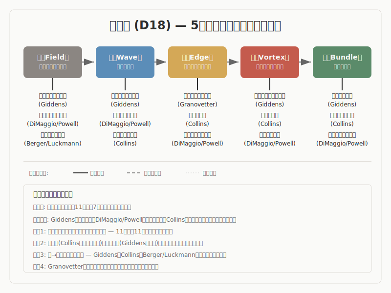

# 社会学

> **立ち位置明示**
> 本稿は、社会学の主要理論と「5段階モデル（場→波→縁→渦→束）」との
> 構造的類似を調査した報告です。特定の理論的立場を主張するものではなく、
> 異なるラベルが同じ構造を指しているかを検討した調査記録として読まれたい。

## 1. 調査の目的と問い

本調査は、社会学における主要な社会理論が「5段階モデル（場→波→縁→渦→束）」と構造的に対応するかどうかを検討するものです。

社会学は「相互作用から制度化への遷移」を中核問題とする学問です。個人の行為がどのようにして社会構造を形成し、社会構造がどのようにして個人の行為を方向づけるか——この往復運動を記述することが社会学の主題です。この特性は、プロセスの段階的展開を記述する5段階モデルとの比較において独自の位置を占めます。特に社会学は「関係」を中心に据える学問であるため、5段階の「縁」（関係の編成）が最も多様に具体化される領域となります。

本調査では、システム論（ルーマン）、構造化理論（ギデンズ）、普及論（ロジャーズ）、新制度派組織論（ディマジオ＆パウエル）、知識社会学（バーガー＆ルックマン）、社会運動論、ネットワーク分析（グラノヴェッター）、文化再生産論（ブルデュー）、社会的事実論（デュルケーム）、ミクロ社会学（コリンズ）、正統性論（ウェーバー）の11の理論を評価しました。

中心的な問いは以下のとおりです。

- 社会学の諸理論が記述する「相互作用から制度への遷移過程」は、5段階モデルの順序（場→波→縁→渦→束）と構造的に対応するか
- 社会学における「関係の編成」（縁）はどのような多様性を持つか
- 同じ5段階パターンがミクロ（対面的相互作用）・メゾ（組織・運動）・マクロ（社会全体）の異なるスケールで反復されるか

## 2. 調査の方法

### 方法の概要

本調査は、以下の手順で進められました。

まず、社会学の主要理論から、5段階モデルとの構造的類似が期待される過程論・構造論を選定しました。19世紀の古典理論（デュルケーム、ウェーバー）から20世紀の体系的理論（ルーマン、ギデンズ、ブルデュー）、そして特定のプロセスに焦点を当てた中範囲理論（ロジャーズ、グラノヴェッター、コリンズ）まで、11の理論を対象としています。各理論について一次文献の特定箇所を参照し、理論の内在的構造を確認しました（Phase 1-2）。次に、各理論について複数の独立した視点から構造的対応を検討し、対応の強弱を判定しました（Phase 3-4）。

判定基準は以下のとおりです。

- **強い対応**: 理論の内在的構造が5段階の順序と直接一致し、一次文献の具体的テキスト箇所による裏付けがあるもの
- **部分的な対応**: 一部の段階に明確な対応が確認されるが、全5段階にわたる対応は限定的であるもの
- **条件付きの対応**: 対応は示唆されるが、理論と5段階モデルの間に根本的な緊張があるもの

その後、Phase 5（論拠監査）で既存11件の強度分類とギャップ分析を実施し、Phase 6（構造再読）で各エントリの5段階対応を4軸（正確な対応・怪しい対応・破綻箇所・見えていなかった構造）で再評価しました。Phase 7（横断統合）で領域内の横断パターンを抽出しました。

### 調査の限界

本調査の11の理論は、西洋（欧米）の社会学理論が中心です。非西洋の社会理論は含まれていません。また、感情社会学（ホックシールドの感情労働など）やデジタル・ネットワーク社会における社会学的分析も対象外です。これらの不在は、5段階モデルの適用範囲に関する検証の一部が未完了であることを意味します。

### 方法論的開示（S60）

> 本調査における先行研究との構造対応は解釈仮説であり、原著の精読に基づく
> 確定的対応ではありません。5段階のラベルと先行研究のラベルの対応にはグラデーション
> があり、1対1の厳密なマッピングではありません。また、AIによる解釈代行のプロセスを
> 含むため、著者（pjdhiro）自身の精読による検証が完了していない箇所があります。

## 3. モデルの概要

5段階モデルは、創造プロセスを5つの段階で記述する枠組みです。

**場（ば）** は、未分化の状態です。方向も構造もまだ定まっておらず、潜在的な可能性を含む初期条件にあたります。社会学の文脈では、バーガー＆ルックマンの「日常世界の前提的現実」（行為者にとって「当たり前」として経験される現実の基盤）や、デュルケームの「集合意識」（社会の成員に共通する信念や感情の総体）がこの段階と対応します。

**波（なみ）** は、場の中に差異が生まれ、複数の方向性が発散・競合する段階です。微小な揺らぎが成長し、系の均衡が崩れ始めます。社会学では、社会運動論における「政治的機会の変動」（制度的アクセスの開放やエリートの亀裂）、ウェーバーの「カリスマ的断裂」（既存秩序を破壊的に革新する指導者の出現）がこの段階にあたります。

**縁（えん）** は、対立する要素が共存し、どちらにも収束しない緊張状態です。複数の要素が関係し合い、新たな構造の可能性が生まれる臨界的な局面です。社会学では、グラノヴェッターの「弱い紐帯」（異なるクラスター間を橋渡しする関係）、ディマジオ＆パウエルのフィールドの構造化（組織間の相互作用、支配構造、情報循環、相互認知の発達）がこの段階に対応します。

**渦（うず）** は、縁での緊張の中から新たなまとまり（秩序）が自発的に立ち上がる段階です。自己維持的なプロセスが作動し、系が質的に変化します。社会学では、コリンズの「集合的沸騰」（対面的相互作用で情動的高揚が頂点に達する状態）、ウェーバーの「カリスマのルーティン化」（非日常的エネルギーが制度的構造へ凝固していく過程）がこの段階にあたります。

**束（たば）** は、形が確定し、再利用可能な構造として安定する段階です。社会学では、ギデンズの「構造の二重性」（構造が行為を制約すると同時に可能にし、行為を通じて再生産される）、デュルケームの「社会的事実」（個人の外にあり個人を拘束する行為・思考の様式）がこの段階にあたります。なお、束が永続するとは限りません。デュルケームのアノミー（規範の弛緩による束の崩壊）やウェーバーの「鉄の檻」（官僚制への過剰な固定化）が示すように、束の不足と過剰のいずれも病理を生む可能性があります。

## 4. 調査結果: 全体像

11件の調査対象について、5段階モデルとの構造的対応を評価した結果を以下に示します。

| # | 理論/概念 | 提唱者 | 対応段階 | 判定 |
|---|----------|--------|---------|------|
| 1 | 社会システム論 | ルーマン | 全5段階に照射 | 条件付きの対応 |
| 2 | 構造化理論 | ギデンズ | 全5段階（特に束→場循環） | 強い対応 |
| 3 | イノベーションの普及 | ロジャーズ | 波→渦→束に集中 | 部分的な対応 |
| 4 | 制度的同型化 | ディマジオ＆パウエル | 全5段階（特に縁） | 強い対応 |
| 5 | 現実の社会的構成 | バーガー＆ルックマン | 全5段階 | 強い対応 |
| 6 | 社会運動の動員過程 | マッカーシー＆ザルド、タロウ | 波・縁に強い対応 | 部分的な対応 |
| 7 | 弱い紐帯の強さ | グラノヴェッター | 縁に特化 | 強い対応 |
| 8 | 場・資本・ハビトゥス | ブルデュー | 全5段階（同名異義に注意） | 部分的な対応 |
| 9 | 社会的事実・連帯・アノミー | デュルケーム | 場・縁・束に対応 | 部分的な対応 |
| 10 | 相互作用儀礼連鎖 | コリンズ | 全5段階（ミクロサイクル） | 強い対応 |
| 11 | 正統性の3類型とカリスマのルーティン化 | ウェーバー | 渦→束に強い対応 | 部分的な対応 |

温度帯の分布としては、強い対応が5件（ギデンズ、ディマジオ＆パウエル、バーガー＆ルックマン、グラノヴェッター、コリンズ）、部分的な対応が5件、条件付きの対応が1件（ルーマン）です。社会学は全体として5段階モデルとの対応が高い領域であり、特に「縁」の多様性と「束→場循環」の明示的な記述が際立っています。ただし、社会学は「関係」を対象とする学問であるため、縁の多様性が自然に生じやすいことには留意が必要です。

> **安全弁**
> ここまでの全体像で十分な場合、以降の詳細分析は省略可能です。
> 各知見の詳細は以下のセクションで展開します。

## 5. 調査結果: 主要な知見

### 5.1 構造化理論（ギデンズ）

- **事実として**: ギデンズ（1984）は「構造の二重性」を提唱しました。構造は行為を制約すると同時に可能にするものであり、行為の外部に存在するのではなく行為の中で再生産されます。「規則と資源」が構造の二側面であり、行為者は「再帰的モニタリング」によって自らの行為と他者の行為を絶えず監視しています。

- **読み取りとして**: ここでは、構造と行為の再帰的な往復運動——構造が行為の条件を設定し、行為が構造を再生産するという循環的プロセスを読み取ります。類似の水準はプロセスであり、特に「再生産の循環構造」に着目します。

- **解釈として**: この「構造の二重性」は、5段階モデルの束→場循環と直接対応すると考えられます。束（再生産された制度的パターン）が場（行為の条件）を構成し、場での行為が束を再生産する。ギデンズの理論は、この循環を中心命題として最も明示的に定式化しています。さらに「意図せざる帰結」の概念は、5段階の循環が単純な計画-実行-結果ではなく、常に予測不可能な要素を含むことを示唆します。

### 5.2 制度的同型化と組織フィールド（ディマジオ＆パウエル）

- **事実として**: ディマジオ＆パウエル（1983）は、組織がなぜ同質化するかを説明しました。同型化には3つのメカニズムがあります。強制的同型化（政治的影響や正統性圧力）、模倣的同型化（不確実性への反応として成功した組織を模倣する）、規範的同型化（専門職化による基準の統一）です。「組織フィールド」の構造化は、相互作用の増加、支配・連合構造の出現、情報負荷の増加、相互認知の発達から成ります。

- **読み取りとして**: ここでは、フィールドの構造化プロセス——多様な組織集合が制度的圧力のもとで関係を編成し、共通の型へ収束していく過程の段階的展開を読み取ります。類似の水準はプロセスであり、特に「構造化（structuration）の4要素」が関係の段階的編成として明示されている点に着目します。

- **解釈として**: フィールドの構造化の4要素は、5段階モデルの「縁」（関係の編成）を最も具体的に記述するものと考えられます。未構造化の組織集合（場）に制度的圧力が加わり（波）、相互作用・連合・情報循環・相互認知が形成され（縁）、同型化の「型」が立ち上がり（渦）、同型化した慣行が再生産される（束）。ただし、この理論が記述するのは「創造」ではなく「同質化」であり、5段階を「創造プロセス」として前提する場合には方向性が逆転します。この逆方向性自体が、5段階が創造と反創造の両方を記述しうるかという理論的問いを提起しています。

### 5.3 現実の社会的構成（バーガー＆ルックマン）

- **事実として**: バーガー＆ルックマン（1966）は、社会が「外在化・客体化・内在化」の三契機から成る弁証法的過程であると論じました。「社会は人間の産物であり、社会は客観的現実であり、人間は社会の産物である」。制度化は「反復され習慣化された行為の相互類型化」であり、正当化は「二次的客体化」として制度秩序に意味を付与します。重要な留保として、三契機は時間順に生起するのではなく同時並行的に作動すると明示されています。

- **読み取りとして**: ここでは、現実の構成を「位相の弁証法」として読み取ります。外在化（意味を外へ投射する）→客体化（制度として固まる）→内在化（社会化を通じて主観に組み込まれる）という変容の位相を読み取ります。類似の水準は構造であり、弁証法的循環の配置関係に着目します。

- **解釈として**: 日常世界の前提的現実（場）→外在化による意味の投射（波）→制度化としての相互類型化（縁）→正当化による意味の統合（渦）→内在化と社会化による再外在化（束→場回帰）という対応が考えられます。ただし、三契機の同時並行性は5段階を「厳密な時間順」として読む場合に破綻します。5段階を「変容の分析的位相」として読むならこの緊張は緩和されますが、この方法論的問題は社会学固有ではなく5段階モデル全体に関わる未解決の問いです。

### 5.4 弱い紐帯の強さ（グラノヴェッター）

- **事実として**: グラノヴェッター（1973）は、たまにしか会わない知人との関係（弱い紐帯）が、親密な友人関係（強い紐帯）よりも新奇な情報の伝達において効果的であることを示しました。強い紐帯は情報の冗長性が高く、弱い紐帯は異なるクラスター間を「橋渡し」（bridge）する機能を持ちます。また「埋め込み」（embeddedness）概念により、経済行為が社会的ネットワークに埋め込まれていることを論じました。

- **読み取りとして**: ここでは、異なる集団を接続する「橋渡し」機能を持つ関係のメカニズムを読み取ります。類似の水準はメカニズムであり、「接続の性質によって情報の流れが構造化される」点に着目します。

- **解釈として**: 弱い紐帯は、5段階モデルの「縁」の最も純粋な社会学的定式化と考えられます。異なるクラスター（場）間を接続する「橋」としての定義は、縁の構造的定義と直接対応します。さらに、バート（1992）の「構造的空隙」概念やロジャーズのキャズム理論が示すように、「縁の不在」（非接続）もまた構造的に機能することが示唆されます。縁は「接続」だけでなく「非接続」を含む概念として理解する可能性があります。

### 5.5 相互作用儀礼連鎖（コリンズ）

- **事実として**: コリンズ（2004）は、対面的相互作用の4要件——身体的共在、外部への境界、共通の注意焦点、共有された情緒——が揃ったとき「集合的沸騰」（デュルケーム由来の概念）が生じると論じました。成功した相互作用儀礼は「情動エネルギー」を生成し、これが個人に蓄積されて次の相互作用への動機づけとなります。儀礼の「連鎖」が社会構造（階層、ネットワーク、文化的シンボル）を生成します。

- **読み取りとして**: ここでは、対面的相互作用のミクロスケールにおける完全なサイクル——共在から情動的高揚を経て構造の蓄積に至る循環的プロセスを読み取ります。類似の水準はプロセスであり、ミクロレベルでの段階的展開の全体像に着目します。

- **解釈として**: 対面的共在（場）→共通の注意焦点への収斂（波）→参加者間のリズム的同期（縁）→集合的沸騰としての情動的ピーク（渦）→情動エネルギーと集合的シンボルの蓄積（束）という対応が、ミクロスケールでの5段階サイクルとして最も明瞭に記述されます。「連鎖」は束→場循環の反復です。さらに「失敗した儀礼」（4要件のいずれかが欠けた場合）は、5段階の遷移が起きない「失敗モード」をミクロレベルで記述するものと考えられます。

### 5.6 社会的事実・連帯・アノミー（デュルケーム）

- **事実として**: デュルケーム（1893, 1895, 1897）は「社会的事実」を「個人の外にあり個人を拘束する行為・思考・感覚の様式」と定義しました。機械的連帯（類似性に基づく連帯）から有機的連帯（分業に基づく相互依存）への移行を記述し、「アノミー」（規範の弛緩・崩壊）を分業の急速な進展がもたらす病理として分析しました。自殺論では、束の不足（アノミー的自殺）と束の過剰（宿命的自殺）の両極が病理を生むことが示されています。

- **読み取りとして**: ここでは、連帯の質的変容（類似性→相互依存性）と、規範の過不足がもたらす病理の両面を読み取ります。類似の水準はプロセスと構造の両方にまたがり、連帯の変容過程と病理の構造的位置づけに着目します。

- **解釈として**: 分業の進展による差異の拡大（波）→相互依存関係の形成（縁）→制度・法・道徳の自己組織化（渦）→有機的連帯としての安定化（束）という対応が考えられます。デュルケーム固有の貢献は、アノミー——束の崩壊による場への退行——を記述した点です。さらに、束の不足（アノミー）と束の過剰（宿命的状態）の両極が病理をもたらすという知見は、束に「適切な強度」が存在する可能性を示唆します。

### 5.7 正統性の3類型とカリスマのルーティン化（ウェーバー）

- **事実として**: ウェーバー（1922）は正統的支配の3類型を提示しました。伝統的支配（「昔からそうである」慣習への信仰）、カリスマ的支配（非日常的な資質への帰依）、合法的支配（合理的に制定された規則への信従）です。「カリスマのルーティン化」は、カリスマ的断裂が後継者問題・行政装置の整備を通じて日常化・制度化される過程を記述します。

- **読み取りとして**: ここでは、非日常的エネルギーが制度的構造へ凝固していく動態と、束の内部に複数の様態（慣習・人格・規則）が存在する構造を読み取ります。類似の水準はプロセスであり、「カリスマ→制度化」という遷移の動態に着目します。

- **解釈として**: カリスマ的指導者の出現が既存秩序を破壊する（波）→帰依者の結集と使命共同体の形成（縁）→カリスマのルーティン化として制度化が進行する（渦→束）という対応が考えられます。正統性の3類型は束の3つの様態——伝統（慣習の束）、カリスマ（人格の束）、合法性（規則の束）——として読むことができます。また「鉄の檻」（官僚制への閉塞）は、デュルケームの宿命的自殺と同様に束の過剰がもたらす病理を記述しています。

### 5.8 イノベーションの普及（ロジャーズ）

- **事実として**: ロジャーズ（1962/2003）は、イノベーションの普及がS字曲線を描くことを示しました。採用者は5カテゴリに分類されます——革新者（2.5%）→初期採用者（13.5%）→前期多数派（34%）→後期多数派（34%）→遅滞者（16%）。普及の成功は5つの属性（相対的優位性、両立可能性、複雑性、試行可能性、観察可能性）に依存します。

- **読み取りとして**: ここでは、S字曲線に表れる普及の加速と収束のパターンを読み取ります。類似の水準はプロセスであり、採用率の時系列的変化の順序と形状に着目します。

- **解釈として**: S字曲線の初期（革新者の逸脱行動）は波、オピニオンリーダーを介した伝播は縁、急上昇部分は渦、飽和・標準化は束に対応すると考えられます。ロジャーズの5属性は、波が縁に遷移するための条件変数として再解釈可能です。ただし、場（イノベーション以前の状態）の記述がやや薄く、対応は波→渦→束の3段階に集中しています。

### 5.9 社会システム論（ルーマン）

- **事実として**: ルーマン（1984, 1997）は、社会をコミュニケーションの自己準拠的（オートポイエーティック）システムとして記述しました。社会の要素は人間ではなくコミュニケーションです。機能分化した下位システム（法、経済、政治、科学等）がそれぞれ固有のコード（合法/違法、支払/不支払等）で作動します。「意味」は複雑性縮減のメカニズムとして定義されます。

- **読み取りとして**: ここでは、可能性空間（複雑性）からの選択と縮減のプロセスを読み取ります。類似の水準は構造であり、「システムの作動的閉鎖」と「環境との構造的カップリング」の配置関係に着目します。

- **解釈として**: 意味の可能性空間（場）→コード化圧力（波）→システム間カップリング（縁）→機能システムの自己組織化（渦）→コード/プログラムの安定化（束）という対応が理論的には描けます。ただし、抽象度が極めて高く、具体事例での検証がなされていません。対応が「言えるが検証できない」状態にとどまるため、条件付きの対応と判定しています。

### 5.10 場・資本・ハビトゥス（ブルデュー）

- **事実として**: ブルデュー（1979, 1980）は「場」（champ/field）を相対的に自律した社会空間と定義し、行為者が場のルールに従いつつ位置をめぐって競争すると論じました。「資本」は経済資本、文化資本、社会資本、象徴資本の4種です。「ハビトゥス」は過去の経験が身体化された持続的な性向体系であり、将来の行為を生成する原理として機能します。

- **読み取りとして**: ここでは、構造化された性向体系（ハビトゥス）が行為を生成し、その行為が社会空間の構造を再生産するという循環的プロセスを読み取ります。類似の水準は構造であり、「構造化する構造であり構造化された構造」という再帰性に着目します。

- **解釈として**: ハビトゥスは5段階の「束」——過去の経験が身体化され将来の行為を方向づける構造——として強い対応を示します。ただし、重要な概念的注意があります。ブルデューの「場」（champ）は既に構造化された競争空間であり、5段階の「場」（未分化な可能性空間）とは異なる概念です。ブルデューの「場」は5段階では「縁」以降に対応します。この同名異義は概念的混乱を招くリスクがあるため、読者には両者の区別を意識していただく必要があります。また、「象徴暴力」の概念は、束が「見えない」形で作動する場合——支配関係が自然なものとして認知されるメカニズム——を記述しており、束の不可視性という側面を示唆します。

### 5.11 社会運動の動員過程（マッカーシー＆ザルド、タロウ）

- **事実として**: マッカーシー＆ザルド（1977）の資源動員論は、不満の存在だけでは運動は生じず、資源の動員、組織構造、外部支援が決定的であることを示しました。タロウ（1998）の政治過程論は、政治的機会の4要素——制度的アクセスの開放、エリートの亀裂、同盟者の出現、抑圧能力の低下——が集合行為を促進するとしています。「抗争の循環」概念は、運動の経験が次の運動を方向づけることを記述します。

- **読み取りとして**: ここでは、集合行為の発生条件が操作的変数として列挙されている点を読み取ります。類似の水準はメカニズムであり、「波の発生にどのような条件が必要か」を具体化する変数のリストに着目します。

- **解釈として**: 政治的機会の4要素は、5段階の「波」の発生条件を最も具体的に記述するものと考えられます。動員構造（ネットワーク・組織・連合）は縁の制度的実装であり、「抗争の循環」は束→場回帰のメカニズムです。「不満だけでは運動は生じない」という知見は、場（不満の存在）だけでは波は立たず、波の発生には「機会構造」（場の条件変化）が必要であることを意味します。

## 6. 横断的パターン

社会学の11の理論から、以下の横断的パターンが抽出されました。

### 束→場循環の遍在性

11エントリ中6エントリが束→場循環を明示的に記述しています。ギデンズの「構造の二重性」、バーガー＆ルックマンの「外在化→客体化→内在化」、コリンズの「相互作用儀礼連鎖」、ウェーバーのカリスマのルーティン化→再カリスマ化、デュルケームのアノミー→再連帯、社会運動の「抗争の循環」です。社会学は「社会的再生産」としてこの循環を最も体系的に記述する領域と考えられます。ただし、束→場循環は社会学理論の一般的特徴（社会的再生産は社会学の中心的テーマ）であるため、5段階固有の構造類似と社会学の一般的性質を区別する必要があります。

### 縁の構造的多様性

11エントリに11タイプの異なる縁の型が対応し、重複がありません。抽象型（ルーマン）、再帰型（ギデンズ）、伝播型（ロジャーズ）、制度型（ディマジオ＆パウエル）、類型化型（バーガー＆ルックマン）、動員型（社会運動）、橋渡し型（グラノヴェッター）、競争型（ブルデュー）、依存型（デュルケーム）、同期型（コリンズ）、正統性型（ウェーバー）です。この多様性は、5段階の「縁」が単一のメカニズムではなく、多様な関係編成の形態を包含する概念であることを示唆します。ただし、社会学が「関係」を対象とする学問であることを考慮すると、この多様性は5段階の「縁」概念の弁別力を過大評価するリスクも含んでいます。

### スケール横断的な自己相似性

同じ5段階パターンが、ミクロ（コリンズの対面的相互作用）、メゾ（ディマジオ＆パウエルの組織フィールド、社会運動）、マクロ（ギデンズの社会構造、ルーマンの世界社会）の3スケールで反復されます。ただし、ミクロの相互作用がどのようにマクロの構造を生むかという「ミクロ-マクロ問題」は社会学でも未解決であり、スケール間の遷移メカニズムの記述は不足しています。

### 波の条件変数の具体化

社会学は、5段階の「波」がどのような条件下で発生するかを操作的変数として具体化しています。社会運動論の政治的機会4要素、ウェーバーのカリスマ的断裂、ロジャーズの5属性がその具体例です。「場に差異が生じるために何が必要か」という問いに対する社会学的回答のリストとして、独自の貢献を持ちます。

### 束の病理学

デュルケームのアノミー（束の不足: 規範の弛緩）とウェーバーの鉄の檻（束の過剰: 官僚制への閉塞）は、束の両極的病理を記述しています。ディマジオ＆パウエルの制度的同型化（束による多様性の抑制）もまた束の過剰の一形態です。束には適切な強度があり、過不足のいずれも社会的病理を生む可能性があります。これは5段階モデルに「健全な循環」と「病理的停滞」の区別を導入しうる知見ですが、5段階モデル内での定式化は未達成です。

## 7. 未解決の問い

### 5段階は「順次モデル」か「位相モデル」か

バーガー＆ルックマンの三契機の同時並行性、コリンズの相互作用儀礼の同時性は、5段階を「分析的位相」として読むことを支持します。しかしロジャーズのS字曲線やウェーバーのカリスマのルーティン化は「時間的順序」を含意します。この緊張関係は社会学の知見だけでは解消できず、5段階モデル全体に関わる方法論的問いとして残ります。

### ブルデュー「場」と5段階「場」の同名異義

ブルデューの「場」（champ）は既に構造化された競争空間であり、5段階の「場」（未分化な可能性空間）とは異なる概念です。この同名異義が読者の概念的混乱を招くリスクがあります。5段階の「場」という語を使い続けるか、別の表現に置換するかは理論的判断として残されています。

### 束の「適切な強度」の定式化

デュルケームのアノミー（束の不足）とウェーバーの鉄の檻（束の過剰）から示唆される「束の適切な強度」は、直感的に妥当ですが、5段階モデル内でどのように定式化するかは未解決です。場・波・縁・渦の各段階にも「適切な強度」があるのかという問いへと一般化する可能性があります。

### 「反創造プロセス」の位置づけ

ディマジオ＆パウエルの制度的同型化は「多様性→同質性」を記述し、5段階の「未分化→分化→構造化」とは方向が逆です。5段階が「創造」のみを記述するのか、「創造と反創造の両方」を記述するのかは、理論的な判断として未解決です。

### 情動と社会構造の接続

コリンズの「情動エネルギー」とデュルケームの「集合的沸騰」が情動を扱いますが、感情社会学の体系的な知見は本調査に含まれていません。5段階の各段階——特に波（差異の認知に伴う情動的反応）と渦（集合的情動の高揚）——における情動の機能について、更なる検討が必要です。

## 8. 結論

> **結びの温度開示**
> 本調査の知見は、確定から仮説までの温度帯に分布しています。
> 5段階モデルとの構造的対応は、11エントリ中5件で強い対応、5件で部分的な対応、1件で条件付きの対応が確認されました。社会学は30領域の中でも構造的対応が高い領域の一つです。

社会学の調査から得られた主要な知見を要約します。

第一に、束→場循環の遍在性です。ギデンズ、バーガー＆ルックマン、コリンズをはじめとする複数の理論が、構造と行為の循環的な再生産を明示的に記述しています。これは5段階モデルの循環構造との対応を示すものですが、社会的再生産が社会学理論の一般的特徴であることを踏まえた慎重な解釈が必要です。

第二に、縁の構造的多様性です。11の理論それぞれが異なるタイプの「関係の編成」を記述しており、5段階の「縁」が多義的な概念であることを示唆しています。ただし、この多様性が社会学の学問的性質（「関係」を対象とすること）に起因する可能性にも留意が必要です。

第三に、波の条件変数の具体化です。社会運動論やロジャーズの普及理論が、波の発生条件を操作的変数として示しており、5段階モデルの抽象的な定義を具体化する貢献を持ちます。

第四に、束の病理学です。束の不足（アノミー）と過剰（鉄の檻）の両極に病理が存在するという知見は、5段階モデルに新たな分析軸を導入する可能性を持つ仮説です。

第五に、スケール横断的な自己相似性です。ミクロ・メゾ・マクロの3スケールで同じ5段階パターンが反復することが示唆されますが、スケール間の遷移メカニズムの記述は不足しています。

特に「5段階は順次モデルか位相モデルか」という方法論的問い、「束の適切な強度」の定式化、ブルデュー「場」との同名異義の扱いについては、更なる検証が必要です。

## Colophon

| 項目 | 値 |
|------|-----|
| 生成日 | 2026-03-18 |
| generator_model | claude-opus-4-6 |
| evidence_count | 11件（強い対応: 5, 部分的: 5, 条件付き: 1） |
| source_evidence | evidence-D18-sociology.md |
| source_dr | DR-D18-sociology.md |
| reader_rules | reader-rules-creation v2.2 |
| template | domain-report-template v1.0 |
