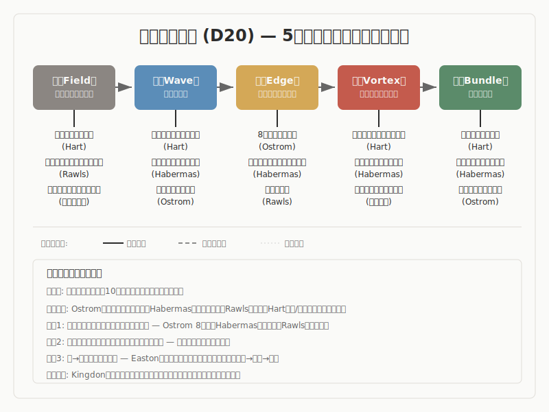

# 法学・政治学

> **立ち位置明示**
> 本稿は、法学・政治学の主要理論と「5段階モデル（場→波→縁→渦→束）」との
> 構造的類似を調査した報告です。特定の理論的立場を主張するものではなく、
> 異なるラベルが同じ構造を指しているかを検討した調査記録として読まれたい。

## 1. 調査の目的と問い

本調査は、法学・政治学における主要な理論が「5段階モデル（場→波→縁→渦→束）」と構造的に対応するかどうかを検討するものです。

法学・政治学は、「規範・制度の生成と正当化」を中核とする学問群です。法秩序の基盤をめぐる分析哲学（Hart）、政治システムのフィードバック構造（Easton）、共有資源の自己統治（Ostrom）、憲法制定という秩序の根源的創出（Sieyes, Schmitt）、紛争解決の多層的手続設計（ADR）、国際的な制度形成（Krasner, Keohane）、正義の原理の基礎づけ（Rawls）、討議を通じた法の正当化（Habermas）、政策形成の偶然的合流（Kingdon）、そして旧秩序の崩壊後の再建（移行期正義）にいたるまで、規範がどのように生まれ、維持され、時に崩壊するかを多角的に記述します。この「規範の生成と正当化」という営みは、5段階モデルが記述する秩序生成のプロセスとの比較において独自の位置を占めます。

中心的な問いは以下のとおりです。

- 法学・政治学が記述する「規範・制度の生成・正当化・崩壊のプロセス」は、5段階モデルの順序（場→波→縁→渦→束）と構造的に対応するか
- 個別紛争・国内制度・国際レジームという異なるスケールの理論が、同じ構造パターンを示すか
- 法学・政治学における「権力」の横断的作用は、5段階モデルの記述にどのような制約を課すか

## 2. 調査の方法

### 方法の概要

本調査は、以下の手順で進められました。

まず、法学・政治学の主要理論から、5段階モデルとの構造的類似が期待される過程論・制度論を選定しました。英米法哲学（Hart）、政治システム理論（Easton）、制度分析（Ostrom）、憲法学（Sieyes, Schmitt）、紛争解決法（ADR）、国際関係論（Krasner, Keohane）、政治哲学（Rawls, Habermas）、政策過程論（Kingdon）、国際法・人権法（移行期正義）の10件を対象としています。各理論について一次文献の特定箇所を参照し、理論の内在的構造を確認しました（Phase 1-2）。次に、各理論について複数の独立した視点から構造的対応を検討し、対応の強弱を判定しました（Phase 3-4）。

判定基準は以下のとおりです。

- **強い対応**: 理論の内在的構造が5段階の順序と直接一致し、一次文献の具体的テキスト箇所による裏付けがあるもの
- **部分的な対応**: 一部の段階に明確な対応が確認されるが、全5段階にわたる対応は限定的であるもの
- **条件付きの対応**: 対応は示唆されるが、理論と5段階モデルの間に根本的な緊張があるもの

その後、Phase 5（論拠監査）で既存10件の強度分類とギャップ分析を実施し、Phase 6（構造再読）で各エントリの5段階対応を4軸（正確な対応・怪しい対応・破綻箇所・見えていなかった構造）で再評価しました。Phase 7（横断統合）で領域内の横断パターンを抽出しました。

### 調査の限界

本調査の10の理論は、英米・大陸ヨーロッパの法学・政治学に基づいています。イスラーム法学、東アジアの法伝統、アフリカの慣習法体系など、非西洋圏の法的伝統は含まれていません。また、デジタルプラットフォームのガバナンスやAI規制など、現在進行中の制度形成は射程外です。

### 方法論的開示（S60）

> 本調査における先行研究との構造対応は解釈仮説であり、原著の精読に基づく
> 確定的対応ではありません。5段階のラベルと先行研究のラベルの対応にはグラデーション
> があり、1対1の厳密なマッピングではありません。また、AIによる解釈代行のプロセスを
> 含むため、著者（pjdhiro）自身の精読による検証が完了していない箇所があります。

## 3. モデルの概要

5段階モデルは、秩序生成のプロセスを5つの段階で記述する枠組みです。

**場（ば）** は、未分化の状態です。方向も構造もまだ定まっておらず、潜在的な可能性を含む初期条件にあたります。法学・政治学の文脈では、Hartの「前法的社会」——慣習が未分化に併存する状態——や、Rawlsの「原初状態」——個人的属性が消去された可能性空間——がこの段階と対応します。

**波（なみ）** は、場の中に差異が生まれ、複数の方向性が発散・競合する段階です。微小な揺らぎが成長し、系の均衡が崩れ始めます。法学・政治学では、Hartの「前法的社会の3つの欠陥」（不確実性・静態性・非効率性）の顕在化や、Habermasの「事実性と妥当性の緊張」がこの段階にあたります。

**縁（えん）** は、対立する要素が共存し、どちらにも収束しない緊張状態です。複数の要素が関係し合い、新たな構造の可能性が生まれる臨界的な局面です。法学・政治学では、Ostromの「8つの設計原則」（共有資源ガバナンスの境界・監視・紛争解決の制度設計）、Habermasの「討議手続」（平等参加・合意志向の関係構造）、ADRの「多層手続」（交渉→調停→仲裁→訴訟の段階的設計）がこの段階に対応します。法学・政治学はこの「縁」の段階が最も豊かに具体化される領域です。

**渦（うず）** は、縁での緊張の中から新たなまとまり（秩序）が自発的に立ち上がる段階です。自己維持的なプロセスが作動し、系が質的に変化します。法学・政治学では、Hartの「承認規則」による法体系の統合、Rawlsの「2つの正義原理への合意」、憲法テキストへの収束と採択がこの段階にあたります。渦には、討議的合意によるもの（Habermas）と権威的決定によるもの（Schmitt）という2つの類型が確認されました。

**束（たば）** は、形が確定し、再利用可能な構造として安定する段階です。法学・政治学では、Eastonの政策群の制度化、Ostromの運用規則群の蓄積、憲法文化の形成がこの段階に対応します。束は単なる終点ではなく、Eastonのフィードバック循環が示すように、政策帰結が新たな要求を生み、場への回帰を駆動します。束の安定性には、制度設計の構造的な適切さ（Ostrom的条件）と、システム全体への信頼（Eastonの「拡散的支持」）という二重の条件が必要です。

## 4. 調査結果: 全体像

本調査で評価した10の理論と5段階モデルとの対応は、以下のとおりです。

| # | 理論/概念 | 提唱者 | 対応段階 | 判定 |
|---|----------|--------|---------|------|
| 1 | 一次ルール/二次ルールの結合 | Hart (1961) | 場・波・縁・渦・束 | 部分的な対応 |
| 2 | 政治システムの入力-出力-フィードバック | Easton (1965) | 束が中心、場・波・縁・渦は部分的 | 部分的な対応 |
| 3 | 共有資源ガバナンスの制度形成 | Ostrom (1990) | 場・波・縁・渦・束 | 強い対応 |
| 4 | 憲法制定過程と制憲権力 | Sieyes (1789), Schmitt (1928) | 場・波・縁・渦・束 | 強い対応 |
| 5 | 多層ADR（交渉→調停→仲裁→訴訟） | UNCITRAL (2021) | 縁が中心、波・渦は部分的 | 部分的な対応 |
| 6 | 国際レジーム形成 | Krasner (1982), Keohane (1984) | 縁・渦が中心、場・波・束は部分的 | 部分的な対応 |
| 7 | 正義論（原初状態と無知のヴェール） | Rawls (1971) | 場・渦が中心、波・縁・束は部分的 | 部分的な対応 |
| 8 | 討議民主主義と手続的正当性 | Habermas (1992) | 波・縁・渦が中心 | 強い対応 |
| 9 | 政策の窓（多重流れモデル） | Kingdon (1984) | 場・縁が中心、渦・束は弱い | 条件付きの対応 |
| 10 | 移行期正義 | Teitel (2000) | 場・波・縁・渦・束 | 条件付きの対応 |

温度帯の分布は、強い対応が3件（Ostrom、憲法制定、Habermas）、部分的な対応が5件（Hart、Easton、ADR、国際レジーム、Rawls）、条件付きの対応が2件（Kingdon、移行期正義）です。全体として、手続設計・制度設計を記述する理論との対応が構造的に強く、特に「縁」の段階が最も豊かに具体化される傾向が確認されました。10の理論のうち8件が「縁」に明確な対応を持ちます。

> **安全弁**
> ここまでの全体像で十分な場合、以降の詳細分析は省略可能です。
> 各知見の詳細は以下のセクションで展開します。

## 5. 調査結果: 主要な知見

### 5.1 一次ルール/二次ルールの結合（Hart）

H. L. A. Hartは1961年の著作『法の概念』において、法体系を一次ルール（行為を規制する義務賦課規則）と二次ルール（認定・変更・裁定の権能付与規則）の結合として記述しました。

- **事実として**: Hartによれば、一次ルールのみの社会（前法的社会）は3つの欠陥を持ちます。不確実性（何がルールかわからない）、静態性（ルールを変更する手段がない）、非効率性（ルール違反を裁定する手段がない）です。二次ルールはこれらの欠陥を解決します。「承認規則」（rule of recognition）は法体系の究極的基準であり、何が法であるかを同定するメタ規範です。二次ルールは3種類あり、認定規則（何が法か）、変更規則（法の改変手続）、裁定規則（紛争解決手続）に分かれます。

- **読み取りとして**: ここでは、未分化な規範集合が構造的な欠陥を顕在化させ、その解決として関係構造（二次ルール）が形成され、メタ規範（承認規則）によって統合されるという段階的な変容構造を読み取ります。類似の水準はプロセスであり、特に「欠陥の顕在化→解決のための制度的構造の形成→統合」という順序に着目します。

- **解釈として**: 慣習が未分化に併存する状態（場）→3つの欠陥の顕在化（波）→二次ルールの出現による関係構造の制度化（縁）→承認規則による法体系の統合（渦）→判例・立法・運用の蓄積（束）という流れが、5段階モデルと構造的に対応します。特に注目すべきは、二次ルールの3種類（認定・変更・裁定）が「縁」の異なるモードとして読める点です。認定は「何が含まれるかの境界設定」、変更は「関係構造の動的再編」、裁定は「紛争時の関係回復」を担います。

なお、Phase 6の構造再読では、承認規則が「渦」に対応するか「束の一部」に対応するかは曖昧であることが指摘されました。承認規則は法体系の統合原理（渦的）であると同時に、歴史的に蓄積された実践（束的）でもあります。この二面性は、5段階の境界が常に明確ではないことを示しています。

### 5.2 政治システムの入力-出力-フィードバック（Easton）

David Eastonは1965年の著作『政治生活のシステム分析』において、政治システムを入力-変換-出力-フィードバックの循環として記述しました。

- **事実として**: Eastonによれば、政治システムは社会からの要求（demands）と支持（support）を入力として受け取り、政策決定を出力として産出し、その結果が再び入力に影響するフィードバック循環を構成します。システム維持の鍵は「拡散的支持」（diffuse support）——特定の政策ではなくシステム自体への信頼——です。個別政策への評価（特定的支持）とシステム全体への信頼（拡散的支持）は区別されます。

- **読み取りとして**: ここでは、制度化された政策群が統治方向を規定し、その帰結が新たな要求を生むというフィードバック循環構造を読み取ります。類似の水準は構造であり、特に「産出物が入力条件を再生成する循環的配置」に着目します。

- **解釈として**: 社会内の潜在的不満の蓄積（場）→要求の争点化と対立軸の形成（波）→政党・議会・官僚制での利害調整（縁）→政策パッケージとしての決定形成（渦）→制度化された政策群（束）→政策帰結が新たな要求を生成（束→場回帰）という対応が見出されます。この理論の最大の貢献は「束→場循環」の明示的定式化です。5段階は一回的なプロセスではなく、循環的に反復しうることをEastonの枠組みは示しています。また、「拡散的支持」は束の持続条件として重要です。束が持続するためには個々の構成要素の質ではなく、束全体への信頼が必要であるという知見は、束の安定性を理解する上で不可欠です。

### 5.3 共有資源ガバナンスの制度形成（Ostrom）

Elinor Ostromは1990年の著作『コモンズのガバナンス』において、共有資源管理が国家統制でも市場化でもない第三の道——利用者集団による自己統治——で実現可能であることを実証しました。2009年ノーベル経済学賞を受賞した研究です。

- **事実として**: Ostromは世界各地の事例研究から、共有資源の持続的管理に成功した制度に共通する8つの設計原則を抽出しました。明確な境界、調達と供給ルールの合致、集合的選択の仕組み、監視、段階的制裁、紛争解決メカニズム、自治権の承認、入れ子型組織の8つです。これらは「コモンズの悲劇」（Hardin, 1968）への応答として、共有資源が必ずしも枯渇するわけではないことを示しました。

- **読み取りとして**: ここでは、資源依存の集団が過剰利用の圧力に直面し、監視・境界設定・紛争解決の取り決めを自己設計し、それが制度として定着するという段階的な制度形成プロセスを読み取ります。類似の水準はプロセスと構造の両方であり、特に「8設計原則が同時に満たされることで制度が機能する」という同時的条件の構造に着目します。

- **解釈として**: 利用者間で資源依存はあるがルールが粗い状態（場）→過剰利用・ただ乗り問題の顕在化（波）→監視・境界設定・紛争解決の取り決め（縁）→ローカル制度の実効的成立（渦）→運用規則群の蓄積と資源管理の長期的持続（束）という対応が、5段階モデルと構造的に強く一致します。8設計原則は「縁の設計チェックリスト」として読めます。特に、「明確な境界」（原則1）は縁の最も基本的な機能、「段階的制裁」（原則5）は縁の強制力の段階的設計、「入れ子型組織」（原則8）は縁のフラクタル構造に対応します。

Phase 6の構造再読では、8原則が順序を持たない「同時的条件」であることが新たに注目されました。縁は段階的に構築されるのではなく、複数条件が同時に満たされる必要があります。これは5段階の「縁」に関する新しい理解を提供しています。

### 5.4 憲法制定過程と制憲権力（Sieyes, Schmitt）

憲法制定過程は、秩序生成の最も根源的な事例の一つです。Sieyesは1789年に制憲権力（pouvoir constituant）と被制定権力（pouvoir constitue）の区別を明示し、Schmittは1928年に制憲権力を「政治的統一体の実存の態様と形式に関する具体的な全体決定を下す政治的意思」と定義しました。

- **事実として**: 制憲権力は、憲法によって作られた権力とは区別される始源的な力です。International IDEAの実務ガイドは、constitution buildingを「改憲必要性の合意→包摂的手続設計→批准→実施」の長期プロセスと位置づけています。一次資料・準一次資料が段階記述を直接含んでおり、危機→対立→手続→収束→定着という過程が文献上に明示されています。

- **読み取りとして**: ここでは、正当性危機の下で政治状況が未分化に開かれ、制憲主体をめぐる対立を経て、手続の設計・テキストへの収束・運用の持続化にいたるという秩序生成のプロセスを読み取ります。類似の水準はプロセスであり、特に「既存の制度的枠組みの外から秩序が創出される」という根源的な秩序生成の順序に着目します。

- **解釈として**: 正当性危機下の未分化な政治状況（場）→制憲主体・限界をめぐる対立（波）→制憲手続の設計（縁：委員会・議会・公衆参加という異質な行為者の接続と境界条件の定義）→憲法テキストへの収束と採択（渦）→実施・運用・改正・憲法文化の形成（束）という対応は、一次資料の段階記述に直接支持されており、写像が安定しています。この理論の最大の独自性は「場の創出」という概念です。制憲権力は既存の制度的枠組みの外から秩序を創出する力であり、5段階の「場」が所与ではなく意志的に創出されうることを示しています。

### 5.5 多層ADR（UNCITRAL）

ADR（裁判外紛争解決手続）は、紛争解決の多層的な手続設計を提供します。UNCITRAL調停規則（2021年）とシンガポール調停条約（2018年）が国際的枠組みを定めています。

- **事実として**: UNCITRALモデル法は、調停が「紛争の異なる段階で成功裏に利用可能」であり「多層（multi-tiered）紛争解決条項」に組み込めると説明しています。調停は他の手続の開始有無を問わず、いつでも行うことができます。多層ADRでは、交渉→調停→仲裁→訴訟という段階的な手続が設計されますが、一次資料自身が非線形性と段階の飛越・並行利用を明示しています。

- **読み取りとして**: ここでは、手続の挿入によって紛争を可制御化するという「縁の段階的設計」の構造を読み取ります。類似の水準はプロセスであり、特に「介入の強度が段階的に上昇する手続設計」に着目します。

- **解釈として**: 未整理の紛争状態（場）→対立の顕在化・エスカレーション（波）→多層条項・手続合意・調停による枠組み化（縁）→和解合意・仲裁判断・判決（渦）→執行・履行・制度化（束）という対応が見出されます。最も注目すべきは、交渉（最小の介入）→調停（第三者の介入）→仲裁（拘束力のある介入）→訴訟（国家権力の介入）という縁の「強度のグラデーション」です。縁は有か無かの二項対立ではなく、弱い縁から強い縁まで連続的に存在することをこの事例は示しています。ただし、一次資料が明示するように、5段階を直線的な順序として読むのではなく、位相として読む必要があります。

### 5.6 国際レジーム形成（Krasner, Keohane）

Stephen Krasnerは1982年に国際レジームを「原則・規範・ルール・意思決定手続き」の集合と定義し、Robert Keohaneは1984年にレジームが取引費用・不確実性・情報問題に対処する機能を持つことを説明しました。

- **事実として**: Krasner定義の4構成要素は、原則（最も抽象的な信念）→規範（行動の基準）→ルール（具体的な命令・禁止）→意思決定手続き（最も具体的な実施の仕組み）という抽象度の階層を持ちます。WTOやモントリオール議定書が具体的事例です。レジームは「行為者の期待が収斂する枠組み」として定義されます。

- **読み取りとして**: ここでは、Krasner定義の4層構造（原則→規範→ルール→手続き）が抽象度の階層を持ち、「縁」の内部に複数の層が存在するという構造を読み取ります。類似の水準は構造であり、特に「規範的枠組みの抽象度に応じた多層構造」に着目します。

- **解釈として**: 争点領域の相互依存だが非制度化の状態（場）→危機・外部性の顕在化と利害対立（波）→原則・規範・ルール・手続の交渉・形成（縁：Krasner定義そのもの）→条約・機関の成立（渦：期待が制度へ収束）→遵守・改定・慣行としての持続（束）という対応が見出されます。Krasner定義の4構成要素が「縁」に直接対応する点は構造的に強いものです。ただし、国際レジームの形成には覇権や権力要因による非線形性が大きく、5段階の順次進行モデルとの乖離がある場合もあります。

### 5.7 正義論（Rawls）

John Rawlsは1971年の著作『正義論』において、正義の原理を選択するための思考実験装置として「原初状態」と「無知のヴェール」を提示しました。

- **事実として**: 「原初状態」は正義の原理を選択するための仮想的状況であり、「無知のヴェール」は自己の社会的地位・才能・善の構想等の特殊情報を遮断する装置です。この状態から合理的に選択される原理として、Rawlsは2つの正義原理を導きます。第1原理は平等な基本的自由、第2原理は差異原則（最も不遇な人の利益の最大化）と公正な機会均等です。「反照的均衡」は、原理と直覚的判断を相互に調整する方法論です。

- **読み取りとして**: ここでは、個人的属性が消去された未分化状態から、正義原理の候補間の比較・選択圧を経て、原理への合意に至るというプロセスを読み取ります。類似の水準はプロセスであり、特に「未分化状態の意図的設計→選択圧→合意への収束」という順序に着目します。

- **解釈として**: 原初状態（場：個人的属性が消去された可能性空間）→正義原理の候補間の比較・選択圧（波）→反照的均衡による原理と直覚の相互調整（縁）→2つの正義原理への合意（渦）→基本構造の制度設計（束）という対応が見出されます。特に注目すべきは、「無知のヴェール」が場の意図的設計の思考実験である点です。場は自然に未分化なのではなく、意図的に未分化にすることで公正な原理が導かれます。なお、Phase 6の構造再読では、「反照的均衡」の5段階上の位置づけは未解決の問いとして残されています。反照的均衡は行為者間の関係ではなく認知内部の調整プロセスであり、「縁」よりも「波→渦の移行メカニズム」として読む方が正確である可能性があります。

### 5.8 討議民主主義と手続的正当性（Habermas）

Jurgen Habermasは1992年の著作『事実性と妥当性』において、法の正当性が民主的討議手続に由来するという理論を展開しました。

- **事実として**: Habermasの「討議原理」によれば、有効なのは実践的討議において全関係者が合意しうる行為規範のみです。「理想的発話状況」は、全参加者が平等に討議に参加でき、強制なく合意に至れる条件を指します。「事実性と妥当性の緊張」が法の動態を駆動します。理想と現実の乖離条件として、(a)参加者の排除、(b)権力の非対称性、(c)戦略的行為の混入、(d)時間的制約の4つが明示されています。

- **読み取りとして**: ここでは、討議手続が「縁の理想型」として機能し、その乖離条件が「縁の失敗モード」の分類を提供するという構造を読み取ります。類似の水準は構造であり、特に「理想的な関係構造とその失敗条件の体系的分類」に着目します。

- **解釈として**: 公共圏における多元的意見の共存（場）→事実性と妥当性の緊張が争点を顕在化（波）→討議手続を通じた論拠の交換（縁：参加者間の対称的関係構造）→合意の形成（渦：討議原理に基づく規範の正当化）→法制度としての制度化（束）という対応が見出されます。Habermasの乖離条件4つは「縁の失敗条件」のリストとして読めます。(a)参加者の排除＝縁の不完全性、(b)権力の非対称性＝縁の歪み、(c)戦略的行為の混入＝縁の目的の変質、(d)時間的制約＝縁のリソース限界です。ただし、「理想的発話状況」は到達不能な規範的理想であり、5段階の「縁」は経験的記述を志向する点に注意が必要です。規範的理想型と経験的記述を混同すると、分析の性質が変わるリスクがあります。

### 5.9 政策の窓（Kingdon）

John Kingdonは1984年の著作『アジェンダ・代替案・公共政策』において、政策変更のメカニズムとして「多重流れモデル」を提唱しました。

- **事実として**: 多重流れモデルでは、問題の流れ（社会問題の認知・指標・焦点事象）、政策の流れ（政策共同体内での代替案の生成・淘汰）、政治の流れ（国民の気分・政権交代・利益集団の圧力）が独立に流れています。「政策の窓」は3つの流れが合流する機会であり、「政策起業家」がこの窓を利用して政策を前進させます。合流は偶然的・一時的であり、窓は短時間で閉じます。

- **読み取りとして**: ここでは、3つの独立した流れが偶然的に合流するという非線形的な制度変化のモデルを読み取ります。類似の水準はプロセスですが、5段階の順次進行とは根本的に異なる構造を持つ点に注意が必要です。

- **解釈として**: 3つの流れが独立に存在する状態（場）→焦点事象・危機・政治変動による流れの可視化（波）→政策の窓における3流れの合流（縁：異なる要素の一時的接合）→政策起業家が窓を利用し政策を形成（渦）→政策の制度化（束）という対応が限定的に見出されます。最も重要な知見は「縁の一時性」です。他の理論が制度的に安定した縁を記述するのに対し、Kingdonの「政策の窓」は一時的で偶然的な縁として機能します。ただし、Kingdonモデルは根本的に「偶然的合流」のモデルであり、5段階の順次進行とは異質です。3つの流れは並行して存在し偶然合流するのであって、場→波→縁→渦→束という方向的移行とは構造が異なります。このため、5段階は「位相」として読むことでKingdonモデルとの対応が成立しますが、構造類似の範囲は限定されます。

### 5.10 移行期正義（Teitel）

移行期正義は、権威主義・紛争後の社会が過去の大規模人権侵害に対処するための司法的・非司法的措置の総体です。南アフリカ真実和解委員会（TRC, 1996-2003）が代表的事例です。

- **事実として**: Ruti Teitel（2000年）やICTJ（国際移行期正義センター）の定義によれば、移行期正義には4つの柱があります。刑事訴追、真実究明、賠償、制度改革（vetting含む）です。これらは旧体制の崩壊後に、過去の人権侵害への対処と新たな社会の構築を同時に追求する試みです。

- **読み取りとして**: ここでは、旧秩序の崩壊→真実の顕在化→新秩序の構築というプロセスを読み取ります。類似の水準はプロセスであり、特に「束の崩壊後に場が再出現し、新たな束が形成される」という循環に着目します。

- **解釈として**: 旧体制の崩壊（場：旧束の解体後の未分化状態）→過去の人権侵害の顕在化・記録（波：真実究明が差異を可視化）→4つの柱の手続設計（縁）→新たな法的・社会的秩序の形成（渦）→制度改革・和解・記憶の制度化（束）という対応が見出されます。ただし、Phase 6の構造再読では、4つの柱を一括して「縁」に位置づけることの問題が指摘されました。刑事訴追は「渦」（判決への収束）的であり、真実究明は「波」（事実の顕在化）的であり、制度改革は「束」（新制度の形成）的です。4つの柱は5段階の異なる位相にまたがっている可能性があり、この点は過度の単純化として注意が必要です。

また、移行期正義は「束の崩壊後の場」が初期の場とは異なる性質を持つことを示しています。過去の束の記憶を含む場は、純粋な未分化状態ではありません。崩壊後の場が外部的に強制される場合（敗戦、革命）と内部的に崩壊する場合では、5段階の動態が異なります。

## 6. 横断的パターン

本調査で確認された法学・政治学に固有の横断的パターンを以下に示します。

### パターン1: 縁の多層性

法学・政治学は「縁」の段階が最も豊かに具体化される領域です。複数の理論を横断して分析すると、縁は単一の概念ではなく多層的な内部構造を持つことが示されます。

Hartの二次ルール3種（認定・変更・裁定）は縁の3つの機能モードを示し、ADRの多層手続（交渉→調停→仲裁→訴訟）は縁の強度のグラデーションを示し、Krasner定義の4構成要素（原則→規範→ルール→手続き）は縁の抽象度の階層を示し、Habermasの乖離条件4つは縁の失敗モードを分類します。これらは、縁がモード・強度・抽象度・失敗条件の多次元で記述される必要があることを示唆しています。

### パターン2: 場の設計可能性

複数の理論が「場は自然に存在するだけでなく、意図的に創出・設計される」ことを示しています。

Sieyes/Schmittの制憲権力は既存の制度的枠組みの外から場を創出する力であり、Rawlsの無知のヴェールは場を意図的に未分化にする思考装置であり、移行期正義は旧束の崩壊後に場が再出現するケースを記述します。場の生成メカニズムには少なくとも3つの類型——自然発生型・意志的創出型・崩壊後再出現型——があることを、法学・政治学の事例は示しています。

### パターン3: 権力の横断的作用

法学・政治学に固有の特徴として、「権力」が5段階の全てに横断的に作用することが挙げられます。制憲権力が場を創出し（Sieyes）、権力の非対称性が波の対立を構造化し、権力が手続を操作して縁を歪め（Habermasの乖離条件b）、権威的決定が収束を強制し（Schmittの決断主義）、強制力が制度を維持します。権力は特定の段階に固定されるのではなく、全段階に浸透するメタ変数として作用します。

### パターン4: 5段階の「位相」としての読み

法学・政治学の複数の理論が、5段階を時間的順序ではなく「位相」として読むべきことを示唆しています。Eastonの束→場回帰、Kingdonの3流れの偶然的合流、移行期正義の束→場への退行、ADRの段階の飛越・並行利用は、いずれも5段階が一方向に進行しないことを示しています。法学・政治学は5段階の「位相的読み」を最も強く要求する領域の一つです。

## 7. 未解決の問い

本調査において、以下の問いが未解決のまま残されています。

1. **反照的均衡の5段階上の位置**: Rawlsの反照的均衡は方法論的概念です。これを「縁」（関係構造）に位置づけるか、「波→渦の移行メカニズム」（振動を通じた収束）として読むか、あるいは認知内プロセスとして5段階の外に置くかは、未解決です。方法論的概念を構造的段階に写像することの原理的問題が残されています。

2. **Kingdonモデルと5段階の異質性**: 3つの流れが並行的に存在し偶然合流するというKingdonモデルは、5段階の順次進行モデルと根本的に異なる構造を持ちます。「位相として読む」ことで暫定的に対処可能ですが、5段階モデルの根本的拡張が必要かどうかは検討を要します。

3. **法と暴力の関係**: 場の創出に暴力がどのように関与するかは、法学・政治学の固有テーマです。Benjamin (1921) "Critique of Violence"やDerrida (1990) "Force of Law"の系譜に連なるこの問いは、本調査のスコープ外ですが、理論的射程が広いため記録しています。

4. **縁の多層構造の一般化可能性**: 法学・政治学で発見された縁の内部構造（モード・強度・抽象度・失敗条件）が、他の領域でも同様に成立するかは、領域横断的な検証を必要とします。

5. **5段階と「不正義」の記述可能性**: 本調査の理論は概ね「制度形成の成功パターン」を記述しています。悪法の制定、権威主義的な法の道具化、法的差別の制度化といった「不正義」が5段階でどう記述されるかは十分に検討されていません。5段階が秩序生成の成功パターンのみを記述するのか、失敗パターンも記述可能かは理論的に重要な問いです。

6. **行為者の能動性の位置づけ**: Kingdonの政策起業家やOstromの利用者集団は5段階のプロセスに能動的に介入する行為者です。5段階モデルは「プロセスの記述」ですが、「行為者がプロセスにどう介入するか」の記述については更なる検討が必要です。

## 8. 結論

> **結びの温度開示**
> 本調査の知見は確定・有力・仮説の温度帯に分布しています。
> 特に、縁の多層的内部構造については複数の理論からの裏付けがあり有力な知見ですが、
> Kingdonモデルとの対応の限界、反照的均衡の位置づけ、権力の横断的作用の
> 一般化については更なる検証が必要です。

法学・政治学と5段階モデルとの構造的対応は、全体として高い水準で確認されました。10の理論のうち3件で強い対応が、5件で部分的な対応が、2件で条件付きの対応が見出されています。

最も構造的対応が強いのは、Ostromの共有資源ガバナンス（8設計原則が「縁の設計チェックリスト」として機能する）、憲法制定過程（一次資料の段階記述に直接支持される安定した写像）、Habermasの討議民主主義（「縁の理想型」と「縁の失敗条件」の体系的定式化）の3件です。

法学・政治学の独自性として、以下の3点が特に重要です。第一に、「縁」の段階が最も豊かに具体化される領域であり、縁の内部にモード・強度・抽象度・失敗条件の多層構造が確認されました。第二に、5段階を時間的順序ではなく「位相」として読む必要性が、他の領域以上に強く示されています。第三に、「権力」が全段階に横断的に作用するメタ変数として存在し、5段階のプロセス記述に固有の制約を課しています。

一方で、Kingdonの3流れモデルとの対応が構造的に限定されること、移行期正義の4つの柱を5段階に配置する際に過度の単純化が生じるリスクがあること、規範的理想型（Habermas、Rawls）と経験的記述の区別が常に必要であることは、本調査の限界として記録しておきます。

## Colophon

| 項目 | 値 |
|------|-----|
| 生成日 | 2026-03-18 |
| generator_model | Claude Opus 4.6 (1M context) |
| evidence_count | 10件（強い対応: 3, 部分的: 5, 条件付き: 2） |
| source_evidence | evidence-D20-law-politics.md |
| source_dr | DR-D20-law-politics.md |
| reader_rules | reader-rules-creation v2.2 |
| template | domain-report-template v1.0 |
