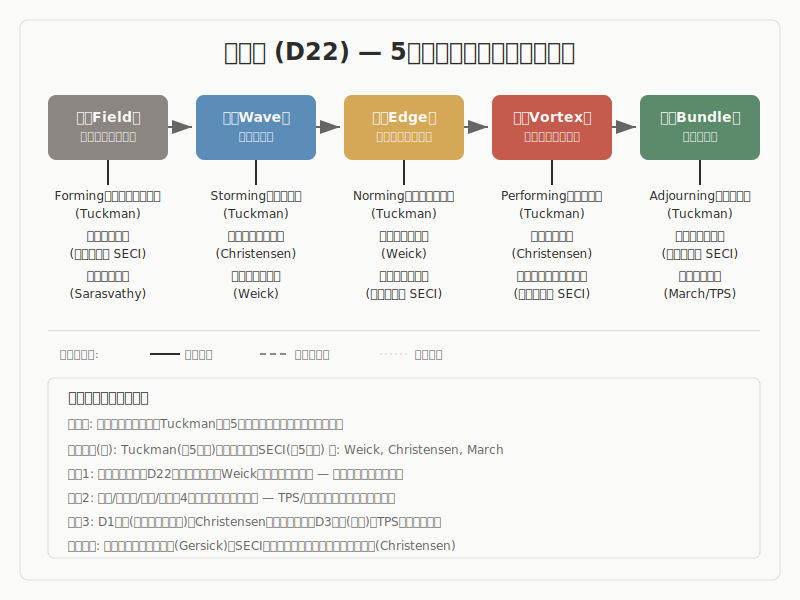

# 経営学

> **立ち位置明示**
> 本稿は、経営学の主要理論と「5段階モデル（場→波→縁→渦→束）」との
> 構造的類似を調査した報告である。特定の理論的立場を主張するものではなく、
> 異なるラベルが同じ構造を指しているかを検討した調査記録として読まれたい。

## 1. 調査の目的と問い

本報告書の目的は、経営学・組織論・イノベーション論の主要理論が記述する組織的プロセスが、5段階モデル（場→波→縁→渦→束）と構造的に対応するかどうかを検討することです。

経営学は、組織がどのように知識を創造し、変化に対応し、構造を制度化するかを理論化してきました。本調査が問うのは、これらの理論が組織の生成・変化・安定化をどのような順序と仕組みで記述しているかであり、そこに5段階モデルとの構造的な対応が見出せるかどうかです。

経営学は30領域の中でも「構造対応が容易に見える」リスクが最も高い領域です。5フェーズ、5モード、5ディシプリンなど数的一致が多く、牽強付会に陥りやすい。本報告書では、数の一致ではなく、変化の方向性・メカニズム・条件の整合を基準として判定しています。

## 2. 調査の方法

### 方法の概要

対象としたのは、組織的知識創造論（野中・竹内）、デザイン思考（d.school）、小集団発達段階論（タックマン）、破壊的イノベーション論（クリステンセン）、学習する組織（センゲ）と精神分析的組織論（ビオン）、探索/活用論（マーチ）、センスメイキング論（ワイク）、トヨタ生産方式/リーン/アジャイル、エフェクチュエーション論（サラスバシー）、アンチフラジャイル論（タレブ）、U理論（シャーマー）を含む11の理論です。

調査は段階的に進めました。まず各理論の原著・先行研究から構造的特徴を抽出し（Phase 1-4）、続いてPhase 5（論拠監査）で既存11件の対応強度を「中核的対応」「限定的対応」「高リスク」の3段階に分類し、5段階の各段階に対するカバレッジのギャップを分析しました。Phase 6（構造再読）では各エントリの5段階対応を「正確な対応」「疑わしい対応」「破綻箇所」「見えていなかった構造」の4軸で再評価しました。Phase 7（横断統合）では領域内の横断パターンを抽出し、段階定義の精緻化提案を導出しました。

判定では、段階数の一致そのものではなく、次の4点を見ました。第一に、理論が記述するプロセスの方向性（未分化→分化→凝集→定着）が5段階と整合するか。第二に、関係の生成・未決定性・構造への接続という「縁」の三条件を満たす記述があるか。第三に、同型パターンが異なるスケールで観察されるフラクタル性があるか。第四に、5段階モデルとは独立した理論的系譜から同型構造に到達しているか。

### 方法論的開示

> 本調査における先行研究との構造対応は解釈仮説であり、原著の精読に基づく
> 確定的対応ではない。5段階のラベルと先行研究のラベルの対応にはグラデーション
> があり、1対1の厳密なマッピングではない。また、AIによる解釈代行のプロセスを
> 含むため、著者（pjdhiro）自身の精読による検証が完了していない箇所がある。

## 3. モデルの概要

本報告書でいう5段階モデルは、創造や変化の過程を次の5つの局面として定義します。

**場（ば）** は、未分化の状態です。方向も構造もまだ定まっておらず、すべてが溶け合っている初期条件にあたります。

**波（なみ）** は、場の内部で差異や緊張が前景化し、複数の方向性が発散・競合する探索の局面です。

**縁（えん）** は、対立する要素が共存し、どちらにも収束しない緊張状態です。関係や制約が生まれ、新しい秩序の芽が現れる界面にあたります。

**渦（うず）** は、緊張の中から新たなまとまり（秩序）が自発的に立ち上がる局面です。ばらばらだった要素が一つの構造として組織化されます。

**束（たば）** は、形が確定し、再利用可能な構造として安定する局面です。渦で立ち上がったまとまりが持ち運び可能な形で残り、次のサイクルの場を支える足場になります。

この5段階は直線ではなく循環として読みます。束は終点ではなく、次の場を支える足場です。ここまでの定義に違和感がある場合、その違和感自体が本調査で確かめるべき論点の一つです。以下では、その違和感を保持したまま、どの理論で対応が強く、どの理論で限定的かを見ていきます。

## 4. 調査結果: 全体像

本調査では11の理論を検討し、以下のような分布が確認されました。

| # | 理論/概念 | 提唱者 | 対応段階 | 判定 |
|---|----------|--------|---------|------|
| 1 | 組織的知識創造5フェーズ | 野中・竹内（1995） | 場・波・縁・渦・束 | 強い対応 |
| 2 | デザイン思考5モード | d.school / Brown（2008） | 場・波・縁・渦・束 | 部分的対応（未解決の問いあり） |
| 3 | 小集団発達5段階 | Tuckman（1965） | 場・波・縁・渦 | 強い対応（前半4段階） |
| 4 | 破壊的イノベーション | Christensen（1997） | 場・波・縁・渦・束 | 部分的対応 |
| 5 | 学習する組織 + 精神分析的組織論 | Senge（1990） / Bion（1961） | 場・波・縁 | 部分的対応 |
| 6 | 探索/活用 + 両利き経営 | March（1991） | 場・波・渦・束 | 部分的対応 |
| 7 | センスメイキング + HRO | Weick（1995） | 場・波・縁・渦・束 | 強い対応 |
| 8 | TPS/リーン + アジャイル | 大野（1978） / Ries（2011） | 場・波・渦・束 | 部分的対応（束に特化） |
| 9 | エフェクチュエーション | Sarasvathy（2001） | 場・波・縁 | 強い対応（前半3段階） |
| 10 | アンチフラジャイル | Taleb（2012） | 波・渦・束 | 条件付き対応（記述水準が異なる） |
| 11 | U理論 | Scharmer（2007） | 場・波・縁・渦・束 | 部分的対応（影響関係あり） |

温度帯の分布としては、確定と判断できる対応が4件（野中、タックマン、ワイク、サラスバシー）、有力な対応が4件（デザイン思考、クリステンセン、センゲ、TPS）、仮説段階が2件（タレブ、シャーマー）、未解決の問いが1件（デザイン思考の形骸化問題）です。

> **安全弁**
> ここまでの全体像で十分な場合、以降の詳細分析は省略可能です。
> 各知見の詳細は以下のセクションで展開します。

## 5. 調査結果: 主要な知見

### 5.1 組織的知識創造5フェーズ（野中・竹内）

**事実として**: 野中郁次郎と竹内弘高は、組織が新しい知識を創り出すプロセスを5つのフェーズとして記述しました（Nonaka & Takeuchi, 1995）。暗黙知の共有から始まり、概念の言語化、外部基準による正当化、原型（プロトタイプ）の構築、組織横断的な知識の展開（cross-leveling）へと進みます。また「場（Ba）」の概念を導入し、知識創造が起きる共有された文脈の重要性を主張しました。ただし、SECIモデルの経験的妥当性にはGourlay（2006）による批判があり、特に「問題発見」段階の欠落が指摘されています。

**読み取りとして**: ここでは、暗黙知が共有される場から出発し、概念化・正当化・原型化・横断展開へと進む方向性、すなわち「未分化な共有状態→言語化による差異の顕在化→外部基準との関係づけ→行為可能な形への凝集→構造としての定着」という生成の順序を構造的特徴として読み取ります。類似の水準はプロセスです。

**解釈として**: 暗黙知の共有（まだ言語化されない知が溶けている共有空間）は場に、概念化（暗黙の了解に差異と言葉が立ち上がる）は波に、正当化（概念が外部基準と関係づけられ採否の境界が編まれる）は縁に、原型化（実装可能なまとまりとして立ち上がる）は渦に、cross-leveling（知が他ユニットへ波及し構造として残り次サイクルを起動する）は束に、それぞれ構造的に対応すると考えられます。5フェーズの全体方向が5段階と整合しており、特にcross-levelingは束の「構造として残り次のサイクルを起動する」という定義と正確に一致します。なお、Gourlay批判が指摘する「問題発見の欠落」は、SECIモデルが「波」に相当する機能——何が知識変換を起動するかという差異の検出——を十分に記述していないことを意味しており、5段階の波がSECIの構造的盲点を指している可能性があります。

### 5.2 デザイン思考5モード（d.school）

**事実として**: スタンフォード大学d.schoolは、デザイン思考をEmpathize（共感）、Define（定義）、Ideate（発想）、Prototype（試作）、Test（検証）の5つのモードとして記述しました。公式には、これらは線形の手順ではなく非線形・反復的なプロセスであると明言されています。Brown（2008）はデザイン思考を「人々のニーズ」「技術的実現可能性」「事業としての実行可能性」を接続する規律と位置づけました。

**読み取りとして**: ここでは、共感的没入から始まり、焦点化、発散、暫定的な形への凝集、学習の蓄積へと向かう生成の方向性を構造的特徴として読み取ります。類似の水準はプロセスです。注意すべきは、5段階との対応ではd.school公式の順序（Empathize→Define→Ideate）と異なり、Empathize→Ideate→Defineの順で対応する点です。これ自体が「手順ではなく構造的対応」であることの証拠になりえます。

**解釈として**: Empathize（文脈への没入）は場に、Ideate（多数の方向性の発散）は波に、Define（情報統合による焦点化）は縁に、Prototype（「Build to think」——触れられる形としてまとまりが立ち上がる）は渦に、Test→Iteration（フィードバックと学習の蓄積）は束に、それぞれ対応すると考えられます。ただし、本調査ではデザイン思考と5段階の関係について重要な未解決の問いが残っています。5モードを手順として適用する「形骸化したデザイン思考」と、プロセスの駆動原理を保持したデザイン思考は異なるものであり、5段階モデルが記述しているのは後者の構造的基盤である可能性があります。この論点は現時点では仮説であり、確定的な判断には至っていません。

### 5.3 小集団発達5段階（タックマン）

**事実として**: Tuckman（1965）は小集団発達研究50本のレビューから、Forming（形成）→Storming（混乱）→Norming（規範化）→Performing（遂行）の4段階を提案し、1977年にAdjourning（解散）を追加して5段階としました。一方、Gersick（1988）はpunctuated equilibriumモデルを提示し、段階の逐次通過ではなく締切等の時間認知で駆動される変化パターンを示しています。

**読み取りとして**: ここでは、集団が未分化な状態から出発し、対立を経て規範を形成し、機能的に遂行するに至る発達方向を構造的特徴として読み取ります。特にNorming段階の「役割・規範・信頼が整い関係のルールが形成される」という記述に注目します。類似の水準はプロセスです。

**解釈として**: Forming（目的・役割・境界を探る集団の場の立ち上がり）は場に、Storming（意見衝突・感情的摩擦による差異の表面化）は波に、Norming（役割・規範・信頼の形成）は縁に、Performing（機能的役割分担のもとでの成果創出）は渦に、それぞれ構造的に対応します。前半4段階の対応は、本調査の11理論の中で最も直観的かつ忠実です。特にNormingは、「関係の網が編まれる」という縁の定義と正確に一致する記述です。Adjourning（解散）を束として読むには原典を超える解釈が必要ですが、解散後に成果物・共有学習・役割継承が次のチーム編成に残る点に着目すれば、束の「次のサイクルを起動する構造的定着」として読むことは可能です。Gersickのpunctuated equilibriumは反証ではなく、5段階の非線形性——段階は必ずしも順序通りに通過しない——の経営学的裏付けとして位置づけられます。

### 5.4 破壊的イノベーション（クリステンセン）

**事実として**: Christensen（1997）は、当初は性能が劣る製品が低価格帯・新市場から参入し、やがて既存市場を置換するプロセスを「破壊的イノベーション」として記述しました。中核概念は「価値ネットワーク」——企業が製品の価値を認識し資源配分を決定するコンテクスト——であり、「正しいこと」をした企業が失敗する逆説（イノベーターのジレンマ）を説明します。ただし理論の適用可能性にはKing & Baatartogtokh（2015）による批判があります。

**読み取りとして**: ここでは、既存のパラダイム（価値ネットワーク）が破壊的技術という弱い信号を検出できず、新市場での試行を経て市場構造が転換するという一連の流れを構造的特徴として読み取ります。特に「価値ネットワーク＝世界観」という対応——世界観が「何が誤差か」を規定するため、その内部では破壊的技術が誤差として見えない——に注目します。類似の水準はプロセスです。

**解釈として**: 既存価値ネットワーク（安定的パラダイムの運用）は場に、破壊的技術の出現（弱い信号の顕在化）は波に、低価格帯での試行（既存市場と新市場の境界に留まること）は縁に、新市場の立ち上がり（自己強化的な成長の凝集）は渦に、市場転換完了（新たな産業構造の確立）は束に、それぞれ対応すると考えられます。ただし縁の記述は暗黙的であり、「境界にいること」と「関係の網が編まれること」は同じではない点に留意が必要です。

### 5.5 学習する組織と精神分析的組織論（センゲ / ビオン）

**事実として**: Senge（1990）は、システム思考・自己マスタリー・メンタルモデル・共有ビジョン・チーム学習の5つのディシプリンを「学習する組織」の条件として提示しました。中核概念は「創造的緊張」——ビジョンと現実のギャップを解消せず保持することが学習の駆動力となる——です。Argyris & Schon（1978）のdouble-loop学習（前提自体の修正）とも接続します。一方、Bion（1961）は集団が不安を回避する際に陥る3つの基本想定——依存（baD）、闘争-逃避（baF）、つがい（baP）——を記述しました。

**読み取りとして**: ここでは、創造的緊張が「差異を検出しそれを反射的に解消せず保持する」機能として読める点に注目します。またBionの基本想定が「差異（波）を関係（縁）として編めず、反射的に処理してしまう」3パターンとして読める点を構造的特徴として読み取ります。類似の水準はメカニズムです。

**解釈として**: システム思考（全体性の把握）は場の一側面に、創造的緊張（ビジョンと現実のギャップの検出と保持）は波に、対話（異なる視点の出会い）は縁に、それぞれ対応すると考えられます。一方、渦と束の対応は未分離のままです（共有ビジョンが渦と束に一括されている）。Bionの基本想定は「波で止まり縁に進めないメカニズム」として読むことができ、5段階の遷移がなぜ阻害されるかを精神分析的に記述しています。

### 5.6 探索/活用と両利き経営（マーチ）

**事実として**: March（1991）は組織学習を探索（新しい可能性の追求）と活用（既知の精緻化）に二分し、両者のバランスの重要性を論じました。過剰な活用はコンピテンシー・トラップ（成功パターンの反復による固着）を生みます。O'Reilly & Tushman（2004）は構造的分離による「両利き経営」を提案しました。また、Cohen, March & Olsen（1972）のゴミ箱モデルは、問題・解・参加者・機会の偶然合流として意思決定を記述しました。

**読み取りとして**: ここでは、探索が5段階前半（未知への開放→揺らぎ→接続）、活用が5段階後半（凝集→安定化）という大構造との整合を読み取ります。またゴミ箱モデルの「偶然合流」が場の非意図的・自生的な性格の精密な記述として読める点に注目します。類似の水準は構造です。

**解釈として**: ゴミ箱モデル（未分化な流れからの偶発的構造化）は場に、探索開始は波に、活用モード（既知の精緻化）は束に、それぞれ対応すると考えられます。縁は探索/活用の二分法では明示的に記述されません。コンピテンシー・トラップは「束に固着し場に戻れない状態」の理論的記述です。ゴミ箱モデルが場の最も社会学的に精密な経営学的記述である一方、5段階が場→束の方向性を持つのに対しゴミ箱モデルは方向性を持たないという緊張があり、「方向性はどこから来るか」が未解決の問いとして残ります。

### 5.7 センスメイキングとHRO（ワイク）

**事実として**: Weick（1995）はセンスメイキング（意味形成）を、経験に意味を付与する社会的プロセスとして7つの特性で記述しました。中核概念は「イナクトメント」（行為が環境を「創り出す」——観察者と環境は分離不可能）と「もっともらしさ優先」（正確さよりも行為可能な物語が重要）です。Cosmology episode（Mann Gulch森林火災の事例研究、1993年論文）は意味枠組みが完全崩壊する瞬間を記述しました。Weick & Sutcliffe（2007）は高信頼性組織（HRO）の5原則——失敗への注目、単純化への抵抗、オペレーション感受性、レジリエンス、専門知尊重——を提示しました。

**読み取りとして**: ここでは、センスメイキングの全プロセスが「未分化な手がかりの海→不調和の気づき→行為と環境の相互生成→もっともらしい物語の凝集→制度化された意味体系」という方向性を持つ点を構造的特徴として読み取ります。特にイナクトメントが「行為者と環境が相互に生成し合う」双方向性を持ち、縁の「関係の網」「未決定性」の条件を満たす点に注目します。類似の水準はプロセスです。

**解釈として**: 生の手がかりが漂う未分化状態は場に、不調和や微弱信号への気づきは波に、イナクトメント（行為と環境の相互生成）は縁に、もっともらしい物語の凝集は渦に、制度化された意味体系としての定着は束に、それぞれ対応すると考えられます。イナクトメントは本調査で最も社会学的に精緻な縁の記述です。またHROの「失敗への注目」は波の制度的増幅装置（組織として差異を拾いやすくする仕組み）として、「単純化への抵抗」は早すぎる渦への凝集を防ぐ安全弁として読むことができます。

### 5.8 トヨタ生産方式/リーン/アジャイル

**事実として**: 大野耐一（1978）はトヨタ生産方式（TPS）をジャスト・イン・タイムと自働化（jidoka）の二本柱として体系化しました。自働化とは異常検知時の自動停止であり、アンドン（ラインストップ信号）によって制度化されています。「現地現物」（現場で直接見て判断する）、「なぜなぜ5回」（根本原因への再帰的探索）も中核的実践です。Ries（2011）のリーンスタートアップではBuild→Measure→Learn（BML）サイクルとMVP（最小実行可能製品）が提唱されました。

**読み取りとして**: ここでは、TPSの各実践が5段階の特定のフェーズに特化した組織的仕組みとして読める点に注目します。特に自働化が「差異の制度的検出」の仕組みである点、スプリントが2週間という時間スケールで場→束の全構造を圧縮反復するフラクタル的特性を持つ点を構造的特徴として読み取ります。類似の水準はメカニズムです。

**解釈として**: 現地現物（身体的没入）は場に、異常検知/アンドン（差異の顕在化）は波に、MVP/プロトタイプ（完成前の暫定構造）は渦に、標準作業/カイゼンの制度化（知見の構造的定着）は束に、それぞれ対応すると考えられます。TPS全体としては束（標準化・制度化）の精緻化に重点があり、5段階全体との対応よりも「特定フェーズに特化した実践体系」として位置づける方が正確です。縁の対応（多品種混流やスプリントレビュー）は未決定性条件が弱く、暗黙的な対応にとどまります。一方、BMLサイクルは渦→波→場の逆回転ループとして読め、5段階の螺旋的回帰の高速版と位置づけられます。

### 5.9 エフェクチュエーション（サラスバシー）

**事実として**: Sarasvathy（2001, 2008）は、熟練起業家の意思決定論理を「エフェクチュエーション」として因果論理（目標→手段→実行）と対比しました。5つの原則——Bird-in-hand（手中の鳥：手持ちの手段から始める）、Affordable loss（許容可能な損失）、Crazy quilt（クレイジーキルト：自発的にコミットする相手と関係を編む）、Lemonade（レモネード：予期せぬ出来事を資源として活かす）、Pilot-in-the-plane（操縦者：予測不能な世界で制御可能な部分に集中する）——を提示しました。Knight（1921）の「確率を割り当てられない不確実性」を理論的基盤としています。

**読み取りとして**: ここでは、エフェクチュエーションの「手段→関係→目的創発」という方向性——手持ちの手段で動き始め、出会った相手と関係を編み、その関係から目的が事後的に生まれる——を構造的特徴として読み取ります。特にCrazy quiltが「関係の網」「未決定性」「渦への接続」という縁の三条件を全て満たす点に注目します。類似の水準はプロセスです。

**解釈として**: Bird-in-hand（手持ち手段への没入）は場に、Lemonade（予期せぬ出来事を資源として検出する）は波に、Crazy quilt（自発的コミットメントから目的が創発する関係の網）は縁に、それぞれ高精度で対応すると考えられます。Crazy quiltは本調査で縁の三条件を全て満たす最も精密な記述の一つです。一方、渦→束はエフェクチュエーション理論の射程外であり、事業の制度化・安定化は因果論理の領域に移行します。この「理論の射程が途中で終わる」構造は、5段階の特定区間のみを記述する理論として正直に扱うべきものです。因果論理/エフェクチュエーションの対比は、束（固着した構造の運用）と場（手持ち手段での能動的探索）の対比と構造的に対応しています。

### 5.10 アンチフラジャイル（タレブ）

**事実として**: Taleb（2012）は、ストレスに対するシステムの応答を3つに分類しました。フラジャイル（ストレスで弱化する）、ロバスト（耐える）、アンチフラジャイル（ストレスで強化される）です。関連する概念として、ブラックスワン（予測不可能で極端な影響を持ち、事後的に「説明可能」に見える事象、Taleb 2007）、皮膚の露出（Skin in the Game: リスクを負わない意思決定者は構造的にフラジャイルになる、Taleb 2018）、Via negativa（追加ではなく除去による改善）、リンディ効果（長く生き延びたものほどさらに長く生き延びる）があります。

**読み取りとして**: ここでは、アンチフラジャイルが5段階的な「生成のプロセス」とは異なる記述水準——システムの応答特性——に位置する点に注目します。フラジャイル/ロバスト/アンチフラジャイルの三分類は5段階の段階ではなく、5段階が生じるシステムの条件を記述していると考えられます。類似の水準は構造ですが、記述水準の差異に留意が必要です。

**解釈として**: ストレッサー/ブラックスワン（予測モデルの根本的失敗）は波に、過補償（ストレスを超えた新構造の凝集）は渦に、リンディ効果（時間テストを経た安定化）は束に、それぞれ対応する要素を持ちます。ただし5段階が「生成のプロセス」を時間軸で描くのに対し、タレブは「システムの応答特性」をストレスの関数として描いており、プロセスと特性は異なるカテゴリです。この意味でタレブの理論は5段階の「メタ記述」——5段階が生じるシステムの条件についての記述——として位置づけるのが妥当と考えられます。バーベル戦略（極端な保守と極端なリスク志向の組合せ、中間の排除）は、場と束の両極を意図的に保持する戦略として読める可能性がありますが、仮説段階にとどまります。

### 5.11 U理論（シャーマー）

**事実として**: Scharmer（2007/2009）はU理論として、社会的場の質を変容させるプロセスをU字カーブで記述しました。7段階——Downloading（既存パターンの反復）→Seeing（事実的観察）→Sensing（全身感知）→Presencing（最深の源泉への接続）→Crystallizing（ビジョンの結晶化）→Prototyping（実験的具現化）→Performing（新実践の制度化）——で構成されます。U字の下降を妨げる「3つの敵」——Voice of Judgment（判断の声）、Voice of Cynicism（冷笑の声）、Voice of Fear（恐怖の声）——も記述されています。シャーマーはセンゲの弟子であり、学習する組織の「盲点」を埋める試みとして位置づけています。実証的根拠の弱さへの批判もあります（Kuhl, 2020）。

**読み取りとして**: ここでは、U字の右半分（Presencing→Performing）が5段階の場→束と方向性が一致する点、およびU字の左半分（Downloading→Presencing）が「場に至るまでの道程」——5段階が暗黙に前提とする「どうやって場に入るか」——を記述している点を構造的特徴として読み取ります。類似の水準はプロセスです。

**解釈として**: Presencing（最深の源泉への到達）は場に、Seeing/Sensing（枠組みの保留と全身感知）は波に、Crystallizing（ビジョンの結晶化）は縁に、Prototyping（実験的具現化）は渦に、Performing（新実践の制度化）は束に、それぞれ対応すると考えられます。ただし、シャーマーがセンゲの弟子であるという影響関係が存在します。影響を受けた理論が類似するのは「独立した構造類似の発見」ではなく「影響の帰結」であり、この区別は重要です。5段階モデルはセンゲからではなく神経科学・精神分析・日本思想から構築されたため、理論的経路の独立性は保たれていますが、U理論との類似は影響関係の可能性を含むものとして慎重に扱う必要があります。U理論の最大の貢献は「場への降下プロセスの可視化」であり、5段階の実践的適用への補完として位置づけられます。

## 6. 横断的パターン

本調査の11理論を横断的に見ると、経営学に固有の構造パターンが浮かび上がります。

### 遷移阻害メカニズムの体系

経営学は30領域の中でも「5段階の遷移がなぜ止まるか」を最も豊富に記述する領域です。11理論から、以下のような遷移阻害パターンが抽出されました。

場→波の阻害として、既存パターンの反復（U理論のDownloading）と価値ネットワークの固着（クリステンセン）が挙げられます。世界観が「何が差異か」を規定するため、異なる信号を遮断してしまいます。波→縁の阻害として、Bionの基本想定（依存・闘争-逃避・つがい）による防衛的退行があります。差異（波）を関係（縁）として編めず、反射的に処理してしまう状態です。束→場の阻害として、コンピテンシー・トラップ（マーチ）と因果論理への固着（サラスバシー）があります。活用の成功が探索（場への回帰）を阻む構造です。

これらのパターンは経営学に固有のものではなく、5段階モデルの一般的な遷移阻害メカニズムの分類枠として他領域でも検証可能と考えられますが、現時点では仮説です。

### 縁の三つの現れ方

縁の記述が強い3つの理論から、縁には異なる類型があることが示唆されます。

規範型（タックマンのNorming）は、役割・ルール・信頼の形成による関係の安定化です。最も直観的な縁の記述です。相互生成型（ワイクのイナクトメント）は、行為者と環境が双方向的に創り出し合う動態です。最も精緻な縁の記述です。創発型（サラスバシーのCrazy quilt）は、自発的コミットメントから目的が創発する関係の網です。縁の三条件を全て満たす記述です。

三類型に共通するのは「未決定の関係が後の構造（渦）を駆動する」という方向性です。この分類が他領域の縁の記述にも適用可能かどうかは、今後の検証課題です。

### 経営学は「束の理論」が豊富

11理論を俯瞰すると、経営学は他領域と比較して「束」（構造化・制度化・標準化）の記述が突出して豊富です。cross-leveling（野中）、Adjourning後の継承（タックマン）、活用モード（マーチ）、制度化された意味体系（ワイク）、標準作業/カイゼンの制度化（TPS）、リンディ効果（タレブ）がこれに該当します。これは経営学の本質的関心が「どう構造化するか」にあることの反映と考えられます。一方、場（未分化な全体性への没入）の記述は哲学や美学に比べて薄い傾向にあります。

### フラクタル的反復の経営学的証拠

5段階の同じ構造が異なるスケールで反復するフラクタル性を、経営学は最も明確に例証します。スプリント（TPS/アジャイル）は2週間で場→束の全構造を圧縮反復し、タックマンのモデルはサブグループ→プロジェクト→部門間で同型パターンを示し、ワイクのセンスメイキングは秒（危機的状況）から年（組織文化の定着）のスケール範囲を持ち、シャーマーはマイクロU（会話）からマクロU（社会変革）までを自ら明示しています。

## 7. 未解決の問い

### デザイン思考と5段階の関係の本質

5モードと5段階の関係は「類似」なのか、「5段階がデザイン思考の上位フレームワーク」なのか、「同じものの異なる側面」なのか。形骸化したデザイン思考は「駆動原理を欠いた手順の反復」と定義できる可能性がありますが、この仮説の検証は現時点では完了していません。

### 記述水準の差異の扱い

タレブのアンチフラジャイルは「システム特性」を記述し、5段階は「生成のプロセス」を記述しています。この二つの記述水準をどう関連づけるかは未解決です。アンチフラジャイルは5段階の「メタ記述」（5段階が生じるシステムの条件）として位置づけることが有力な仮説ですが、確定には至っていません。

### 遷移阻害メカニズムの一般化可能性

経営学で発見された遷移阻害パターンが30領域横断で検証可能かどうかは未確認です。特にBionの基本想定による波→縁の阻害は、心理学や宗教学とも接続する可能性があります。

### 縁の二面性

本調査の evidence は、縁が「位置としての境界」（クリステンセンの低価格帯試行、タレブの皮膚の露出）と「プロセスとしての関係の網の生成」（タックマンのNorming、ワイクのイナクトメント、サラスバシーのCrazy quilt）の二面を持つことを示唆しています。この二面がどう統合されるかは、5段階モデルの縁の定義にとって重要な問いです。

### 場は受動的か能動的か

エフェクチュエーションのBird-in-handは「手持ち手段で能動的に探索する」場の記述であり、TPSの現地現物も「身体で能動的に現場に入る」記述です。場の定義（未分化な全体性）が含意する受動的没入と、これらの能動的記述との緊張関係は未解決です。

## 8. 結論

経営学は、5段階モデルとの構造対応が30領域の中でも最も密度の高い領域の一つです。11理論のうち4件で強い構造対応が確認され、4件で部分的な対応が確認され、2件で仮説段階の対応が示されました。

特に強い知見として、以下が挙げられます。第一に、経営学は「遷移がなぜ止まるか」を最も豊富に記述する領域であり、遷移阻害メカニズムの体系的分類が可能と考えられます。第二に、縁の三つの類型（規範型・相互生成型・創発型）が区別され、縁の理解を深める素材を提供しています。第三に、スプリントなどのフラクタル的反復が、5段階の同型構造が異なるスケールで現れることの明確な経営学的証拠となっています。第四に、束の記述が突出して豊富であり、これは経営学の本質的関心の反映です。

一方、経営学は牽強付会リスクが最も高い領域でもあります。5フェーズ、5モード、5ディシプリンなど数的一致が多く、「対応が見える」ことと「構造的に同型である」ことの区別を常に意識する必要があります。デザイン思考と5段階の関係、タレブの記述水準の差異、U理論の影響関係など、慎重な扱いを要する論点が複数残っています。

> **結びの温度開示**
> 本調査の知見は、確定（4件）・有力（4件）・仮説（2件）・未解決（1件）の温度帯に分布しています。
> 特にデザイン思考の形骸化問題、遷移阻害メカニズムの一般化可能性、
> 縁の二面性については更なる検証が必要です。

## Colophon

| 項目 | 値 |
|------|-----|
| 生成日 | 2026-03-18 |
| generator_model | claude-opus-4-6 |
| evidence_count | 11件（強い対応: 4, 部分的: 5, 条件付き: 2） |
| source_evidence | evidence-D22-business-management.md |
| source_dr | DR-D22-business-management.md |
| reader_rules | reader-rules-creation-report v2.2 |
| template | domain-report-template v1.0 |
