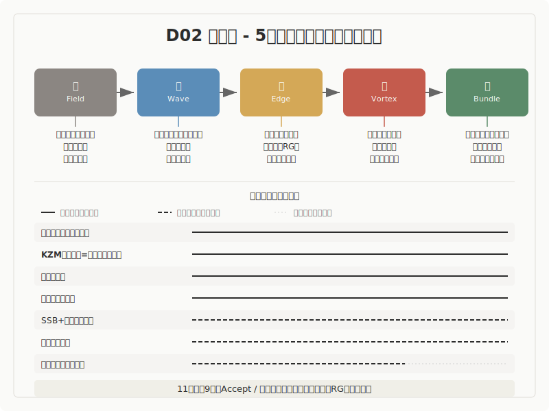

## 物理学

5段階モデル（場・波・縁・渦・束）との構造対応調査

---

## 調査の概要

- **調査対象**: 物理学の主要理論 11件
- **調査の問い**: 物理学の秩序生成理論は、5段階モデルと構造的に対応するか
- **判定結果**: 強い対応 7件（根拠強度「高」）、中程度の対応 3件、棄却 1件
- 物理学は「秩序が生まれる過程」を観測可能な構造として記述する領域であり、5段階との対応が密に確認されました

---

## 構造対応図

---

## 5段階モデルの概要

| 段階 | 定義 |
|------|------|
| 場（ば） | 未分化の状態。方向も構造もまだ定まっていない初期条件 |
| 波（なみ） | 複数の方向性が発散・競合する探索の段階 |
| 縁（えん） | 対立する要素が共存し、どちらにも収束しない緊張状態。境界で接し、影響し合い、関係が生まれる場所 |
| 渦（うず） | 緊張の中から新たなまとまり（秩序）が自発的に立ち上がる段階 |
| 束（たば） | 形が確定し、再利用可能な構造として安定する段階 |

---

## 構造対応の全体像

| 理論 | 5段階対応の核 | 根拠強度 |
|---|---|---|
| 場の量子論（QFT） | 量子場→真空ゆらぎ→相互作用→束縛/共鳴→安定粒子 | 高 |
| BKT転移 | 位相場→スピン波→渦対束縛→解離→相転移後相 | 高 |
| アブリコソフ渦糸格子 | 秩序場→局所不安定化→位相巻き/相互作用→渦糸→格子 | 高 |
| キブル＝ズレック機構 | 高対称相→臨界ゆらぎ→ドメイン境界→欠陥→スケーリング | 高 |
| 自発的対称性の破れ+ヒッグス機構 | 対称真空→破れ→ゴールドストーン→吸収/質量化→スペクトラム | 中 |
| くりこみ群 | 臨界系→ゆらぎ→RG流→固定点近傍→普遍性クラス | 高 |
| レーザー発振 | 無秩序集団→反転分布→モード競合→誘導放出連鎖→コヒーレント光 | 高 |
| ベナール対流 | 静止流体→浮力ゆらぎ→臨界近傍→対流セル→安定パターン | 中 |
| 量子デコヒーレンス | 重ね合わせ→環境相互作用→pointer選択→（渦欠落）→古典状態 | 中 |
| 古典核生成理論 | 準安定相→熱ゆらぎ→臨界核界面→不可逆成長→安定相構造 | 高 |

---

## 主要エントリ 1: アブリコソフ渦糸格子

- **概要**: 第二種超伝導体に磁場を加えると、磁束が個々の量子渦糸として侵入し、それが規則的な格子を形成するメカニズムです
- **構造対応**: 渦（個別の渦糸）から束（安定した格子構造）への遷移を、観測可能な形で最も明瞭に示します
- **注目点**: 材料依存のピン止め効果により格子が歪む場合があり、理想的な遷移が常に実現するわけではありません

---

## 主要エントリ 2: キブル＝ズレック機構

- **概要**: 宇宙初期や物質の相転移で、対称性の破れが因果律に制約されて段階的に進行するメカニズムです。Kibble（1976）と Zurek（1985）の理論に基づきます
- **構造対応**: 5段階の全体を因果律ベースで説明できる点が特徴です。高対称相（場）→臨界ゆらぎ（波）→ドメイン境界（縁）→欠陥形成（渦）→スケーリング則（束）
- **注目点**: 5段階への分割には解釈の幅があり、5段階が唯一の分割ではない点に注意が必要です

---

## 主要エントリ 3: くりこみ群

- **概要**: スケール変換に対する物理量の振る舞いを系統的に記述する理論です。Wilson（1971）の業績が基盤です
- **構造対応**: 臨界系（場）→ゆらぎ（波）→くりこみ群の流れ（縁）→固定点近傍での再編（渦）→普遍性クラス（束）として読めます
- **注目点**: 抽象度が高く初見には難解ですが、スケール間の関係を再編する操作として縁を明確に定式化できます

---

## 横断的パターン

- 物理学では「縁」が抽象語ではなく、界面・相互作用・競合・流れとして測定可能な量になります。これがこの領域の最大の特徴です
- 11理論中7理論で縁の記述強度が高く、5段階全体に因果連鎖として追える構造が見られます
- 5段階は万能ではなく、量子デコヒーレンスのように渦段階を経ない安定化経路も確認されています

---

## 未解決の問い

- 「縁」の過剰一般化リスク: 相互作用や界面を持つだけで縁と判定してしまう危険があり、関係網・未決定性・渦接続の3条件による厳密な判定が必要です
- 5段階の必須性: デコヒーレンスのような渦なし経路が多数確認された場合、「常に5段階」から「主要経路としての5段階」への修正が検討されます
- 発想源バイアス: 場の量子論が5段階モデルの発想源の一つであるため、循環論法リスクの管理が必要です

---

## 結論

- 物理学は5段階モデルとの構造対応が最も密に確認された領域の一つです
- 特にアブリコソフ渦糸格子、キブル＝ズレック機構、くりこみ群で、因果連鎖として追える強い対応が見られます
- 量子デコヒーレンスの「渦なし経路」は、5段階の普遍性に対する重要な反証候補として残されています
