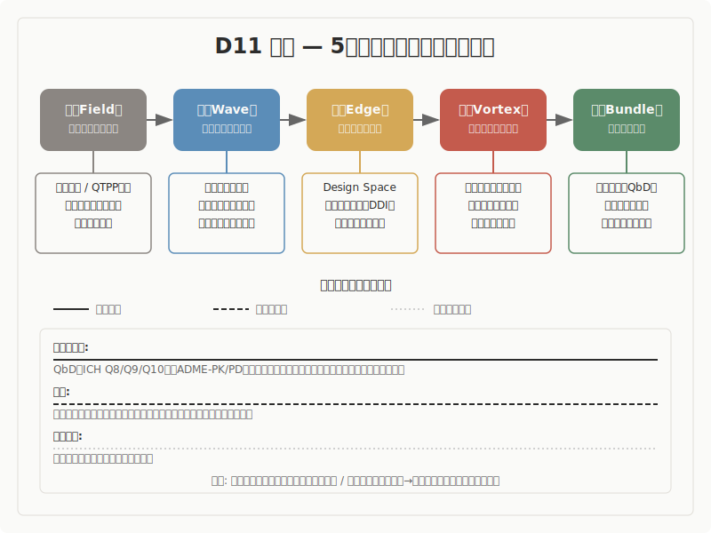

## 薬学

5段階モデル（場・波・縁・渦・束）との構造対応調査

---

## 調査の概要

- **調査対象**: 薬学の主要理論 10件
- **調査の問い**: 薬学の諸理論は、5段階モデルと構造的に対応するか
- **判定結果**: 条件付きの対応 1件

---

## 構造対応図

---

## 5段階モデルの概要

| 段階 | 定義 |
|------|------|
| 場（ば） | 未分化の状態。方向も構造もまだ定まっていない初期条件 |
| 波（なみ） | 複数の方向性が発散・競合する探索の段階 |
| 縁（えん） | 対立する要素が共存し、どちらにも収束しない緊張状態。境界で接し、影響し合い、関係が生まれる場所 |
| 渦（うず） | 緊張の中から新たなまとまり（秩序）が自発的に立ち上がる段階 |
| 束（たば） | 形が確定し、再利用可能な構造として安定する段階 |

---

## 構造対応の全体像

| 温度 | 理論・概念 | 位置づけ |
|---|---|---|
| 確定に近い | QbD（ICH Q8/Q9/Q10）、ADME-PK/PD、抗菌薬耐性進化、薬物相互作用、ファーマコゲノミクス | 5段階全体への対応が明瞭で、「縁」の記述が特に具体的です |
| 有力 | 漢方処方設計（君臣佐使）、医薬品開発パイプライン、構造ベース創薬 | 対応はあるが、「縁」の質や前半段階で解釈的な距離が残ります |
| 条件つき | 経口徐放性製剤、プロドラッグ設計 | 手続き的な対応は堅実ですが、「制御・設計」と「生成」の接続に解釈余地があります |

---

## 主要エントリ 1: QbD: 品質は設計に組み込む（ICH Q8/Q9/Q10）

- QbD（Quality by Design）は、医薬品の品質を製造後の検査ではなく、開発段階の設計に組み込むという品質保証思想です。2000年代にFDAとICH（医薬品規制調和国際会議）が主導し、ICH Q8（医薬品開発）、Q9（品質リスクマネジメント）、Q10（医薬品品質システム）として制度化されました。中核概念であるDesign Spaceは、「入力変数と工程パラメータの多次元的な組み合わせと相互作用によって品質が保証される範囲」として公式に定義されています（ICH Q8(R2), 2009）。
- **事実として**: ICH Q8(R2)は、QTPP（目標製品品質プロファイル）の設定から始まり、開発試験による知識蓄積を経て、Design Spaceの確立、Control Strategy（管理戦略）の策定、承認後の継続的改善へと至るプロセスを規定しています。Q9はリスク評価・管理の循環的プロセスを、Q10は医薬品ライフサイクル全体にわたる品質システムを定めています。
- **読み取りとして**: ここでは、ICH公式定義の語彙自体が5段階モデルと構造的に対応している点に注目します。類似の水準は構造です。Design Spaceの公式定義に「相互作用」が明記されていること、Space内での運用が「未決定の許容範囲」を制度的に保証していること、Q9のリスク循環とQ10の継続的改善が動的なフィードバックループを形成していることは、単なるラベルの近さではなく、プロセスの配置関係として対応しています。
- **解釈として**: QTPPの設定が場（品質目標という初期条件の設定）、開発試験による知識増幅が波（複数の変数が競合・発散する探索）、Design Spaceが縁（多変数間の相互作用が共存する空間）、Q9リスク循環とQ10継続的改善が渦（フィードバックによる動的な秩序形成）、Control Strategyと承認後運用が束（制度的に安定した管理構造）に対応します。
- QbDが本調査で特に重要なのは、「相互作用」という語が規制文書の公式定義に含まれている点です。これは、5段階モデルの「縁」が指す構造を、薬学が独自の制度語彙で記述していることを意味します。「似ている」というよりも、「同じ構造を規制の言葉で書いている」と読める稀有な事例です。

---

## 主要エントリ 2: 抗菌薬耐性進化: 解決が新たな問題を生む

- 抗菌薬耐性は、抗菌薬の使用（選択圧）によって耐性を持つ変異体が集団内で増殖・拡散する現象です。水平遺伝子伝播（プラスミドなど）により、耐性遺伝子は種を超えて広がります。1945年のFlemingのノーベル賞講演ですでに警告されていた問題であり、現在もWHOが最優先課題として対策を進めています（Davies & Davies, 2010）。
- **事実として**: 抗菌薬を投与すると、感受性のある菌は死滅し、耐性変異を持つ菌が生き残ります。水平遺伝子伝播により、耐性遺伝子はプラスミドなどを介して他の菌種にも移行します。新薬の開発、耐性菌の出現、治療指針の更新というサイクルが数十年の時間スケールで繰り返されています。
- **読み取りとして**: ここでは、「解決（新薬）が新たな問題（耐性菌）を生み、次のサイクルの起点になる」という循環構造に注目します。類似の水準はプロセスであり、特に束から場への循環が明示的に追跡できる点が重要です。分子レベルの突然変異から、細胞集団内の選択、公衆衛生制度の更新まで、複数のスケールで同じ循環が生じています。
- **解釈として**: 多様な感受性を持つ微生物集団が場、抗菌薬投与による選択圧の顕在化が波、プラスミドなどによる水平遺伝子伝播が縁（種間の関係を介した遺伝子の移動）、耐性クローンの優占と自己組織化が渦、治療標準の更新が束に対応します。そして、更新された治療標準が新たな選択圧を生み出し、次のサイクルの場を形成します。
- この理論が重要なのは、5段階モデルの「束→場」循環を最も明示的に示す事例の一つだからです。「解決が新たな問題を生む」という構造は、進化生物学の自然選択と同型ですが、人為的介入が進化を駆動している点が薬学に固有です。

---

## 主要エントリ 3: 薬物相互作用（DDI）: 縁の未決定性が最大化する場面

- 薬物相互作用（Drug-Drug Interaction, DDI）は、複数の薬剤を同時に使用した際に、一方の薬物がもう一方の薬物の代謝、吸収、分布、排泄に影響を及ぼす現象です。CYP酵素の阻害や誘導が主な機序であり、組み合わせの数は多剤併用の増加とともに急速に拡大しています（Huang et al., 2007; FDA, 2020）。
- **事実として**: 多剤併用では、薬剤Aが薬剤Bの代謝に関わるCYP酵素を阻害（または誘導）することで、薬剤Bの血中濃度が予期しない水準に変化することがあります。2剤の組み合わせだけでも膨大な数になり、3剤以上の同時使用における相互作用は原理的に全容把握が困難です。FDAはDDIガイダンスを継続的に更新しています。
- **読み取りとして**: ここでは、「組み合わせ爆発により事前予測が原理的に困難である」という性質に注目します。類似の水準は構造であり、未決定性（何が起こるか確定できない状態）が最大化される局面として、5段階モデルの「縁」の性質を最も鮮明に示しています。多剤併用状態は、個々の薬剤の性質だけでは記述できず、関係の網目全体として捉える必要があります。
- **解釈として**: 多剤併用状態が場、代謝経路の相互干渉が波、CYP阻害・誘導による予期せぬ相互作用が縁（関係の網目が未決定性を生む）、創発的な併用効果が渦、併用禁忌や用量調整としてガイドラインに収束する過程が束に対応します。
- DDIは、「縁」が設計や制御を超えた「意図せざる出会い」として現れる事例です。後述する構造ベース創薬が「精密に設計された縁」の例であるのと対照的であり、この対比は薬学領域の「縁のスペクトラム」を構成する重要な一端です。

---

## 横断的パターン

- 薬学を横断して最も際立つのは、「縁のスペクトラム」です
- 第二に、「関係の制度化」が領域全体に浸透しています
- 第三に、「束→場」循環が複数の時間スケールで明示的に現れます
- 第四に、薬学内部に「フラクタル」が見られます

---

## 未解決の問い

- 薬学の多くの概念は「意図的な制御・設計」を主軸としています。5段階モデルが想定する「自発的な生成」との関係をどのように整理するかは、今後の検討課題です。制御と生成は対立するのか、制御の中にも生成的な局面があるのか、この問いは決着していません。
- 「縁のスペクトラム」は薬学内部で確認されましたが、このスペクトラムが他領域にも同様に成り立つかどうかの検証は未了です。
- PK/PD、ファーマコゲノミクス、DDIの三概念は「縁の個別化」というクラスターを形成しますが、動態モデル・個体差の遺伝的源泉・意図せざる相互作用の切り分けが十分かどうかは保留事項です。
- QbDのDesign Spaceと5段階モデルの「縁」の対応は、ICH公式語彙との直接的な対応に基づいていますが、「制度語彙での対応」と「構造的対応」は同じものなのか、異なる水準の主張なのかの整理が必要です。

---

## 結論

- 本調査では、薬学は5段階モデルとの構造類似が全体として非常に強い領域であると確認されました
- 薬学の最大の貢献は「縁のスペクトラム」の提示です
- 本調査の知見は、確定に近い温度帯から条件つきの温度帯に分布しています
