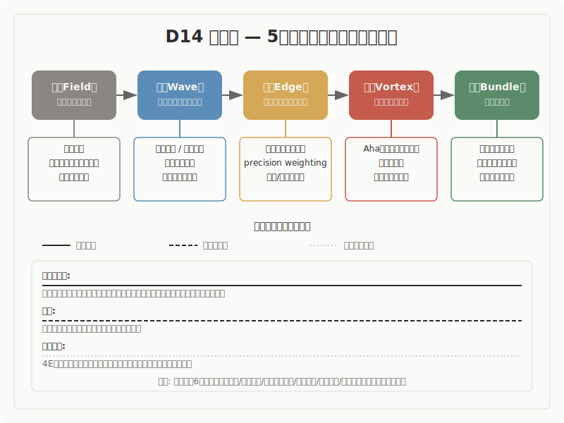

## 心理学

5段階モデル（場・波・縁・渦・束）との構造対応調査

---

## 調査の概要

- **調査対象**: 心理学の主要理論 10件
- **調査の問い**: 心理学の諸理論は、5段階モデルと構造的に対応するか
- **判定結果**: 条件付きの対応 1件

---

## 構造対応図

---

## 5段階モデルの概要

| 段階 | 定義 |
|------|------|
| 場（ば） | 未分化の状態。方向も構造もまだ定まっていない初期条件 |
| 波（なみ） | 複数の方向性が発散・競合する探索の段階 |
| 縁（えん） | 対立する要素が共存し、どちらにも収束しない緊張状態。境界で接し、影響し合い、関係が生まれる場所 |
| 渦（うず） | 緊張の中から新たなまとまり（秩序）が自発的に立ち上がる段階 |
| 束（たば） | 形が確定し、再利用可能な構造として安定する段階 |

---

## 構造対応の全体像

| 温度 | 理論群 | 位置づけ |
|---|---|---|
| 確定に近い | 洞察問題解決、ベイズ脳仮説、スキーマ理論、注意のバイアス競合、認知的柔軟性 | 5段階全体に高い対応があり、縁の構造が具体的に記述されています |
| 有力 | 認知的不協和、フロー体験、概念メタファー | 対応はあるものの、一部の段階で圧縮や自動性が残ります |
| 条件つき | 4E認知、アフォーダンス | メタ理論的な枠組みであり、特定のプロセスより場の性質を記述します |

---

## 主要エントリ 1: 洞察問題解決（Ohlsson; Knoblich）

- 洞察問題解決は、インパス（行き詰まり）から突然の解決への転換を記述する理論です。Ohlsson（1992）は、問題解決者が初期表象（問題の最初の捉え方）の制約に囚われてインパスに陥り、制約緩和や再符号化を通じて表象が変化することで解が出現するモデルを提案しました。Knoblich ら（1999, 2001）は、マッチ棒課題を用いた実験で、課題の難易度が「緩和すべき制約の深さ」と「分解すべきチャンクの強さ」に依存することを示しました。
- **事実として**: Knoblich ら（2001, N=24）は、眼球運動の追跡により、解決者の注意が「値」から「演算子」へ移行する時点が表象変化に対応することを確認しました。また、Hattori ら（2013, N=509）は、閾下ヒント（意識されないレベルのヒント）が解決率を向上させることを示し、意識を伴わない制約緩和の存在を実証しました。
- **読み取りとして**: ここでは、初期表象による行き詰まりから制約の解除を経て新たな表象が成立するという、認知構造の質的転換プロセスを読み取ります。類似の水準はプロセスです。特に、「どの制約を解くか」という選択が認知の再編を方向づける点に着目します。
- **解釈として**: インパスは波（予測と現実の誤差が蓄積し、既存の枠組みでは処理できない状態）に対応します。制約緩和は縁（新たな関係の発見――「どの制約を外すか」の選択が新しい結びつきを可能にする）に対応します。そして表象変化とAha体験は渦（新しいまとまりの自発的な成立）に対応します。初期表象が場、更新された表象の定着が束です。この5段階への対応は、10理論の中で最も構造的に鮮明です。
- さらに、この理論には独自の寄与があります。他の理論が「何と出会ったか」で縁を記述するのに対し、洞察研究は「何が外れたか（制約緩和）」で縁を記述します。縁には「結合」の側面だけでなく「解除」の側面もあることを、この理論は最も明確に示しています。また、眼球運動という客観指標で「関係がいつ結ばれたか」の時刻同定が可能である点は、認知プロセスの実証研究として稀有です。

---

## 主要エントリ 2: ベイズ脳仮説 / 予測処理（Clark; Friston）

- ベイズ脳仮説は、脳が常時世界モデルから予測を生成し、感覚入力との不一致（予測誤差）を最小化する方向にモデルを更新し続けるという理論です。Helmholtz（1867）の「無意識的推論」に遡り、Rao & Ballard（1999）で予測符号化として定式化され、Clark（2013, 2016）によって認知科学全体の統合的枠組みとして提示されました。
- **事実として**: Clark（2013）は、脳が階層的な生成モデルを維持し、各層で予測と入力の照合を繰り返すと論じました。Friston（2010）は、予測誤差の処理に二つの経路があることを指摘しました。一つはモデル自体を更新する経路（知覚的推論）、もう一つは行動によって環境を変える経路（能動的推論）です。さらに、予測誤差への重み付け（precision weighting）が注意の計算論的実装であるとされています（Feldman & Friston, 2010）。
- **読み取りとして**: ここでは、予測誤差の発生から重み付けを経てモデルが更新・安定化するプロセス全体を読み取ります。類似の水準は構造です。特に、precision weighting――「どの誤差に重みを置くか」という選択メカニズム――が、単なる誤差処理ではなく関係の結び方を方向づけている点に着目します。
- **解釈として**: 生成モデル（世界の内部表象）が場、予測誤差の発生が波、precision weighting（どの誤差に注目するかの選択）が縁、モデル更新または能動的推論による新たな予測構造の安定化が渦、更新された世界モデルの定着が束に対応します。この理論は、5段階の各局面を計算論的な語彙で再記述できる可能性を示しています。

---

## 主要エントリ 3: スキーマ理論（Bartlett; Piaget; Neisser）

- スキーマ理論は、過去の経験から抽出された知識の組織化構造（スキーマ）が、新しい経験の解釈を導くという理論です。Bartlett（1932）がスキーマ概念を記憶研究に導入し、Piaget（1952）が同化（新情報を既存スキーマに取り込む）と調節（スキーマ自体を変形する）の二つの処理様式を定式化しました。Neisser（1976）は、スキーマが探索を方向づけ、環境からの情報がスキーマを修正する知覚サイクルを記述しました。
- **事実として**: Piagetの枠組みでは、新しい情報に出会ったとき、それを既存の知識構造にそのまま取り込む処理（同化）と、知識構造自体を作り替える処理（調節）が区別されます。どちらの処理が選ばれるかは、既存スキーマと新情報の不一致の程度に依存します。
- **読み取りとして**: ここでは、既存の知識構造と新情報の不一致に対して二つの処理経路が分岐し、調節によってスキーマが再構成されるプロセスを読み取ります。類似の水準は構造です。特に、同化と調節の「どちらで処理するか」という分岐点が、関係の結び方を決定している点に着目します。
- **解釈として**: 既存スキーマ（世界モデル）が場、スキーマと新情報の不一致（不均衡）が波、同化/調節の選択分岐（どちらで処理するかの決定）が縁、調節によるスキーマ再構成が渦、更新されたスキーマの定着が束に対応します。この理論は、縁を「関係の結び方の分岐」として記述しており、ベイズ脳仮説の予測誤差処理と認知レベルで対応しています。

---

## 横断的パターン

- 心理学を横断して最も際立つのは、**縁の多様な実装**です
- **制約の解除**: 洞察研究は「どの制約を外すか」という解除の側面で縁を記述します
- **重みの配分**: ベイズ脳仮説は「どの誤差に重みを置くか」という選択で縁を記述します
- **処理経路の分岐**: スキーマ理論は「同化か調節か」という処理様式の分岐で縁を記述します

---

## 未解決の問い

- 縁の多様な実装（制約解除、精度重み付け、同化/調節分岐、競合解決、セット切替、方略選択）は、共通する構造的特徴を持つのか、それとも「縁」というラベルが過剰に一般化されているのかは、まだ結論が出ていません。
- Gibsonの直接知覚論（表象なし）と、洞察やスキーマ理論（表象変化が中核）の対立は、縁のメカニズムに「表象」が必要かどうかという根本的な問いに関わります。この対立はこの領域内で解決されていません。
- 概念メタファー理論が提起する自己参照性の問い――5段階モデルの語彙自体がイメージスキーマに依存しているとすれば、5段階は世界の構造を記述しているのか、身体メタファーによる理解の構造を記述しているのか――は、本調査の射程を超える問いとして保留されます。
- フロー体験における「縁」（フィードバックループ）が比較的自動的であり未決定性が低い点は、縁の定義要件として未決定性がどこまで必要かという問いに関わります。

---

## 結論

- 本調査では、心理学・認知科学は5段階モデルとの構造類似が全体として強い領域であることが確認されました
- 確定に近い対応を示したのは、洞察問題解決、ベイズ脳仮説、スキーマ理論、注意のバイアス競合モデル、認知的柔軟性の5理論です
