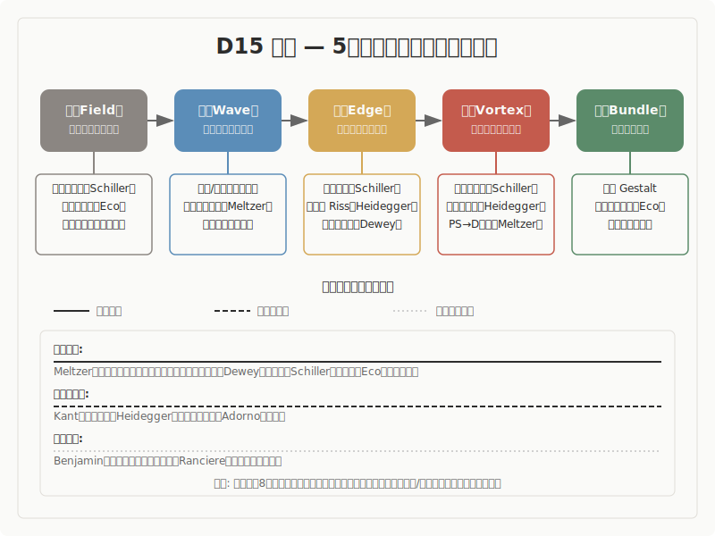

## 美学

5段階モデル（場・波・縁・渦・束）との構造対応調査

---

## 調査の概要

- **調査対象**: 美学の主要理論 10件
- **調査の問い**: 美学の諸理論は、5段階モデルと構造的に対応するか
- **判定結果**: 強い対応 9件、部分的な対応 1件

---

## 構造対応図

---

## 5段階モデルの概要

| 段階 | 定義 |
|------|------|
| 場（ば） | 未分化の状態。方向も構造もまだ定まっていない初期条件 |
| 波（なみ） | 複数の方向性が発散・競合する探索の段階 |
| 縁（えん） | 対立する要素が共存し、どちらにも収束しない緊張状態。境界で接し、影響し合い、関係が生まれる場所 |
| 渦（うず） | 緊張の中から新たなまとまり（秩序）が自発的に立ち上がる段階 |
| 束（たば） | 形が確定し、再利用可能な構造として安定する段階 |

---

## 構造対応の全体像

| # | 理論/概念 | 提唱者 | 対応段階 | 判定 |
|---|----------|--------|---------|------|
| 1 | 美的葛藤 | Meltzer (1988) | 全5段階 | 強い対応 |
| 2 | 日本美学と保持の構造 | 世阿弥・本居宣長・久松真一ほか | 全5段階（縁に特に強い） | 強い対応 |
| 3 | 判断力批判 | Kant (1790) | 全5段階 | 部分的な対応 |
| 4 | 芸術作品の根源 | Heidegger (1935) | 全5段階（縁に特に強い） | 部分的な対応 |
| 5 | 経験としての芸術 | Dewey (1934) | 全5段階 | 強い対応 |
| 6 | 複製技術時代の芸術作品 | Benjamin (1935) | 場→波→縁が強い。渦・束は条件付き | 条件付きの対応 |
| 7 | 感性的なものの分配 | Ranciere (2000) | 場→波→縁が強い。渦は限定的 | 条件付きの対応 |
| 8 | 人間の美的教育について | Schiller (1795) | 全5段階 | 強い対応 |
| 9 | 美の理論 | Adorno (1970) | 縁に特に強い。場の対応は限定的 | 部分的な対応 |
| 10 | 開かれた作品 | Eco (1962) | 全5段階 | 強い対応 |

---

## 主要エントリ 1: Schillerの美的教育論（Schiller, 1795）

- Schillerは、人間の内面に二つの根本的な衝動があると論じました。一つは「感性衝動」（Stofftrieb）で、時間の中の変化や素材への志向です。もう一つは「形式衝動」（Formtrieb）で、永遠性や法則への志向です。この二つの衝動は本来的に対立しますが、その対立を解消するのではなく統合する第三の衝動として「遊戯衝動」（Spieltrieb）を位置づけました。遊戯衝動の対象は「生きた形態」（lebende Gestalt）、すなわち美です。
- さらにSchillerは、美的状態を「規定可能性」（Bestimmbarkeit）として記述しています。これは「実在的にも道徳的にも何も決定しない」が、あらゆる決定を可能にする状態です（第20-21書簡）。
- **事実として**: Schillerの美的教育論は、感性衝動と形式衝動の対立、その統合としての遊戯衝動、そして美的状態としての規定可能性という三つの柱で構成されています。「人間は遊ぶところでのみ完全に人間である」（第15書簡）という有名な命題は、二つの衝動の統合が人間性の完成であるという主張を端的に示しています。
- **読み取りとして**: ここでは、二つの対立する衝動の「間」に第三の衝動が成立するという構造を読み取ります。類似の水準は構造です。感性衝動と形式衝動という二項は、それぞれ独立しては機能せず、両者の結合点に遊戯衝動が立ち上がるという配置関係そのものに注目します。また、「規定可能性」は空虚ではなく「あらゆる規定の可能性が開かれた状態」であり、これは潜在性の構造的記述です。
- **解釈として**: 規定可能性は場に対応します。何も決定されていないが全てが可能である状態です。感性衝動と形式衝動の対立は波に対応し、遊戯衝動はこの二つの衝動の結合点として縁に対応します。遊戯衝動の対象である「生きた形態」の動的成立が渦に、美的教育による人間の全体性の回復が束に対応します。全5段階にわたって明瞭な構造対応が見られます。特に遊戯衝動は、二つの対立する要素の「間」に成立する第三の原理として、縁の哲学的定式化の中でも最も直接的なものの一つです。

---

## 主要エントリ 2: Deweyの美的経験論（Dewey, 1934）

- Deweyは、『経験としての芸術』において、美的経験を日常経験の延長線上に位置づけました。経験一般と区別される「一つの経験」（an experience）は、素材が「充足へと経過」し、完結（consummation）として閉じるものです。部分が次へ縫い目なく流れ込みつつ、全体としての統一と固有の質を持ちます。
- Deweyにとって経験の根は「生きものと環境の相互作用」にあり、欠如から環境への到達を経て均衡が回復される位相を含みます。さらに、行為（doing）と受苦（undergoing）の相互浸透が美的経験の核であり、両者が結合して初めて経験が意味を持ちます。抵抗・葛藤・緊張は障害ではなく、より高次の均衡や調和を生む素材です。
- **事実として**: Deweyの美的経験論は、生きものと環境の相互作用を起点とし、欠如から均衡回復へ向かうリズムを記述しています。行為と受苦は分離できず、その結合が経験に意味を与えます。完結（consummation）は単なる終了ではなく、経験が一つの統一された質を獲得する充足です。
- **読み取りとして**: ここでは、「欠如→到達→均衡回復」という経験のリズムと、行為と受苦の不可分な結合という二つの構造的特徴を読み取ります。類似の水準はプロセスです。特に注目するのは、このリズムが芸術家の制作、鑑賞者の受容、教育の場面で同型的に反復するという点です。また、行為と受苦が「関係」として不可分であるという記述は、二つの対立する契機の結合点に焦点を当てています。
- **解釈として**: 生きものと環境の相互作用という未分化な出発点が場に対応します。欠如が意識され、リズムが揺れとして立ち上がる局面が波です。行為（doing）と受苦（undergoing）の結合点が縁に対応します。これは二つの対立する契機が分離できない関係として成立する接点です。抵抗と緊張からより高次の均衡が自発的に立ち上がる局面が渦に、経験が「一つの経験」として充足し完結する局面が束に対応します。全5段階にわたって構造対応が確認され、特に行為と受苦の結合としての縁の記述は、哲学的に最も具体的なものの一つです。

---

## 主要エントリ 3: Meltzerの美的葛藤（Meltzer, 1988）

- Meltzerは、Klein学派の精神分析の枠組みから美的経験を記述しました。「美的葛藤」（aesthetic conflict）とは、対象の外的な美しさと、その内的世界の不可知性との間の緊張です。美しいものに出会ったとき、人はその内側を知りたいという好奇心（curiosity）と、知ることへの恐れ（fear）との間で引き裂かれます。この葛藤に耐える力が心的発達の鍵だとMeltzerは論じました。
- 背景にはKleinの妄想分裂ポジション（PS）と抑うつポジション（D）の理論があります。PS的な分裂不安に耐える契機が必要であり、その耐性が統合（Dポジション）に向かう条件となります。
- **事実として**: 美的葛藤は、外的な美しさと内的世界の不可知性の間の緊張として定義されます。好奇心と恐れという二つの極が葛藤の構造を形成し、この葛藤への耐性が統合的な心の発達を可能にします。臨床的観察に基づく理論であり、母子関係や分析家-被分析者関係から芸術作品との出会いまで、複数のスケールで記述されます。
- **読み取りとして**: ここでは、「知りたい」と「怖い」という二つの相反する情動が共存し、そのどちらにも解消されない状態が美的経験の核であるという構造を読み取ります。類似の水準はメカニズムです。葛藤そのものが解消の対象ではなく、耐えることが発達の条件になるという因果の仕組みに注目します。
- **解釈として**: 対象との出会い以前の未分化な状態が場に、好奇心と恐れの二極化が波に対応します。この二つの極が共存しどちらにも収束しない葛藤状態が縁です。葛藤への耐性の中からPS的分裂を超えた統合が立ち上がる局面が渦に、統合された対象関係が安定する局面が束に対応します。他の理論が認識論的または存在論的な枠組みで美を記述するのに対し、Meltzerは情動の次元から記述しており、「他者の内的世界の不可知性」を葛藤の源泉とする点が独自です。

---

## 横断的パターン

- 美学を横断して最も顕著に現れるのは、「縁」の多様性です
- **葛藤型**: 好奇心と恐れの共存（Meltzer）
- **停止型**: 利害の停止としての無関心性（Kant）
- **接合型**: 世界と大地の闘争の接合点（Heidegger）

---

## 未解決の問い

- Schillerの「規定可能性」は、場を「何もない起点」ではなく「あらゆる規定の可能性が開かれた状態」として再定義します。これは5段階モデルの場の通常の理解（「無」「漂う」）と緊張します。場を潜在性の最大として理解するか、未分化な空白として理解するかは、まだ決着していません。
- Ecoの「開かれた束」は、束が「閉じない」なら束と呼べるのかという問いを提起します。束の定義（安定パターン・秩序への収束）と「開かれた完結」の関係は、今後の整理が必要です。
- Benjaminの歴史的変換の記述を5段階モデルの射程に含めるべきかどうかは、モデルの適用範囲に関わる問いです。5段階が個人の創造プロセスだけを記述するのか、社会的・技術的変容も射程に含むのかによって、後半段階の位置づけが変わります。
- Kant、Heidegger、DeweyはD13（哲学）の調査にも関連する理論です。美学的次元と哲学的次元の接続と区別は、領域横断的な課題として残ります。

---

## 結論

- 本調査では、美学は5段階モデルとの構造類似が全体として高い領域であることが確認されました
- 美学が5段階モデルの理解に対して最も大きく貢献するのは、「縁」の多様性です
- もう一つの重要な貢献は、「束」を「閉じた完成」ではなく「開かれた完結」として再理解する視点です
