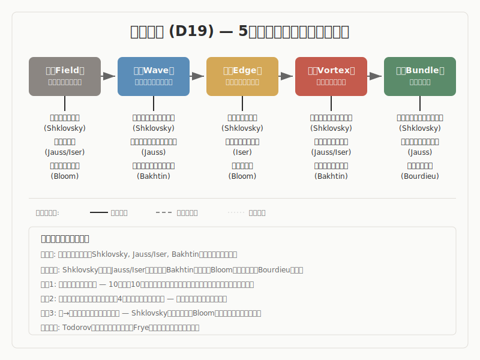

## 文芸学

5段階モデル（場・波・縁・渦・束）との構造対応調査

---

## 調査の概要

- **調査対象**: 文芸学の主要理論 10件
- **調査の問い**: 文芸学の諸理論は、5段階モデルと構造的に対応するか
- **判定結果**: 部分的な対応 1件、条件付きの対応 1件

---

## 構造対応図

---

## 5段階モデルの概要

| 段階 | 定義 |
|------|------|
| 場（ば） | 未分化の状態。方向も構造もまだ定まっていない初期条件 |
| 波（なみ） | 複数の方向性が発散・競合する探索の段階 |
| 縁（えん） | 対立する要素が共存し、どちらにも収束しない緊張状態。境界で接し、影響し合い、関係が生まれる場所 |
| 渦（うず） | 緊張の中から新たなまとまり（秩序）が自発的に立ち上がる段階 |
| 束（たば） | 形が確定し、再利用可能な構造として安定する段階 |

---

## 構造対応の全体像

| 温度 | 理論群 | 位置づけ |
|---|---|---|
| 確定に近い | Shklovsky（異化）、Jauss/Iser（受容美学）、Bakhtin（対話性） | 移行の記述が具体的で、5段階全体への対応が明瞭です |
| 有力 | Propp（物語機能）、Barthes（テクストの多元的読解）、Bourdieu（文学場）、Bloom（影響の不安）、Genette（ナラトロジー） | 対応はありますが、特定の段階に厚みが偏るか、圧縮を伴います |
| 条件付き | Todorov（物語構造）、Frye（原型批評） | 部分的な対応は見られますが、原典照合が未完了（Todorov）、あるいは体系の恣意性への批判がある（Frye）ため、慎重な扱いが必要です |

---

## 主要エントリ 1: Shklovskyの異化（ostranenie）

- ロシアフォルマリズムの創始者の一人であるShklovskyは、1917年の論文「手法としての芸術」で「異化」（ostranenie）の概念を提唱しました。芸術の目的は、事物を「既知として」ではなく「知覚として」回復させることにあり、反復によって「自動化」した知覚に対して、対象を「不慣れ」にし、知覚の時間を引き延ばす技法が異化であると論じています。詩的言語は理解の効率性ではなく、形式の「粗化」（zatrudnenie）と遅延によって知覚の回復を実現します。
- **事実として**: Shklovskyは、日常的な反復により知覚が自動化すると、世界は「生きられなくなる」と指摘しました。芸術はこの自動化への抵抗であり、対象を見慣れないものとして提示し直す技法（異化）によって、知覚そのものを更新する営みです（Shklovsky, 1917 "Art as Technique"）。
- **読み取りとして**: ここでは、習慣化と脱習慣化のサイクルという知覚の動態構造を読み取ります。類似の水準はプロセスであり、特に「自動化した知覚が異化によって回復し、やがて再び自動化する」という循環の順序に着目します。
- **解釈として**: 習慣化された知覚、すなわち世界が「既知」に溶けた状態は、5段階の場に対応します。自動化への気づきと鈍化の感知が波です。異化装置の導入——散文と詩的言語の境界設定、技法と知覚の間に緊張を生む操作——が縁に当たります。遅延された知覚の中で対象が「新しく」立ち上がる瞬間が渦です。そして手法が共有・規範化され、やがて再び自動化圧力にさらされる状態が束であり、この束は新たな場へと回帰します。
- この理論が興味深いのは、創造を「新しいものを作る」ことだけでなく、「既知のものを新しく知覚する」こととして捉えている点です。5段階モデルが記述する構造変化は、生産だけでなく知覚の更新にも適用できることを、異化は示唆しています。

---

## 主要エントリ 2: Jauss/Iserの受容美学

- Jauss（1967）とIser（1972）に代表されるコンスタンツ学派の受容美学は、文学作品の意味を作者の意図に求めるのではなく、読者と作品の相互作用の中に見出す理論です。
- **事実として**: Jaussは「期待の地平」（Erwartungshorizont）の概念を提示しました。読者はジャンル、先行作品、社会的文脈から予期の枠組みを形成しており、作品の価値は期待の地平とのずれ（美的距離）によって測定されます。一方、Iserは「空所」（Leerstellen）の概念を提示しました。テクストは意図的に省略する箇所を含み、読者はこの空所を能動的に補完して意味を生成します（Iser, 1972 *Der implizite Leser*）。
- **読み取りとして**: ここでは、読者の予期構造と作品の間に生じるずれが意味生成を駆動するという動態を読み取ります。類似の水準はプロセスであり、「既存の予期枠 → 作品によるずれの導入 → 読者による能動的補完 → 新しい意味の成立」という生成順序に着目します。
- **解釈として**: 読者が先行作品やジャンル経験から形成した期待の地平は、5段階の場に対応します。作品が期待を裏切ることで生じる美的距離が波です。テクストの空所を読者が能動的に補完し、テクストと読者が関係として接合される局面が縁です。補完を通じて新しい意味がまとまりとして成立する瞬間が渦であり、解釈が批評共同体で共有・蓄積され、文学史的評価として定着する局面が束に当たります。
- たとえば、推理小説の読者が「犯人はこの人物だろう」という予期を持ち、その予期が覆されたとき、読者は手がかりを読み直し、物語全体を新しい視点で再構成します。この再構成は、作者が「答え」を渡すのではなく、テクストの空所を読者が自ら埋めることで成立します。
- 受容美学の重要な貢献は、「意味の生成主体」を作者から読者に移した点にあります。5段階モデルにとっては、創造が個人内で完結するのではなく、作品と受容者の界面で生じることを具体的に示す事例です。

---

## 主要エントリ 3: Bakhtinの対話性とヘテログロシア

- Bakhtinは、言語は本質的に対話的であり、すべての発話は他者の発話への応答を含むと論じました。「ヘテログロシア」（heteroglossia / raznorechie）は、社会的に階層化された言語の多様性を指し、小説はこの多声的言語が交渉・衝突する場として機能します。
- **事実として**: Bakhtinは、小説を単一の声で統御されるモノローグ的形式ではなく、異なる社会言語が交渉し衝突する多声的構造として分析しました（Bakhtin, 1934-35/1981 "Discourse in the Novel"）。「対話性」（dialogism）の概念では、すべての言語は他者の言語に応答し、他者の言語を含むとされ、モノローグ的言語は対話を抑圧した人為的産物とみなされます（Bakhtin, 1929/1984）。また「カーニバル」の概念では、公的秩序の一時的転倒と、権威的言葉と内的説得的言葉の緊張が記述されます。
- **読み取りとして**: ここでは、異なる社会言語（声）が共存し、交渉する場における関係編成の構造を読み取ります。類似の水準は構造であり、「多声性の中から対話的関係が編まれ、作品固有の秩序が立ち上がる」という配置関係に着目します。
- **解釈として**: 社会的に階層化された言語が未分化に共存するヘテログロシア空間が場です。声の対立やアイロニーによって差異が可視化される局面が波です。対話場面において言説が交差し、異なる「声」が関係として接合される局面が縁です。作品固有の多声的秩序が形成される局面が渦であり、ジャンル慣習として文芸体系に編入される局面が束に当たります。
- 対話性の概念は、縁を「接触点」としてだけでなく、「あらゆる発話がすでに他者への応答である」という、より根本的な関係性として記述します。この点で、縁は単なる段階ではなく、言語の存在様態そのものに組み込まれた構造として理解されます。

---

## 横断的パターン

- 文学研究を横断して最も際立つのは、縁の実装の多様性です
- 第二に、束→場の循環が複数の理論で明示的に記述されています
- 第三に、文学研究は「スケールの分離」を自然に提供します

---

## 未解決の問い

- Todorovの物語構造における「均衡→撹乱→認知→対処→新均衡」の5要素が、5段階モデルとの偶然の数的一致なのか構造的必然なのかは、一次文献の照合が完了するまで判断を保留しています。二次資料では広く流通していますが、原典での列挙形式は未確認です。
- Bloomの6つの修正比と5段階の数的不一致をどう扱うかは、方法論的な問題として残ります。6修正比は5段階に対する反例なのか、5段階の内部で異なる位相として整理できるのかは、さらなる検討が必要です。
- 文学研究の理論が記述するのは「分析的な生成」（読解・理解の中で構造が見えてくること）なのか、「存在的な生成」（作品そのものが生まれること）なのかという問いは、Bloomのような創造行為を直接記述する理論と、Genetteのような分析枠組みでは回答が異なります。この区別が5段階モデルの射程をどう限定するかは、未整理です。
- 縁の型が10種類あることは多様性を示しますが、それらが構造的に同一のものなのか、類似しているが異なるものなのかの判別基準は、まだ確立していません。

---

## 結論

- 本調査では、文学研究は5段階モデルとの構造類似が全体として有力な領域であると確認されました
- 確定に近いのは、Shklovsky、Jauss/Iser、Bakhtinの系統です
- 文学研究から得られる最大の示唆は、5段階モデルが個人の創造過程だけでなく、知覚の更新（Shklovsky）、テクストと読者の相互作用（Jauss/Iser）、社会制度の自律化（Bourdieu）という複数のスケールで構造対応を示すことです
- 本調査の知見は、確定に近い知見から条件付きの仮説まで分布しています
