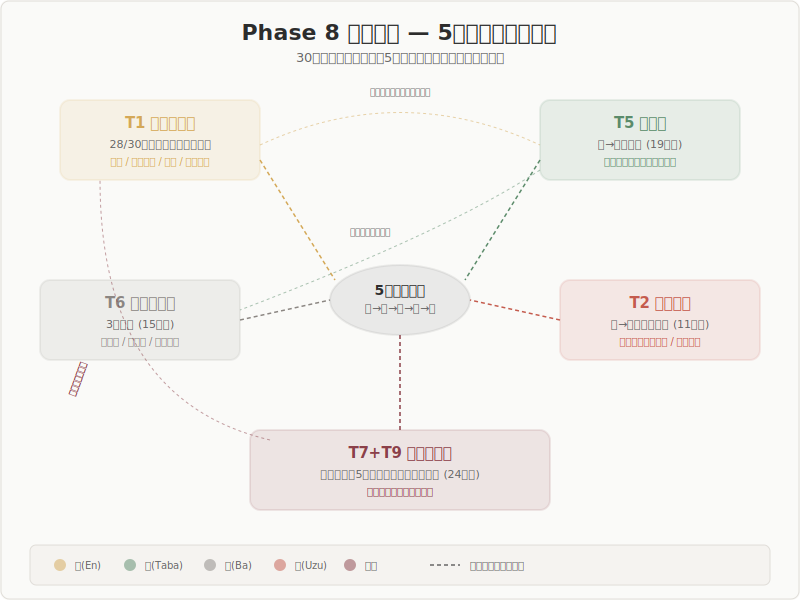

## Phase 8 Cross-Domain Analysis: Conclusion

### The Structure of the Five-Stage Model Revealed across 30 Domains

Five structural themes emerged independently, directing the model's update.

---

## Five Structural Themes

| ID | Theme | Supporting domains |
|----|-------|--------------------|
| T1 | Edge Typology and Unified Classification | 28/30 |
| T5 | Recirculation Mechanism | 19/30 |
| T6 | Field Multi-Layering | 15/30 |
| T2 | Threshold Structure and Edge-to-Vortex Transition | 11/30 |
| T7+T9 | Blind Spots and Counterexamples | 24/30 |

---

## Most Robust Cross-Domain Findings

Discoveries at the level of "established facts" with independent support from 30 domains.

- **Edge is a bandwidth**: Not a line but a region with breadth (T1: 5 domains independently confirmed)
- **Edge-to-vortex transition is threshold-like**: A discontinuous tipping point exists (T2: 5 domains independently confirmed)
- **The bundle is the seed of the next field**: The bundle is not an endpoint (T5: 15+ domains converge)
- **Circulation is an irreversible spiral**: Not a return to the original field but a transition to an altered field (T5: 12+ domains)

---

## Proposed Updates to Stage Definitions

| Stage | Current | Direction of update |
|-------|---------|---------------------|
| Field | Zero, nothingness | Conditioned potentiality (primordial/circulatory distinction) |
| Edge | Contradiction is maximized | Family of concepts (space described by 6 coordinates) |
| Vortex | Coherence arises | Explicating threshold character and irreversibility |
| Bundle | Stabilized endpoint | Dynamic phase that prepares the next field |

---

## Structural Update to the Model

**From a linear model to a spiral model**

- Not a "straight line + optional circulation" from field → wave → edge → vortex → bundle
- The spiral is not an incidental but an **essential structural** property of the five stages
- Field quality changes irreversibly with each cycle
- Incompleteness of the bundle is the driving force of the spiral

---

## Failure Modes for Each Stage

The five stages harbor not only a "success path" but also inherent **failure modes**.

| Stage | Failure mode | Representative example |
|-------|-------------|------------------------|
| Field | Closure/absence | Freezing, failure to descend into the field |
| Wave | Non-ignition/excess | Lack of perturbation, runaway |
| Edge | Misjudgment/fixation | Autoimmunity, excessive holding |
| Vortex | Non-arrival/runaway | Schism, epilepsy |
| Bundle | Over-fixation/insufficiency | Lock-in, cancer |

---

## Scope and Limits of the Model

**The five stages are a theory specialized in "order generation."**

Within scope:
- Generation of order and spiral circulation
- Failure modes (deviations at each stage)
- Planned dissolution (one form of bundle-to-field return)

Outside scope (requiring separate theorization):
- Order dissolution itself
- One-time, non-cyclical events
- Value judgments ("good bundle" vs. "bad bundle")

---

## Top 5 Open Questions

1. **Integration of bandwidth and threshold**: Is there a threshold within the bandwidth, or is the boundary of the bandwidth the threshold?
2. **Universality of circulation**: Is circulation a definitional or incidental property?
3. **The third level (ultimate field)**: Is Nishida's absolute nothingness within the scope of the five stages?
4. **Essentiality of staging**: Does the number "5" hold privileged status?
5. **Cross-scale connection**: Do the five stages at the synaptic level and the societal level share the same structure?

---

## Next Steps

- Concretize proposed updates to stage definitions
- Refine the taxonomy of failure modes
- Explore mathematical formalization of the bandwidth-threshold relationship
- Visualize the spiral model
- Phase 9: Develop a plan for theoretical integration and verification

---

## Summary

**The cross-domain analysis of 30 fields has clarified both the "descriptive power" and the "limits" of the five-stage model.**

The model is robust as a description of order generation, and the five structural themes concretely indicate the direction of its update. At the same time, the undescribed nature of dissolution processes, resistance to staging, and the problem of value neutrality remain as open questions.

Following the principle of "do not rush to resolve," we proceed to the next stage while holding these tensions.
