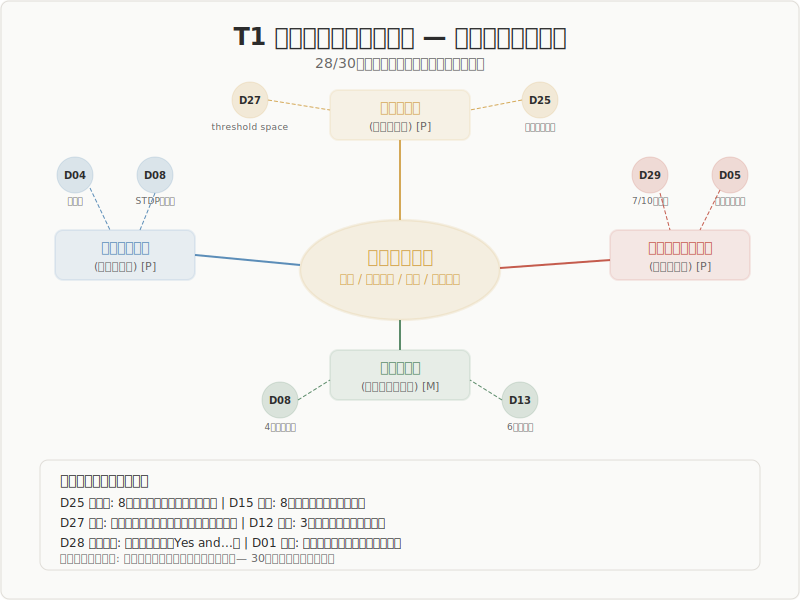

## T1: Edge Typology and Unified Classification

### The Polymorphism of "Edge" across 30 Domains

The most powerful cross-cutting finding: 28 of 30 domains independently thematized the polymorphism of "edge."

---

## Overview

| Item | Value |
|------|-------|
| Supporting domains | **28/30** |
| Extracted types | **30+** |
| Core question | Is edge a bandwidth, a threshold, or a family of concepts? |

\

---

## Finding 1: Edge Is a "Bandwidth"

Edge is not a line but a **region with breadth**. The most robust cross-domain support across all 30 fields.

| Domain | Implementation of bandwidth |
|--------|----------------------------|
| Architecture | Threshold space, engawa |
| Anthropology | Liminality (transitional period) |
| Pharmacology | Therapeutic window |
| Agriculture | Ecotone |
| Complex systems | Width of the critical vicinity |

---

## Finding 2: Edge Is a "Site of Directional Selection"

Edge is not merely an "in-between" but a **place where the direction of outcomes is chosen**.

- **Anthropology**: The content of the redressive phase determines the outcome
- **Evolutionary biology**: Conditions for speciation determine lineage
- **Neuroscience**: STDP time window determines potentiation/depression
- **Chemistry**: Structure of the transition state determines the product

---

## Finding 3: Edge "Arises from Antagonism"

For a wave (the manifestation of difference) to transform into an edge, a **site where opposing forces make contact** is required.

- Complex systems: Antagonism generates edge in 7/10 entries
- Earth science: Antagonism between tectonic plates
- Chemistry: Energy antagonism between reactants and products
- Aesthetics: Heidegger's Streit (strife)

---

## Finding 4: Edge Is Implementation-Independent

**"Selection through relation" as a structural feature** is preserved across different mechanisms.

- Neuroscience: The same structure across 4 different mechanisms
- Complex systems: 5 realization types forming a "phase space"
- Philosophy: The same structure across 6 philosophical traditions

---

## Finding 5: Two Directions — Binding and Release

Edge operates not only in a "binding" direction but also in a "releasing" direction.

- **Binding direction**: Nearly all domains — "what met what"
- **Release direction**: Psychology — insight is the "release" of constraints

---

## Unified Classification: A Proposal of 6 Coordinates

| Coordinate | Question | Representative theory |
|------------|----------|----------------------|
| When | Point of qualitative transformation | Phase transition, threshold type |
| How | Selection mechanism | Competition type, directional determination |
| Where | Interface between inside and outside | Interface type, ecotone |
| Through what | Mediation of chains | Propagation type, transduction |
| On what | Structural substrate of relations | Structural type, multiple realization |
| By whom | Conscious/unconscious agent | Conscious/unconscious |

---

## Limitations and Unresolved Questions

- **Type proliferation problem**: Are 30+ labels too many "fingers pointing at the moon"?
- **Passage vs. dwelling**: The five stages presuppose passage, yet D3 values dwelling
- **Non-Western edge concepts**: Insufficient description of non-Western theories beyond D30 (Traditional Knowledge)
- **"Designed edge" vs. "discovered edge"**: From descriptive theory to design theory

---

## Conclusion

**Edge is the core concept of the five-stage model and should be understood not as a single definition but as a "family of concepts."**

Five cross-cutting features — bandwidth, directional selectivity, antagonistic origin, implementation independence, and bidirectionality — were independently supported by 30 domains.

Unified classification should aim not at "integration of types" but at "identification of a small number of coordinate axes."
