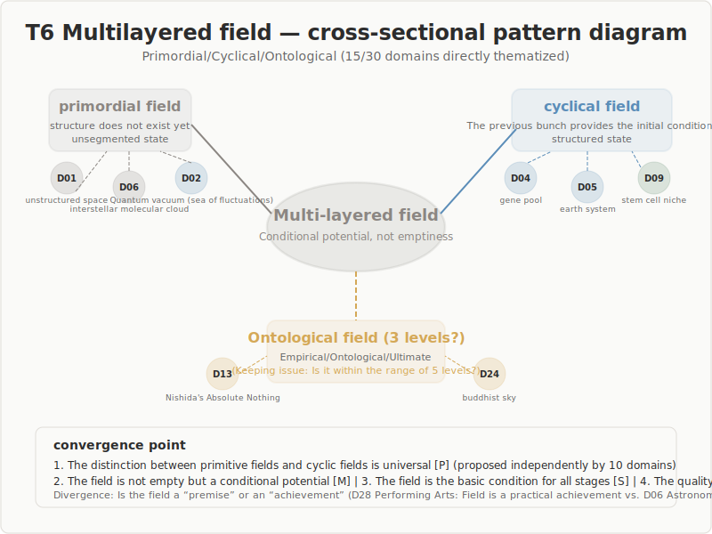

## T6: Field Multi-Layering

### Primordial / Circulatory / Ontological — The Field Is Not Singular

15 of 30 domains directly thematize the multi-layered nature of the field. In stage-definition proposals, 28 of 30 reference "field."

---

## Overview

| Item | Value |
|------|-------|
| Direct thematization | **15** domains |
| Stage-definition proposals | **28** domains |
| Core question | Is the field "emptiness" or "conditioned potentiality"? |

---

## Finding 1: Primordial Field vs. Circulatory Field

The highest-convergence distinction, independently proposed by 10 domains.

| Kind | Character | Representative examples |
|------|-----------|------------------------|
| **Primordial field** | Pre-structural, unarticulated state | Interstellar molecular cloud (D06), pre-axiomatic (D01) |
| **Circulatory field** | Conditions provided by the preceding bundle | Critical vicinity (D29), gene pool (D04) |

Most applications of the five stages involve the circulatory field.

---

## Finding 2: The Field Is Not "Empty"

The field is not "zero, nothingness" but **conditioned potentiality**.

- **Physics**: Quantum vacuum = a sea of fluctuations
- **Aesthetics**: Schiller's determinability = all decisions are possible
- **Neuroscience**: Dynamic equilibrium = neither too stable nor too unstable
- **Architecture**: Ma (negative space) = the absence that is something

---

## Finding 3: The Field Is the Foundational Condition for All Stages

The field is the "first stage" of the five stages and simultaneously the **foundation of all stages**.

- **Anthropology**: The field is not a stage but a precondition for all stages
- **Philosophy (Nishida)**: Basho (place) = that which encompasses everything
- **Traditional knowledge**: The field sustains the entire process

---

## Finding 4: The Quality of the Circulatory Field Determines Creation

Even within the same "field," there are qualitative differences, and that quality **depends on the nature of the preceding bundle**.

- Evolutionary biology: Diversity of the gene pool determines adaptive radiation
- Neuroscience: Quality of dynamic equilibrium determines information-processing capacity
- Management science: Organizational culture prescribes innovation capacity

---

## A Three-Level Proposal from Philosophy and Religion

D13 (Philosophy) and D24 (Religion) propose **three levels** of the field.

| Level | Content | Representative |
|-------|---------|----------------|
| Empirical | Husserl's passive background | Everyday pre-understanding |
| Ontological | Simondon's pre-individual reality | Conditions for structural genesis |
| Ultimate | Nishida's absolute nothingness, Buddhist emptiness | The field that encompasses everything |

Whether the third level falls within the scope of the five stages remains an open question.

---

## Bifurcation Points: Unresolved Tensions

- **Necessity of the third level**: Natural sciences suggest two categories suffice
- **Is the field a "precondition" or an "achievement"?**: Astronomy (given) vs. performing arts (practical achievement)
- **Boundary problem with wave**: The more the field is expanded, the more ambiguous its distinction from wave becomes
- **"Designability" of the field**: Architecture designs fields, but if the field is a precondition, this is paradoxical

---

## Implications for the Five-Stage Model

1. **Updated field definition**: "Zero, nothingness" → "conditioned potentiality"
2. **Introduction of the primordial/circulatory distinction**: Theoretical foundation for spiral circulation
3. **Introduction of "field quality"**: Quality of the circulatory field prescribes the quality of creation
4. **Safety conditions for the field**: Polyvagal theory's "safe yet aroused"

---

## Conclusion

**The field should be redefined not as "a state of nothingness" but as "a conditioned space of maximal potentiality."**

The distinction between primordial and circulatory fields is a robust finding independently supported by 10 domains. It provides the theoretical grounding for the five stages as a spiral model.

The scope of the third level (ultimate field) remains an important open question.
