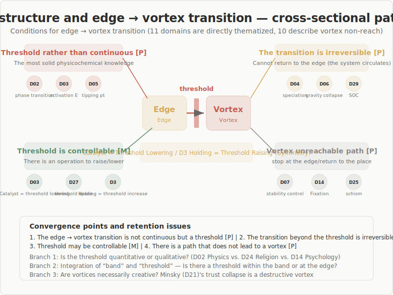

## T2: Threshold Structure and Edge-to-Vortex Transition Conditions

### Conditions Governing the Irreversible Transition from Edge to Vortex

11 domains directly thematize threshold transitions. 10 additional domains describe non-arrival-at-vortex pathways.

---

## Overview

| Item | Value |
|------|-------|
| Strong description | **5** domains (theoretical core) |
| Moderate | **6** domains |
| Indirect | **7** domains |
| Core question | Does a threshold exist within the bandwidth? |

---

## Finding 1: Edge-to-Vortex Transition Is Threshold-Like

Not continuous but characterized by a **discontinuous tipping point**.

| Domain | Form of threshold |
|--------|-------------------|
| Physics | Critical temperature, symmetry breaking |
| Chemistry | Activation energy (saddle point) |
| Earth science | Tipping point |
| Astronomy | Chandrasekhar limit |
| Complex systems | SOC criticality, percolation threshold |

---

## Finding 2: Crossing the Threshold Is Irreversible

Once the vortex is entered, return to the edge is impossible.

- **Physics**: Symmetry breaking
- **Evolutionary biology**: Speciation (establishment of reproductive isolation)
- **Earth science**: Climate tipping point
- **Astronomy**: Gravitational collapse

However, in SOC the system as a whole does cycle — irreversibility pertains to "that particular transition."

---

## Finding 3: Thresholds Can Be "Controlled" in Some Cases

Operations exist to intentionally lower or raise the threshold.

| Direction | Operation | Domain |
|-----------|-----------|--------|
| **Lower** the threshold | Catalyst | Chemistry |
| **Manage** the threshold | IPM intervention | Agriculture |
| **Design** the threshold | Jidoka (autonomation) | Management science |
| **Raise** the threshold | Withhold (hoji) | D3 (holding) |

---

## Finding 4: Non-Arrival-at-Vortex Pathways Exist

The five stages do not entail "inevitable arrival at the vortex."

- **Physics**: Supercritical fluid = bypassing the phase transition
- **Evolutionary biology**: Failure of speciation
- **Engineering**: Stability control = designing to avoid the vortex
- **Psychology**: Fixation = failure to reach insight
- **Anthropology**: Schism = failure of reintegration
- **Performing arts**: Block = cessation of improvisation

---

## The Tension between "Bandwidth" and "Threshold"

T1 concluded "edge is a bandwidth"; T2 finds "the transition is threshold-like."

**Is there a threshold within the bandwidth?**

- Percolation theory: Probabilistic threshold + bandwidth-like behavior
- Potentially formalizable mathematically

Whether the boundary of the bandwidth is the threshold — an open question.

---

## Bifurcation Points: Unresolved Tensions

- **Quantitative vs. qualitative**: Physics (quantifiable) vs. religion (qualitative transformation, unpredictable)
- **Point vs. bandwidth**: First-order phase transition (single point) vs. liminality (bandwidth)
- **Directionality of the vortex**: Order-creating vs. destructive — the vortex is value-neutral
- **Absence of quantitative thresholds**: Quantification of thresholds is difficult in humanities and social sciences

---

## Implications for the Five-Stage Model

1. **Explicating threshold character**: Adding transition properties to "vortex — coherence arises"
2. **Incorporating non-arrival-at-vortex pathways**: Theorizing phenomena that halt at the edge or return to the field
3. **Connection to D3 Withhold**: Catalyst = lowering the threshold; Withhold = raising the threshold
4. **Natural-science bias of thresholds**: Caution is needed for application in humanities and social sciences

---

## Conclusion

**The edge-to-vortex transition is not continuous but threshold-like, and that threshold can in some cases be controlled.**

The existence of non-arrival-at-vortex pathways shows that the five stages are not a "model that must always complete its full course." D3 Withhold can be theoretically positioned as threshold manipulation.

Integration of bandwidth and threshold remains an important formalization challenge.
