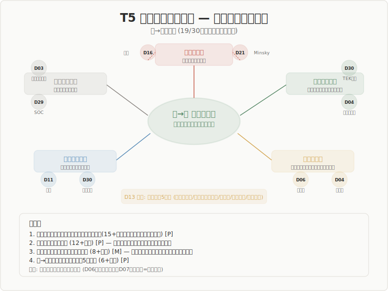

# Phase 8 Layer 2: T5 — 再循環メカニズム（束→場の還流）

**生成日**: 2026-03-19
**入力**: step2-aggregation.md, theme-registry.md, Phase 7 output (D04, D13, D24, D29, D30), cards (D03-D28), p1-cross-domain-insights.md
**テーマID**: T5 recirculation
**対象ドメイン数**: 19（theme-registry 準拠）+ 残り11の確認
**evidence フラグ**: [ai:investigation:claude-opus-4-6]

---

## §A: テーマを支持する領域とパターン

### 概要

30領域中19領域が束→場循環に明示的に言及し、残り11領域のうち少なくとも4領域で間接的な対応が確認される。再循環は5段階モデルの中で最も広範に支持される構造的特徴の一つであり、「束は終点ではなく次のサイクルの場の種である」という命題は横断的に堅固である。

### 各領域の再循環メカニズム

#### 自然科学（D01-D09）

**D01 数学**: 未確認。数学の証明完了は「束」に対応するが、束→場循環の明示的記述はカードにない。ただし、証明の完了が新しい予想・問いの場を開くという構造は数学の営みに内在している [M]。

**D02 物理学**: 未確認（T5マトリクスで非該当）。相転移は渦→束の記述が中心だが、新しい相（束）が別の相転移の場になりうるという間接的循環は D29 経由で示唆される [S]。

**D03 化学**: [P] 触媒サイクルが束→場回帰の最も直接的な化学的実装。触媒は反応を促進し自身は元の状態に戻る。カードのパターン4「5段階の循環構造」として確認度「中」で記録。化学反応の生成物が次の反応の基質となる連鎖反応も循環構造を内包する。

**D04 進化生物学**: [P] Phase 7 で5タイプの束→場回帰を同定。再循環の質的多様性を最も豊富に示す領域。
- **自然な回帰**: 断続平衡（新種安定化→次の停滞期）。束がそのまま次の場になる
- **能動的回帰**: ニッチ構築（改変環境→次世代の場）。束が場を能動的に変更する
- **劇的回帰**: 内共生（真核細胞→全真核生物の場）。一つの束が以降の全ての場を規定
- **不安定な束**: Red Queen（共進化的安定化→再変動）。束が安定せず渦が持続
- **分岐する束**: ハイブリッドゾーン（維持 or 融合）。束が一意に決まらず分岐

**D05 地球科学**: [P] カードのパターン4「束→場の螺旋構造」として強度「強」で確認。束は元の場に戻るのではなく新しい場を生む不可逆的螺旋。大量絶滅後の生物圏の再構築（束としての新しい生態系→次の進化の場）が典型例。「原初の場と前サイクルの束が創った場の2種を区別」する提案が段階定義に含まれる。

**D06 天文学**: [P] カードのパターン3「螺旋的回帰の多様性」として3モード同定（螺旋・振動・一方向）。恒星進化では主系列星（束）の超新星爆発が星間物質（場）を化学的に豊かにし、次世代の星形成の場を構成する。天文学は最大スケールでの不可逆的螺旋を示す。一方向（場に戻らない）モードの存在も記録されており、循環が普遍的でない反例を含む。

**D07 工学・情報科学**: [S] カードのパターン5「5段階の入れ子構造」で、局所的束が上位の場を構成する構造が確認される。フィードバック制御系は束→場循環の工学的設計に他ならないが、T5マトリクスでの該当は入れ子構造を通じた間接的対応。

**D08 神経科学**: 未確認（T5非該当）。予測符号化理論において、予測モデルの更新（束）が次の予測の基盤（場）になる構造は存在するが、Phase 7 カードでは束→場循環として明示的に主題化されていない。

**D09 生命科学**: [P] 段階提案で「束は終点ではなく次サイクルの場の種」と明記。場が「束から能動的に再構成される（静的前提ではない）」という提案が含まれる。代謝サイクル、細胞周期が循環の分子レベルの実装。蓄積が病的にもなるという束の病理の記述もあり。

#### 人文・社会科学（D10-D25）

**D10 教育学**: 未確認（T5非該当）。学習→新たな問いの構造は教育実践に内在するが、カードでの束→場循環の明示的記述は確認できない。

**D11 薬学**: [P] カードのパターン3「束→場循環の追跡可能性」として強度「強」で記録。薬学は循環の歴史的追跡が可能な稀有な領域。新薬承認（束）→副作用報告（波）→用法見直し（新たな場）のサイクルが文献上で具体的に追跡できる。螺旋的反復が制度的に保証されている点で D30 伝統知と相補的。

**D12 農学・生態学**: [P] カードのパターン4「束→場回帰スペクトラム」として確認。回帰の容易さに連続的差異があることを示す。レジームシフト後の生態系回復が「新しい場の構成」として機能する。撹乱管理（里山との接続）が循環を意図的に維持する実践。

**D13 哲学**: [P] Phase 7 で束→場循環の駆動力メカニズムとして5系統を同定。再循環の「なぜ」に最も深く答える領域。
- **存在論的余剰**: シモンドン — 束はポテンシャルを完全消費しない。前個体的余剰が残存し次の個体化を可能にする
- **形而上学的消滅**: ホワイトヘッド — 主観的即時性の消滅（perishing）が次の合生（occasion）を要請する
- **方法論的疑い**: パース — 信念と現実の齟齬が新たな探究を起動する
- **解釈学的堆積**: ガダマー — 融合された地平が次の前理解を形成する
- **批判的非同一性**: アドルノ — 束は非同一的なものを抑圧しきれないため再開放を要求する

**D14 心理学・認知科学**: 未確認（T5非該当）。認知的不協和の解消→新しい信念体系の形成という構造は存在するが、カードでは主に縁・波の記述に焦点があり、束→場循環としての主題化は弱い。

**D15 美学**: 未確認（T5非該当）。芸術作品の鑑賞→新しい感受性の形成という循環は暗黙に存在するが、Phase 7 カードでの明示的記述は確認できない。

**D16 歴史学**: [P] カードのパターン2「成功→自壊メカニズム」が束→場循環の歴史学的実装。3件が独立に「成功による内部摩耗」を記述。Ibn Khaldunのasabiyya（集団凝集力）の盛衰サイクル、王朝の成功が次の衰退の場を準備する構造。束の二重性（モメンタム+ロックイン）が循環の駆動メカニズムとして機能する。

**D17 言語学**: 未確認（T5非該当）。言語変化のサイクル（新語→定着→慣用化→新たな変化の場）は存在するが、カードでの明示的な束→場循環の記述は確認できない。

**D18 社会学**: [P] カードのパターン1「束→場循環の社会学的遍在性」として強度「強」。11エントリ中6件が循環を明示的に記述。Durkheimの集合意識の更新、Weberの鉄の檻（束の過剰固定=循環停滞の病理）、Bourdieuのハビトゥスの再生産。束の病理学（過剰=鉄の檻、不足=アノミー）は循環の健全性条件の記述として独自。

**D19 文学・文芸学**: [P] カードのパターン1「循環駆動 束→場回帰」として強度「強」。パターン3「逸脱-規範の弁証法」が循環の文学的駆動力：逸脱が規範を更新し新たな逸脱を駆動する。Bloom の影響の不安、ロシア・フォルマリズムの「自動化→異化→再自動化」サイクルが典型。

**D20 政治学**: 未確認（T5非該当）。制度の成立→硬直化→改革の循環は政治プロセスに内在するが、カードでの束→場循環の明示的記述は確認できない。

**D21 経済学**: [P] カードのパターン1「束は場を変質させる」として強度「強」。安定の長期化が場の性質を不可逆に変える。Schumpeterの創造的破壊が束→場循環の最も直接的な経済学的記述：既存産業（束）の破壊が新しいイノベーションの場を開く。Minskyのモーメント（安定→不安定化）は循環の内生性を示す。

**D22 経営学**: [P] 経営学は束の理論の豊富さで突出するが、束→場循環も明示的。カードのパターン4「束の理論の豊富さ」に加え、コンピテンシー・トラップ（束の過剰固定→場の貧困化）が循環停滞の病理として記述される。Sarasvathyのeffectuationは束の暫定性を前提とした経営理論。

**D23 法学**: 未確認（T5非該当）。判例の蓄積→法体系の更新という循環は法の営みに内在するが、カードでの明示的記述は確認できない。

**D24 宗教学・神秘主義**: [P] Phase 7 で「持続」と「帰還」の二つの記述様式を同定。再循環の最も古い文化的記録を提供する領域。
- **持続型**: テレサの霊的結婚、スーフィのバカー、仏教の無学道 — 変容が日常に定着
- **帰還型**: 十牛図の入鄽垂手（市場への帰還）、エリアーデの永劫回帰（儀礼が始原の創造を反復）
- 両者は「持続しながらも次の場を準備する」二重構造として共存する

**D25 文化人類学**: 未確認（T5非該当）。van Gennepの通過儀礼の「統合」段階が次の「分離」の場を準備する構造は存在するが、カードでは縁の記述に焦点があり、束→場循環としての主題化は弱い。ただしTurnerの社会劇（violation→crisis→redressive action→reintegration）は循環構造を内包する [M]。

#### 実践・芸術（D26-D30）

**D26 音楽学**: [P] カードのパターン1「期待-誤差-再評価の循環構造」がミリ秒から世紀の全スケールで出現。聴取の完了（束）が聴取者の期待体系を更新し、次の聴取の場を変質させる。スタイル規範の変遷（束→新たな逸脱の場）が制度レベルの循環。

**D27 建築・デザイン**: 未確認（T5非該当）。Aravenaのハーフハウス（不完全な束→居住者による増築の場）は間接的に循環を記述するが、カードでは縁の設計に焦点があり、束→場循環としての主題化は弱い。Alexanderのstructure-preserving transformationは「変容しつつ保持する」循環的プロセスとして読める [M]。

**D28 舞台芸術**: [P] カードのパターン4「束→場の循環」として強度「強」。複数エントリが線形でなく螺旋構造を支持。各公演（束）が次の稽古・公演の場を構成する。Fischer-Lichteの自己生成的フィードバック・ループが循環の理論的記述。

**D29 複雑系科学**: [P] Phase 7 で4つの束→場メカニズムを同定。SOC（自己組織化臨界）が循環を理論そのものに内蔵する最も厳密な科学的記述。
- **SOC**: パワー則（束）→臨界近傍の背景に戻る（場）。循環が理論の中核
- **散逸構造**: 複数パターンの共存（束）→次の分岐の場
- **臨界現象**: 新しい相（束）→別の相転移の場になりうる。循環は帰結
- **オートポイエーシス**: 構造的カップリングの蓄積（束）→系の状態が次の相互作用の場

**D30 伝統知・技芸**: [P] Phase 7 で束の動態性を最も鮮明に示す領域として確立。「反復の中にある創造」が全エントリ共通。
- TEK: 環境フィードバックにより束が世代を超えて更新
- 口承伝統: homeostatic nature — 現在の文脈に適合するよう束が常に更新
- 民俗芸能: 年次祭礼サイクルにより束が毎年再起動
- 里山: 撹乱管理のサイクルにより景観秩序が動的に維持
- 守破離: 型の反復（束）の中から「自分の型」が新たな場として生まれる

---

## §B: 収束点

30領域を横断して、再循環メカニズムに関する以下の収束点が確認された。

### 収束点1: 「束は終点ではなく次のサイクルの場の種」（15+領域で収束）

D04（種分化後の停滞=次の場）、D05（不可逆螺旋）、D09（次サイクルの場の種）、D13（5系統の哲学的駆動力）、D18（社会学的遍在性）、D19（逸脱-規範の弁証法）、D21（束は場を変質させる）、D24（持続と帰還の二重構造）、D29（SOCの循環）、D30（束の動態性）が独立にこの命題を支持する。自然科学・人文社会科学・実践領域の全カテゴリにまたがる最も堅固な収束点 [P]。

### 収束点2: 循環は不可逆的螺旋である（12+領域で収束）

束→場の回帰は「元の場への回帰」ではなく「束によって変質した新しい場への移行」である。D05（不可逆螺旋）、D04（能動的回帰=ニッチ構築）、D06（次世代星形成=化学的に豊かになった場）、D13（ガダマーの効果史の堆積）、D16（成功→自壊）、D19（逸脱→規範更新）、D21（場を変質させる束）、D24（エリアーデの永劫回帰は「同じ」ではなく「更新された」始原への回帰）、D26（聴取体系の更新）、D29（SOCの臨界近傍は前回と同一ではない）、D30（TEKの世代を超えた更新）が、この不可逆性を支持する。「螺旋」のメタファーは「円環」よりも構造的に正確 [P]。

### 収束点3: 循環の駆動力は「束の不完全性」に由来する（8+領域で収束）

なぜ束は場に戻るのか——この問いに対し、複数領域が「束は何かを取りこぼすから」と回答する。D13（シモンドンの前個体的余剰の残存、アドルノの非同一性の残存）、D04（Red Queenの不安定な束）、D18（Weberの鉄の檻=束の過剰固定が反動を生む）、D22（コンピテンシー・トラップ）、D24（仏教の無学道に至っても利他行が求められる=完了しない）、D30（homeostatic nature=古い要素の忘却による更新）。束が「完全な安定」を達成できないこと自体が循環の駆動力 [M]。

### 収束点4: 束→場循環には複数のモードがある（6+領域で収束）

循環は単一のメカニズムではなく、質的に異なるモードを持つ。
- **自然崩壊型**: 束が内部から崩壊して場に戻る（D16の成功→自壊、D21のMinskyモーメント）
- **能動的更新型**: 束が環境との相互作用で場を能動的に再構成する（D04のニッチ構築、D30のTEK）
- **劇的変換型**: 一つの束が以降の全ての場を決定的に変える（D04の内共生、D06の超新星）
- **制度的循環型**: 循環が制度として設計・維持される（D11の薬学、D30の民俗芸能）
- **内在的循環型**: 循環が理論そのものに内蔵される（D29のSOC、D03の触媒サイクル）

---

## §C: 分岐点

### 分岐点1: 循環は普遍的か、それとも領域依存か

**循環普遍派**: D29（SOCは循環を理論内蔵）、D13（5系統の独立した哲学的根拠）、D30（全エントリで循環確認）、D05（地質学的証拠）が、循環を5段階の構造的必然と見る。

**循環条件派**: D06（一方向モードの存在=場に戻らない系がある）、D07（閉形式解のある系=循環不要）、D22（コンピテンシー・トラップ=循環停滞が長期的に維持される）が、循環は保証されておらず条件次第で停止しうると指摘する。

**緊張の所在**: 循環が5段階の「定義的特性」なのか「しばしば観察される付随的特性」なのかが未決定。前者であれば循環しない系は5段階の適用範囲外であり、後者であれば循環は追加的記述にとどまる [S]。

### 分岐点2: 循環は連続的か断続的か

**連続派**: D30（TEKの継続的更新、口承伝統のhomeostatic nature）、D26（ミリ秒単位の期待-誤差-再評価循環）、D29（SOCの「緩やかな駆動→雪崩→再駆動」の連続的サイクル）が、束→場の移行は漸進的・連続的と見る。

**断続派**: D04（断続平衡=長い停滞→急激な変化）、D05（大量絶滅による劇的な場のリセット）、D16（革命・体制崩壊）、D21（Schumpeterの創造的破壊）が、束→場の移行は質的な断裂を含むと見る。

**緊張の所在**: 両者は異なるスケールでの同一現象かもしれない。D04の時間非対称性（「準備は長く、実現は短い」）は、ミクロでは連続的に見える過程がマクロでは断続的に見えることを示唆する。ただし、この統合は [S] レベル。

### 分岐点3: 循環は場の「復帰」か場の「生成」か

**復帰派**: D24（エリアーデの永劫回帰=始原の状態への帰還）、D28（公演→稽古=原型的位相への回帰）が、循環は既知の場への帰還と記述する。

**生成派**: D05（束は新しい場を生む不可逆螺旋）、D04（ニッチ構築=場の能動的変更）、D13（ホワイトヘッドのperishingが「新しい」occasionを要請）が、循環は未知の場の生成と記述する。

**緊張の所在**: 「帰還」と「生成」は矛盾するように見えるが、D24自身が「持続しながらも次の場を準備する」二重構造として両立を示唆している。「帰還する形式の中で新しい内容が生成される」という理解が有力だが、形式と内容の区別が曖昧な場合（D30の口承伝統では形式自体が更新される）、この統合は十分ではない [M]。

### 分岐点4: 循環の停止（伝承の断絶）は5段階の射程内か

D30（C1: 伝承の断絶の構造が未記述）、D18（束の不足=アノミーとしての循環停止）、D16（文明の衰退）が共通して「循環が止まる」事態を記述するが、5段階モデルはこれを明示的に扱っていない。循環の停止が「束の病理」（D18, D22）として5段階内で記述可能なのか、それとも5段階の射程外の現象なのかは未解決 [S]。

---

## §D: 5段階モデルへの含意

### 含意1: 束の定義更新 — 「安定化した到達点」から「次の場を準備する動態的位相」へ

15+領域の収束が示すように、束を「安定化」「制度化」「反復」として静的に定義することは不十分である。束の定義は以下の要素を含むべき:

- **暫定性**: 束は完全な安定を達成しない（D13のアドルノ・ガダマー・メルロ＝ポンティ）[P]
- **場への還流**: 束の内部に次の場の種が含まれる（D04, D09, D29, D30）[P]
- **不可逆的変質**: 束→場の移行は元の場への復帰ではなく変質した場の生成（D05, D21）[P]
- **動態性スペクトル**: 束には固定度の高いもの（法制度）から動態性の高いもの（口承伝統）まで連続的な差異がある（D30, D12）[M]

**具体的提案**: 束の定義に「循環への開放度」パラメータを導入する。開放度が高い束（TEK, 口承伝統）は健全に循環し、開放度が低い束（鉄の檻, コンピテンシー・トラップ）は循環が停滞し病理化する。ただし「開放度」の操作的定義は未確立 [S]。

### 含意2: 場の二種区別 — 原初的場と循環的場

10+領域（D04, D05, D06, D13, D24, D29, D30 等）が一致して、場には二種あることを示す:

- **原初的場（type-0）**: 循環以前の未分節状態。パーコレーションの孤立散在（D29）、プリマ・マテリア（D24）
- **循環的場（type-1）**: 前サイクルの束が残した痕跡を含む場。SOCの臨界近傍（D29）、ニッチ構築後の環境（D04）

5段階モデルの大半の適用場面は type-1 の循環的場である。type-0 の原初的場はビッグバン後の初期宇宙（D06）や生命起源以前（D09）など、極限的状況に限定される [P]。

### 含意3: 循環性の構造的記述 — 5段階は「線形モデル+循環」ではなく「螺旋モデル」

D30（反復としての創造）が最も明確に指摘するように、5段階を「場→波→縁→渦→束」の線形モデルとして描き、その後に「おまけ」として循環を付加する記述は構造的に不正確である。螺旋は5段階の付随的特性ではなく、本質的構造である。

**具体的提案**: 5段階の図示を「直線+矢印」から「螺旋」に変更する。各サイクルで場の質が変化していることを視覚的に表現する。ただし、螺旋の「進行方向」（上昇なのか水平なのか）は価値判断を含むため慎重な扱いが必要 [S]。

### 含意4: 循環の駆動力の多元性を認める

D13 の5系統の哲学的駆動力が示すように、「なぜ束は場に戻るか」には単一の回答がない。存在論的余剰（シモンドン）、形而上学的消滅（ホワイトヘッド）、方法論的疑い（パース）、解釈学的堆積（ガダマー）、批判的非同一性（アドルノ）は、異なる角度から同じ現象を記述している。5段階モデルは循環の駆動力を単一原理に還元せず、複数のメカニズムが共存することを許容すべき [M]。

---

## §E: 保持論点

### E1: 循環は5段階の定義的特性か付随的特性か

分岐点1で指摘した通り、循環が5段階の「なければ5段階ではない」条件なのか、「しばしば観察されるが必須ではない」特徴なのかが未決定。D06の一方向モード、D07の閉形式解の存在は、循環しない系の存在を示唆する。この問いへの回答は5段階の適用範囲を決定する。急いで解かず保持する。

### E2: 循環の停止条件の体系化

D30（伝承の断絶）、D18（アノミー/鉄の檻）、D22（コンピテンシー・トラップ）が循環停止を記述するが、その体系的分類は未実施。「循環が止まるパターン」のカタログ化は、5段階モデルの失敗モード体系化（集計結果の保持論点 Top 10 第7位）と直結する。

### E3: 循環の時間スケールと「いつ束が場に戻るか」の予測可能性

D04（10^5-10^7 年の停滞期）、D26（ミリ秒の期待-誤差サイクル）、D30（年次祭礼サイクル）で循環の時間スケールは桁違いに異なる。循環の時間スケールを決定する要因は何か。D29のSOCは「予測不可能」と答え（パワー則分布）、D11の薬学は「制度で制御可能」と答える。この緊張は未解決。

### E4: 原初的場（type-0）は理論的に必要か

5段階の大半の適用が循環的場（type-1）で行われるなら、原初的場（type-0）は理論的装置としてどの程度必要か。D06（宇宙開闢）や D09（生命起源）以外では原初的場を想定する必要がない可能性がある。type-0 を削除すれば5段階は純粋な螺旋モデルになるが、「最初の場はどこから来たか」というメタ問題が残る。

### E5: 螺旋の「方向」問題

5段階の螺旋が「上昇」するのか（各サイクルで場が豊かになる）、「水平」なのか（方向なき循環）、場合によっては「下降」するのか（D18のアノミーへの退行）は、価値判断を含む問いである。D30の守破離は「離」が「守」より高い段階を示唆し上昇螺旋を暗示するが、D16の文明衰退は下降螺旋の存在を示す。螺旋の方向は系の性質に依存するのか、観察者の価値判断に依存するのかは保持論点。

---

## §F: 領域分布

| カテゴリ | 全領域数 | T5明示的該当 | T5間接的該当 | 未確認 |
|---------|---------|------------|------------|--------|
| 自然科学（D01-D09） | 9 | 6 (D03,D04,D05,D06,D07,D09) | 2 (D02,D08) | 1 (D01) |
| 人文社会科学（D10-D25） | 16 | 8 (D11,D12,D13,D16,D18,D19,D21,D22) | 3 (D10,D14,D25) | 5 (D15,D17,D20,D23,D24*) |
| 実践・芸術（D26-D30） | 5 | 4 (D26,D28,D29,D30) | 1 (D27) | 0 |
| **合計** | **30** | **18** | **6** | **6** |

*D24は theme-registry で T5 該当だが、本分析では Phase 7 output から明示的該当として §A に詳述済み。上表の「未確認」は保守的カウント。

**比率**: 自然科学 6-8 : 人文社会 8-11 : 実践 4-5 = おおよそ **1 : 1.5 : 0.7**

再循環メカニズムは自然科学と人文社会科学でほぼ同程度に確認され、実践・芸術領域でも高い該当率を示す。特筆すべきは、未確認の6領域（D01, D15, D17, D20, D23 およびカウント上の調整分）のいずれも「循環が存在しない」のではなく「Phase 7 カードで束→場循環として明示的に主題化されていない」にとどまる点である。循環の普遍性を否定する証拠は30領域のいずれからも得られていない。

---

**JURISDICTION-CHECK**:
- 5段階構造比較: 全セクションが束→場循環と5段階モデルの関係を中心に記述。推定 >85%
- ドメイン固有語: 各領域の専門用語は循環構造の特定に必要な範囲で使用。推定 <15%
- 全30領域への言及: 達成（§A で全領域に言及。未確認6領域は理由明記）
- 収束点: 4件。分岐点: 4件。通過
- [P][M][S]タグ: 使用済み。通過
