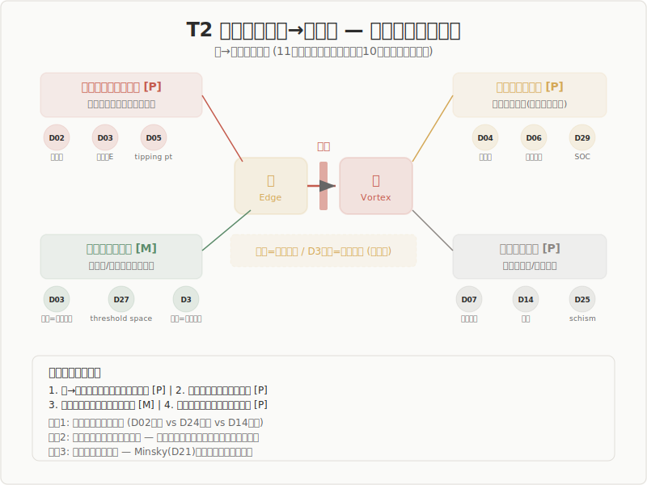

# Phase 8 Layer 2: T2 — 閾値構造と縁→渦遷移の条件

**生成日**: 2026-03-19
**入力**: step2-aggregation.md, Phase 7 output (D02, D29, D03, D06, D28), p1-cross-domain-insights.md
**generator_model**: claude-opus-4-6
**evidence フラグ**: [ai:investigation:claude-opus-4-6]

---

## §A: テーマを支持する領域とパターン

11ドメインが閾値遷移を直接主題化。加えて、渦不到達経路を記述する10ドメインが関連する。

### 閾値遷移の記述（全30領域）

**強い記述（閾値が理論の中核）**

| D# | 領域 | 閾値の形式 | 遷移の性質 |
|----|------|-----------|-----------|
| D02 | 物理学 | 臨界温度、秩序パラメータ | 不可逆的相転移。一次/二次の区別 [P] |
| D03 | 化学 | 活性化エネルギー（鞍点） | 触媒による障壁低下=閾値の制御可能性 [P] |
| D05 | 地球科学 | ティッピングポイント | 不可逆的。正のフィードバック加速 [P] |
| D06 | 天文学 | チャンドラセカール限界、ジーンズ質量 | 定量的に確定した閾値。意識非依存 [P] |
| D29 | 複雑系 | SOC臨界、パーコレーション閾値 | 「閾値的でありかつ統計的」 [P] |

**中程度の記述（閾値が部分的に関与）**

| D# | 領域 | 閾値の形式 |
|----|------|-----------|
| D01 | 数学 | ガロア理論の可解性の壁、Morse理論の臨界値 |
| D08 | 神経科学 | 発火閾値、GWTの意識閾値 |
| D10 | 臨床免疫 | 免疫応答閾値、用量閾値 |
| D12 | 農学 | レジームシフト閾値、IPM介入閾値 |
| D22 | 経営学 | ティッピングポイント（Arthur）、U理論の3つの敵 |
| D24 | 宗教学 | 修行段階の質的転換、回心の「不連続」|

**間接的記述（閾値が暗示される）**

| D# | 領域 | 記述形態 |
|----|------|---------|
| D04 | 進化生物学 | 種分化の生殖隔離成立 |
| D09 | 生命科学 | 細胞分化のコミットメントポイント |
| D14 | 心理学 | 洞察の「アハ」瞬間 |
| D16 | 歴史学 | 革命の臨界点 |
| D25 | 人類学 | 通過儀礼の「閾（limen）」|
| D26 | 音楽学 | サスペンスの解決瞬間 |
| D28 | 舞台芸術 | フィードバックループの自己生成的転換点 |

**閾値記述が弱い/不在**

D07(工学—むしろ閾値を避ける設計), D11(薬学—連続的用量反応が主), D13(哲学—段階化への抵抗), D15(美学—連続的プロセス重視), D17(言語学), D18(社会学), D19(文芸学), D20(法学), D21(経済学—連続的均衡移動が主流), D23(発達心理—連続的発達が主), D27(建築—帯域であり閾値ではない), D30(伝統知—漸進的変容重視)

---

## §B: 収束点

### 収束1: 縁→渦遷移は連続的でなく閾値的である [P]

D02(相転移), D03(活性化エネルギー), D05(ティッピングポイント), D06(チャンドラセカール限界), D29(SOC・パーコレーション) が独立に確認。物理化学的に最も堅い横断知見の一つ。

### 収束2: 閾値を超えた遷移は不可逆的である [P]

D02(対称性の破れ), D04(種分化), D05(気候ティッピングポイント), D06(重力崩壊) が収束。一度渦に入ると縁に戻れない。**ただし** D29 SOCでは雪崩後に系は再び臨界近傍に戻る——不可逆性は「その遷移」についてであり、系全体は循環する。

### 収束3: 閾値は「制御可能」な場合がある [M]

D03化学（触媒=閾値低下装置）、D12農学（IPM=人為的閾値管理）、D22経営（自働化=制度的閾値設定）、D27建築（threshold space=閾値の空間的設計）が収束。**縁→渦遷移の閾値を意図的に下げる/上げる操作が存在する。** これはD3 Withholdの実践的含意——閾値を上げることは「急いで渦に入らない」ことに相当する。

### 収束4: 「渦に至らない経路」が存在する [P]

D02(超臨界流体=相転移を迂回), D04(種分化の失敗), D07(安定制御=渦を避ける設計), D09(分化の失敗=アポトーシス), D14(固着=洞察に至らない), D25(schism=再統合の失敗), D28(ブロック=即興の停止) が収束。**5段階は「必ず渦に到達する」のではなく、縁で止まる/場に戻る経路も含む。**

---

## §C: 分岐点

### 分岐1: 閾値は「量的」か「質的」か

D02物理（臨界温度=量的に確定）vs D24宗教（回心=質的転換で量的に予測不能）vs D14心理（洞察=量的準備の後に質的跳躍）。自然科学は閾値を量的に記述する傾向があるが、人文社会では閾値の量的同定が困難。

### 分岐2: 閾値は「一つ」か「複数」か

D02物理（一次相転移=明確な一点）vs D29複雑系（パーコレーション=確率的閾値）vs D25人類学（移行期=帯域としての閾値）。「帯域としての縁」（T1の知見）と「閾値としての遷移」は緊張関係にある——帯域は幅を持ち、閾値は点を指す。

### 分岐3: 遷移の「方向性」問題

D05地球科学（破壊的ティッピングポイント=渦は破壊的）vs D02物理（超伝導転移=渦は秩序創出的）。渦が必ず「創造的」とは限らない。Minsky(D21)の信用崩壊は自己強化的だが破壊的。渦の価値中立性は5段階モデルの射程を問う。

---

## §D: 5段階モデルへの含意

### 提案1: 縁→渦遷移の閾値性を明示する

現行の「渦——まとまりが立ち上がる」は遷移の性質を記述しない。「閾値を超えたとき」に不可逆的に進むことを記述に加える。

### 提案2: 「渦不到達経路」を理論に組み込む

5段階が「場→波→縁→渦→束」の一方向を記述するだけでは、縁で止まる/場に戻る現象を説明できない。D25人類学のschism、D07工学の安定制御は、「渦に至らないことの価値」も示唆する。

### 提案3: 閾値の「制御可能性」をD3 Withholdと接続する

触媒（D03）= 閾値を下げる装置。Withhold（D3）= 閾値を上げる態度。この対称性は理論的に有意義であり、「縁に留まる」と「渦に入る」の制御メカニズムとして定式化できる可能性がある。

---

## §E: 保持論点

1. **「帯域」と「閾値」の統合**: T1で「縁は帯域」と結論したが、T2では「遷移は閾値的」。帯域の中に閾値があるのか、帯域の端が閾値なのか。これは数学的に定式化可能かもしれない（パーコレーション理論のような確率的閾値+帯域的振る舞い）
2. **渦の方向性（創造的/破壊的）**: 5段階が「創造」のモデルであるなら破壊的渦は射程外。「存在生成」のモデルであるなら射程内。T7+T9（盲点）と直結
3. **閾値の意識的操作 vs 無意識的通過**: D22（意図的にWithholdする）vs D06（意図なく閾値を越える）。5段階理論は両方を包含するか
4. **量的閾値の不在**: 人文社会領域では閾値の量的同定が困難。これは5段階理論の限界か、それとも量的記述に拘束されない構造的理論の強みか

---

## §F: 領域分布

| カテゴリ | 強い記述 | 中程度 | 間接的 | 弱い/不在 |
|---------|---------|--------|-------|----------|
| 自然科学（D01-D12） | 5 | 3 | 2 | 2 |
| 人文社会（D13-D25） | 1 | 1 | 4 | 7 |
| 実践（D26-D30） | 0 | 0 | 2 | 3 |

**自然科学に偏重**。閾値概念は物理化学由来であり、人文社会での直接的対応が少ないのは構造的。ただし、人文社会の「質的転換」（回心、洞察、革命）が閾値概念と本質的に同じ構造を持つかどうかは未検証の重要な問い。
