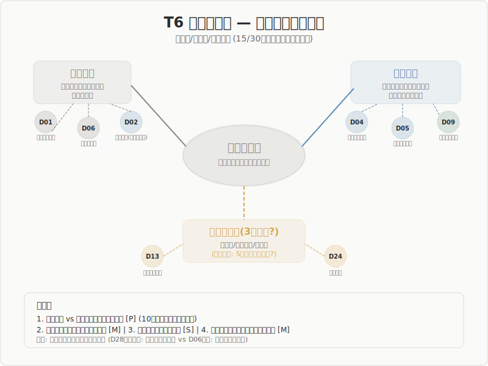

## T6: 場の多層性

### 原初的/循環的/存在論的 — 場は単一でない

15/30ドメインが「場」の多層性を直接主題化。段階定義への提案では28/30が「場」に言及。

---

## 概要

| 項目 | 値 |
|------|-----|
| 直接主題化 | **15** ドメイン |
| 段階定義への提案 | **28** ドメイン |
| 核心問題 | 場は「空虚」か「条件付き潜在性」か |

---

## 発見1: 原初的場 vs 循環的場

10ドメインが独立に提案した、最も収束度の高い区別。

| 種類 | 性格 | 代表例 |
|------|------|--------|
| **原初的場** | 構造以前の未分節状態 | 星間分子雲(D06)、公理系以前(D01) |
| **循環的場** | 前の束が条件を提供 | 臨界近傍(D29)、遺伝子プール(D04) |

5段階の大半の適用場面は循環的場である。

---

## 発見2: 場は「空虚」ではない

場は「ゼロ、無」ではなく**条件付き潜在性**。

- **物理学**: 量子真空 = 揺らぎの海
- **美学**: Schillerの規定可能性 = 全ての決定が可能
- **神経科学**: 動的均衡 = 安定すぎず不安定すぎない
- **建築**: 余白 = 何もないことが何かである

---

## 発見3: 場は全段階の基盤条件

場は5段階の「第1段階」であると同時に、**全段階の基盤**。

- **人類学**: 場は段階でなく全段階の前提
- **哲学(西田)**: 場所 = 全てを包む
- **伝統知**: 場は全過程を支える

---

## 発見4: 循環的場の質が創造を決める

同じ「場」でも質の差があり、その質は**前の束のあり方に依存**。

- 進化生物学: 遺伝子プールの多様性が適応放散を決定
- 神経科学: 動的均衡の質が情報処理能力を決定
- 経営学: 組織文化がイノベーション能力を規定

---

## 哲学・宗教からの3レベル提案

D13哲学とD24宗教が、場の**3レベル**を提案。

| レベル | 内容 | 代表 |
|--------|------|------|
| 経験的 | フッサールの受動的背景 | 日常的な前理解 |
| 存在論的 | シモンドンの前個体的現実 | 構造発生の条件 |
| 究極的 | 西田の絶対無、仏教の空 | 全てを包む場 |

3レベル目は5段階の射程内か — 保持論点。

---

## 分岐点: 未解決の緊張

- **3レベル目の必要性**: 自然科学は2カテゴリで十分と示唆
- **場は「前提」か「到達物」か**: 天文学(所与) vs 舞台芸術(実践的達成)
- **波との境界問題**: 場を拡張するほど波との区別が曖昧に
- **場の「設計可能性」**: 建築は場を設計するが、場が前提なら矛盾

---

## 5段階モデルへの含意

1. **場の定義更新**: 「ゼロ、無」→「条件付き潜在性」
2. **原初的/循環的の区別導入**: 螺旋的循環の理論的基盤
3. **「場の質」概念の導入**: 循環的場の質が創造の質を規定
4. **場の安全条件**: ポリヴェーガル理論が示す「安全だが覚醒」

---

## 結論

**場は「何もない状態」ではなく、「最大の潜在性を持つ条件付き空間」として再定義すべきである。**

原初的場と循環的場の区別は10ドメインが独立に支持する堅固な知見。5段階が螺旋モデルである根拠を理論的に基礎づける。

3レベル目（究極的場）の射程は、今後の重要な保持論点。
